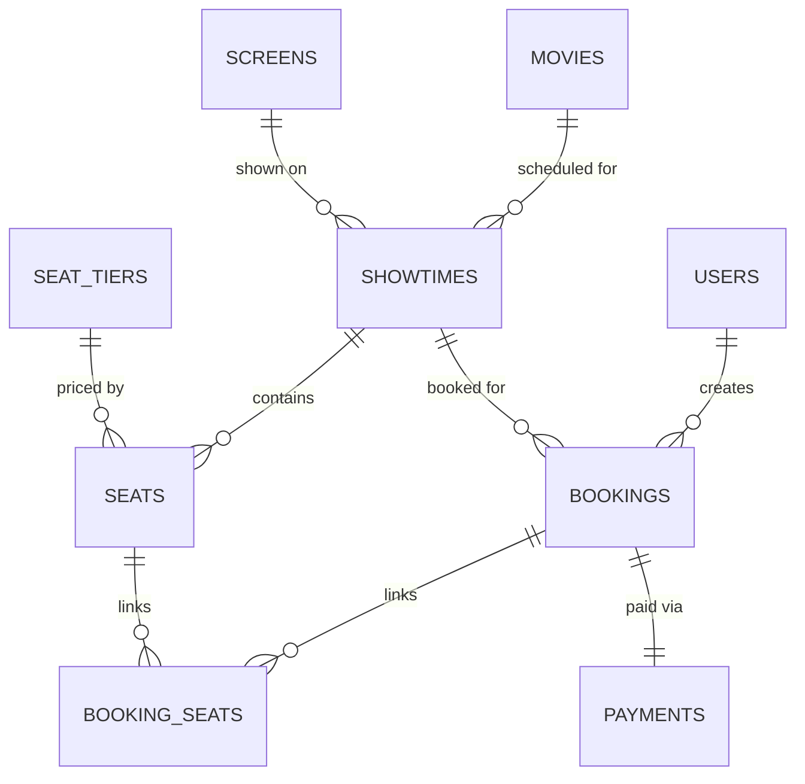

# TicketLedger: Database Schema

## 📋 Purpose

This document defines the **complete database schema** for TicketLedger. It serves as the **single source of truth** for all tables, constraints, indexes, and relationships.

### ✅ This file contains:
- Table definitions with all columns
- Primary and foreign key relationships
- Indexes for performance-critical queries
- Database constraints (UNIQUE, CHECK, EXCLUSION)
- ENUM type definitions
- Audit trail columns
- Soft delete strategy

### ❌ This file does NOT contain:
- State transition logic (see `02_lifecycle_states.md`)
- Business flows (see `03_sequence_flows.md`)
- Migration scripts or versioning
- Database-specific optimization hints

---

## 🔧 Database Configuration

### Platform
- **Database:** PostgreSQL 18
- **Character Set:** UTF-8
- **Timezone:** UTC (all timestamps are `TIMESTAMP WITH TIME ZONE`)

### Extensions
```sql
CREATE EXTENSION IF NOT EXISTS "btree_gist";  -- Required for exclusion constraints
```

### UUID Strategy
- **Version:** UUIDv7 (time-ordered, monotonically increasing)
- **Database Function:** `uuidv7()` (native in Postgres 18)
- **Application Layer:** `java-uuid-generator` library for consistency
- **Benefits:** 
  - Better B-tree index performance than UUIDv4
  - Sortable by creation time (timestamp embedded)
  - Reduced index fragmentation
- **Example:** `019535d9-3df7-79fb-b466-fa907fa17f9e`

**Implementation Note:**
```sql
-- Database default (Postgres 18)
CREATE TABLE example (
    id UUID PRIMARY KEY DEFAULT uuidv7()
);

-- Application layer (Java) generates UUIDs before insert for consistency
UUID id = Generators.timeBasedEpochGenerator().generate();
```

---

## 🗑️ Soft Delete Strategy

### Philosophy

**Financial/Ledger Tables:** ❌ **NO soft delete**
- Bookings, Payments, Seats, booking_seats
- **Why?** Never delete financial records—reverse them via status changes
- **Example:** `booking.status = 'CANCELLED'` instead of `deleted_at = NOW()`

**Configuration/Master Tables:** ✅ **YES soft delete**
- Users, Movies, Screens, Showtimes, seat_tiers
- **Why?** Preserve historical integrity while hiding from future operations
- **Example:** Admin "deletes" a screen → hides from UI, but historical showtimes remain intact

### Tables with Soft Delete

| Table | `deleted_at` Column | Reason |
|-------|---------------------|--------|
| `users` | ✅ | Allow email reuse, preserve booking history |
| `movies` | ✅ | Hide from catalog, preserve showtime history |
| `screens` | ✅ | Decommission venue, preserve showtime history |
| `showtimes` | ✅ | Cancel future shows, preserve booking history |
| `seat_tiers` | ✅ | Deprecate pricing tier, preserve historical prices |
| `bookings` | ❌ | Use `status = 'CANCELLED'` |
| `payments` | ❌ | Use `status = 'REFUNDED'` |
| `seats` | ❌ | Tied to showtime lifecycle |
| `booking_seats` | ❌ | Junction table, no direct deletes |

### Unique Index Handling

**Problem:** Soft-deleted records conflict with unique constraints

```sql
-- ❌ BAD: User can't re-register with deleted email
CREATE UNIQUE INDEX idx_users_email ON users(email);

-- ✅ GOOD: Only enforce uniqueness for active records
CREATE UNIQUE INDEX idx_users_email_active ON users(email) 
WHERE deleted_at IS NULL;
```

**Pattern for all soft-delete tables:**
```sql
-- Users
CREATE UNIQUE INDEX idx_users_email_active ON users(email) 
WHERE deleted_at IS NULL;

-- Screens
CREATE UNIQUE INDEX idx_screens_name_active ON screens(name) 
WHERE deleted_at IS NULL;

-- Seat Tiers
CREATE UNIQUE INDEX idx_seat_tiers_name_active ON seat_tiers(name) 
WHERE deleted_at IS NULL;
```

---

## 📊 Schema Overview

### Entity Relationship Diagram



### Table Categories

| Category | Tables | Soft Delete |
|----------|--------|-------------|
| **Identity** | `users` | ✅ Yes |
| **Content** | `movies`, `screens` | ✅ Yes |
| **Scheduling** | `showtimes` | ✅ Yes |
| **Inventory** | `seat_tiers`, `seats` | ✅ Tiers only |
| **Transaction** | `bookings`, `booking_seats` | ❌ No |
| **Financial** | `payments` | ❌ No |

---

## 🗂️ ENUM Types

### `user_role`
```sql
CREATE TYPE user_role AS ENUM ('CUSTOMER', 'ADMIN');
```
| Value | Description |
|-------|-------------|
| `CUSTOMER` | Regular user who books tickets |
| `ADMIN` | Administrator with management privileges |

### `seat_status`
```sql
CREATE TYPE seat_status AS ENUM ('AVAILABLE', 'HELD', 'SOLD');
```

**Architecture Note: Seat Status as Materialized Lock State**

`seats.status` is a **materialized lock state** optimized for concurrency, while `bookings.status` is the **financial ledger and source of truth**.

**Single Source of Truth Hierarchy:**
1. **Primary Truth:** `bookings.status` (financial ledger, immutable intent)
2. **Derived State:** `seats.status` (database lock mechanism, performance optimization)

**Relationship:**
- `seats.status` MUST always be updated within the same transaction as `bookings.status`
- In case of data corruption, `bookings.status` takes precedence
- `seats.status` enables efficient `SELECT ... FOR UPDATE` locking without joining to bookings

**Why Separate Tables:**
- Performance: Lock seats without scanning bookings table
- Concurrency: `FOR UPDATE` on seats table reduces lock contention
- Query Efficiency: "Show available seats" is a simple index scan

| Value | Description | State Machine |
|-------|-------------|---------------|
| `AVAILABLE` | Free for booking | Initial state |
| `HELD` | Temporarily reserved | Transition state |
| `SOLD` | Permanently booked | Terminal state (reversible via cancellation) |

### `booking_status`
```sql
CREATE TYPE booking_status AS ENUM (
    'HELD', 
    'CONFIRMED', 
    'EXPIRED', 
    'CANCELLED', 
    'COMPLETED', 
    'REFUND_REQUIRED'
);
```
| Value | Description | Transition |
|-------|-------------|------------|
| `HELD` | Awaiting payment | Initial state |
| `CONFIRMED` | Payment successful | Success path |
| `EXPIRED` | Hold timeout exceeded | Failure path |
| `CANCELLED` | User-initiated cancellation | Post-confirmation |
| `COMPLETED` | Showtime passed | Lifecycle end |
| `REFUND_REQUIRED` | Integrity violation | Compensation path |

### `payment_status`
```sql
CREATE TYPE payment_status AS ENUM ('PENDING', 'SUCCESS', 'FAILED', 'REFUNDED');
```
| Value | Description | Gateway State |
|-------|-------------|---------------|
| `PENDING` | Payment initiated | Awaiting response |
| `SUCCESS` | Payment confirmed | Captured |
| `FAILED` | Payment rejected | Declined |
| `REFUNDED` | Payment reversed | Compensated |

### `showtime_status`
```sql
CREATE TYPE showtime_status AS ENUM ('ACTIVE', 'PAUSED', 'INACTIVE');
```
| Value | Description | Booking Allowed |
|-------|-------------|-----------------|
| `ACTIVE` | Open for bookings | ✅ Yes |
| `PAUSED` | Temporarily suspended | ❌ No |
| `INACTIVE` | Permanently closed | ❌ No |

---

## 📋 Table Definitions

### 1. `users` — Identity & Authentication

**Purpose:** Store user accounts and authentication credentials

| Column | Type | Constraints | Description |
|--------|------|-------------|-------------|
| `id` | `UUID` | `PRIMARY KEY DEFAULT uuidv7()` | UUIDv7 user identifier |
| `email` | `VARCHAR(255)` | `NOT NULL` | Login email (case-sensitive) |
| `password_hash` | `VARCHAR(255)` | `NOT NULL` | Bcrypt/Argon2 hashed password |
| `role` | `user_role` | `DEFAULT 'CUSTOMER'` | User permission level |
| `is_verified` | `BOOLEAN` | `DEFAULT FALSE` | Email verification status |
| `deleted_at` | `TIMESTAMPTZ` | `NULL` | Soft delete timestamp |
| `created_at` | `TIMESTAMPTZ` | `DEFAULT NOW()` | Account creation time |
| `updated_at` | `TIMESTAMPTZ` | `DEFAULT NOW()` | Last profile update |

**Indexes:**
```sql
-- Email uniqueness (only for active users)
CREATE UNIQUE INDEX idx_users_email_active ON users(email) 
WHERE deleted_at IS NULL;

-- Soft delete queries
CREATE INDEX idx_users_deleted ON users(deleted_at);
```

**Business Rules:**
- Email must be verified before first booking (`is_verified = TRUE`)
- Soft delete allows email reuse: User can re-register with previously deleted email
- All queries must filter `WHERE deleted_at IS NULL` for active users
- Password hash uses Bcrypt with cost factor 12

**Soft Delete Example:**
```sql
-- Delete user
UPDATE users SET deleted_at = NOW() WHERE id = 'user-123';

-- User re-registers with same email (allowed)
INSERT INTO users (email, ...) VALUES ('john@example.com', ...);
```

---

### 2. `screens` — Physical Theater Rooms

**Purpose:** Represent physical screening locations to prevent scheduling conflicts

| Column | Type | Constraints | Description |
|--------|------|-------------|-------------|
| `id` | `UUID` | `PRIMARY KEY DEFAULT uuidv7()` | UUIDv7 screen identifier |
| `name` | `VARCHAR(50)` | `NOT NULL` | Display name (e.g., "Screen 1") |
| `total_seats` | `INT` | `DEFAULT 0` | Total capacity (informational) |
| `deleted_at` | `TIMESTAMPTZ` | `NULL` | Soft delete timestamp |
| `created_at` | `TIMESTAMPTZ` | `DEFAULT NOW()` | Screen added time |

**Indexes:**
```sql
-- Screen name uniqueness (only for active screens)
CREATE UNIQUE INDEX idx_screens_name_active ON screens(name) 
WHERE deleted_at IS NULL;

-- Soft delete queries
CREATE INDEX idx_screens_deleted ON screens(deleted_at);
```

**Business Rules:**
- Soft delete preserves historical showtime integrity
- Admin cannot hard-delete screen with existing showtimes
- All queries filter `WHERE deleted_at IS NULL` for active screens

---

### 3. `movies` — Content Metadata

**Purpose:** Store basic movie information for scheduling

| Column | Type | Constraints | Description |
|--------|------|-------------|-------------|
| `id` | `UUID` | `PRIMARY KEY DEFAULT uuidv7()` | UUIDv7 movie identifier |
| `title` | `VARCHAR(255)` | `NOT NULL` | Movie title |
| `duration_minutes` | `INT` | `NOT NULL` | Runtime in minutes |
| `deleted_at` | `TIMESTAMPTZ` | `NULL` | Soft delete timestamp |
| `created_at` | `TIMESTAMPTZ` | `DEFAULT NOW()` | Movie added time |

**Indexes:**
```sql
-- Active movies for catalog
CREATE INDEX idx_movies_active ON movies(created_at DESC) 
WHERE deleted_at IS NULL;

-- Soft delete queries
CREATE INDEX idx_movies_deleted ON movies(deleted_at);
```

**Business Rules:**
- Soft delete hides from catalog but preserves showtime history
- `duration_minutes` used to calculate `showtimes.end_time`
- Minimal fields for MVP; extend with genres, ratings, posters later

---

### 4. `showtimes` — Scheduled Screenings

**Purpose:** Time-bound events linking movies to screens with overlap prevention

| Column | Type | Constraints | Description |
|--------|------|-------------|-------------|
| `id` | `UUID` | `PRIMARY KEY DEFAULT uuidv7()` | UUIDv7 showtime identifier |
| `movie_id` | `UUID` | `REFERENCES movies(id)` | Which movie is playing |
| `screen_id` | `UUID` | `REFERENCES screens(id)` | Which screen is used |
| `start_time` | `TIMESTAMPTZ` | `NOT NULL` | Screening start time |
| `end_time` | `TIMESTAMPTZ` | `GENERATED ALWAYS AS (start_time + interval '1 minute' * 120) STORED` | Computed end time (simplified) |
| `status` | `showtime_status` | `DEFAULT 'ACTIVE'` | Booking availability |
| `deleted_at` | `TIMESTAMPTZ` | `NULL` | Soft delete timestamp |
| `created_at` | `TIMESTAMPTZ` | `DEFAULT NOW()` | Showtime created time |
| `updated_at` | `TIMESTAMPTZ` | `DEFAULT NOW()` | Last status change |

**Constraints:**
```sql
-- CRITICAL: Prevent double-booking screens (only for active showtimes)
CONSTRAINT no_screen_overlap EXCLUDE USING gist (
    screen_id WITH =, 
    tstzrange(start_time, end_time) WITH &&
) WHERE (deleted_at IS NULL);
```

**Indexes:**
```sql
-- Find active showtimes efficiently
CREATE INDEX idx_showtimes_active ON showtimes(start_time) 
WHERE status = 'ACTIVE' AND deleted_at IS NULL;

-- Showtime expiry checks (for Reaper job)
CREATE INDEX idx_showtimes_expiry ON showtimes(start_time, status)
WHERE deleted_at IS NULL;

-- Soft delete queries
CREATE INDEX idx_showtimes_deleted ON showtimes(deleted_at);
```

**Business Rules:**
- Soft delete cancels future showtime but preserves booking history
- `end_time` is **computed** (not editable) based on movie duration
- Simplified formula: `end_time = start_time + 120 minutes` (hardcoded)
- Production: `end_time = start_time + movies.duration_minutes + cleanup_buffer`
- Exclusion constraint only applies to non-deleted showtimes

---

### 5. `seat_tiers` — Pricing Categories

**Purpose:** Define seat pricing tiers (e.g., VIP, Regular, Balcony)

| Column | Type | Constraints | Description |
|--------|------|-------------|-------------|
| `id` | `UUID` | `PRIMARY KEY DEFAULT uuidv7()` | UUIDv7 tier identifier |
| `name` | `VARCHAR(50)` | `NOT NULL` | Tier name (e.g., "VIP") |
| `price_multiplier` | `DECIMAL(3, 2)` | `DEFAULT 1.0` | Price factor (e.g., 1.5 for VIP) |
| `deleted_at` | `TIMESTAMPTZ` | `NULL` | Soft delete timestamp |
| `created_at` | `TIMESTAMPTZ` | `DEFAULT NOW()` | Tier created time |

**Indexes:**
```sql
-- Tier name uniqueness (only for active tiers)
CREATE UNIQUE INDEX idx_seat_tiers_name_active ON seat_tiers(name) 
WHERE deleted_at IS NULL;

-- Active tiers for UI
CREATE INDEX idx_seat_tiers_active ON seat_tiers(name)
WHERE deleted_at IS NULL;

-- Soft delete queries
CREATE INDEX idx_seat_tiers_deleted ON seat_tiers(deleted_at);
```

**Business Rules:**
- Soft delete deprecates tier but preserves historical pricing
- Base price × `price_multiplier` = Final seat price
- Price calculation happens at booking time (stored in `booking_seats.price_at_booking`)

---

### 6. `seats` — Inventory Units

**Purpose:** Individual bookable seats for each showtime

| Column | Type | Constraints | Description |
|--------|------|-------------|-------------|
| `id` | `UUID` | `PRIMARY KEY DEFAULT uuidv7()` | UUIDv7 seat identifier |
| `showtime_id` | `UUID` | `REFERENCES showtimes(id) ON DELETE CASCADE` | Which showtime this seat belongs to |
| `tier_id` | `UUID` | `REFERENCES seat_tiers(id)` | Pricing tier |
| `seat_row` | `VARCHAR(5)` | `NOT NULL` | Row identifier (e.g., "A") |
| `seat_number` | `VARCHAR(5)` | `NOT NULL` | Seat number (e.g., "12") |
| `status` | `seat_status` | `DEFAULT 'AVAILABLE'` | Current booking state |
| `version` | `INT` | `DEFAULT 0` | Optimistic locking counter |
| `created_at` | `TIMESTAMPTZ` | `DEFAULT NOW()` | Seat created time |
| `updated_at` | `TIMESTAMPTZ` | `DEFAULT NOW()` | Last status change |

**Constraints:**
```sql
-- No duplicate seats in same showtime
UNIQUE(showtime_id, seat_row, seat_number)
```

**Indexes:**
```sql
-- Find available seats for booking
CREATE INDEX idx_seats_avail ON seats(showtime_id, status);

-- Optimistic locking queries
CREATE INDEX idx_seats_version ON seats(id, version);
```

**Business Rules:**
- ❌ **NO soft delete** — Seats cascade-deleted when showtime is removed
- `version` incremented on every `UPDATE` (optimistic locking)
- Seat layout (coordinates, visual maps) deferred to Phase 2
- Lifecycle tied to showtime; no independent deletion

---

### 7. `bookings` — Reservation Ledger

**Purpose:** Central ledger for all booking transactions

| Column | Type | Constraints | Description |
|--------|------|-------------|-------------|
| `id` | `UUID` | `PRIMARY KEY DEFAULT uuidv7()` | UUIDv7 booking identifier |
| `user_id` | `UUID` | `REFERENCES users(id)` | Who made the booking |
| `showtime_id` | `UUID` | `REFERENCES showtimes(id)` | Which showtime is booked |
| `status` | `booking_status` | `DEFAULT 'HELD'` | Current lifecycle state |
| `locked_until` | `TIMESTAMPTZ` | `NULL` | Hold expiry time (for `HELD` bookings) |
| `confirmed_at` | `TIMESTAMPTZ` | `NULL` | Payment success timestamp |
| `cancelled_at` | `TIMESTAMPTZ` | `NULL` | User cancellation timestamp |
| `completed_at` | `TIMESTAMPTZ` | `NULL` | Showtime passed timestamp |
| `created_at` | `TIMESTAMPTZ` | `DEFAULT NOW()` | Booking initiated time |
| `updated_at` | `TIMESTAMPTZ` | `DEFAULT NOW()` | Last status change |

**Indexes:**
```sql
-- CRITICAL: The Reaper Query
-- "Find all HELD bookings past their expiry"
CREATE INDEX idx_bookings_reaper ON bookings(status, locked_until);

-- User booking history
CREATE INDEX idx_bookings_user ON bookings(user_id, created_at DESC);

-- Showtime bookings
CREATE INDEX idx_bookings_showtime ON bookings(showtime_id, status);
```

**Business Rules:**
- ❌ **NO soft delete** — Use `status = 'CANCELLED'` for reversals
- `locked_until = created_at + 10 minutes` for `HELD` bookings
- Audit timestamps (`confirmed_at`, `cancelled_at`, `completed_at`) are mutually exclusive
- Only `CONFIRMED` bookings can transition to `CANCELLED`
- Financial records never deleted, only status-transitioned

---

### 8. `booking_seats` — Booking-Seat Junction

**Purpose:** Many-to-many relationship between bookings and seats with price snapshot

| Column | Type | Constraints | Description |
|--------|------|-------------|-------------|
| `booking_id` | `UUID` | `REFERENCES bookings(id) ON DELETE CASCADE` | Which booking |
| `seat_id` | `UUID` | `REFERENCES seats(id) ON DELETE CASCADE` | Which seat |
| `price_at_booking` | `DECIMAL(10, 2)` | `NULL` | Snapshot price (for dynamic pricing) |
| `created_at` | `TIMESTAMPTZ` | `DEFAULT NOW()` | Junction created time |

**Constraints:**
```sql
PRIMARY KEY (booking_id, seat_id)
```

**Indexes:**
```sql
-- Find seats for a booking
CREATE INDEX idx_booking_seats_booking ON booking_seats(booking_id);

-- Find bookings for a seat (history)
CREATE INDEX idx_booking_seats_seat ON booking_seats(seat_id);
```

**Business Rules:**
- ❌ **NO soft delete** — Junction table lifecycle tied to bookings
- `price_at_booking` captures price at reservation time (protects against dynamic price changes)
- Cascade delete: If booking deleted, junction rows auto-removed
- Allows seat reuse: Seat can be in multiple bookings over time (different showtimes or after cancellation)

---

### 9. `payments` — Financial Transactions

**Purpose:** Track payment gateway interactions and status

| Column | Type | Constraints | Description |
|--------|------|-------------|-------------|
| `id` | `UUID` | `PRIMARY KEY DEFAULT uuidv7()` | UUIDv7 payment identifier |
| `booking_id` | `UUID` | `REFERENCES bookings(id)` | Which booking this pays for |
| `amount` | `DECIMAL(10, 2)` | `NOT NULL` | Total payment amount |
| `currency` | `VARCHAR(3)` | `DEFAULT 'USD'` | ISO 4217 currency code |
| `provider` | `VARCHAR(50)` | `NOT NULL` | Gateway name (e.g., "STRIPE", "RAZORPAY") |
| `method` | `VARCHAR(50)` | `NULL` | Payment method (e.g., "CREDIT_CARD", "UPI") |
| `status` | `payment_status` | `DEFAULT 'PENDING'` | Current payment state |
| `provider_transaction_id` | `VARCHAR(255)` | `NULL` | External gateway transaction ID |
| `provider_response` | `JSONB` | `NULL` | Raw gateway response (debugging) |
| `provider_captured_at` | `TIMESTAMPTZ` | `NULL` | When gateway confirmed payment |
| `created_at` | `TIMESTAMPTZ` | `DEFAULT NOW()` | Payment initiated time |
| `updated_at` | `TIMESTAMPTZ` | `DEFAULT NOW()` | Last status update |

**Indexes:**
```sql
-- Webhook lookup by external ID
CREATE INDEX idx_payments_provider_id ON payments(provider_transaction_id);

-- Find payments for booking
CREATE INDEX idx_payments_booking ON payments(booking_id);
```

**Business Rules:**
- ❌ **NO soft delete** — Use `status = 'REFUNDED'` for reversals
- **Payment Retry Strategy:** Create **new payment record** with same `booking_id`
  - ❌ **NO** `payment_attempts` table
  - ✅ Multiple `payments` rows can reference same `booking_id`
  - Latest payment (by `created_at DESC`) is authoritative
- `provider_captured_at` vs `created_at` difference detects late payments
- `provider_response` stores full JSON for debugging gateway issues
- Financial records never deleted, only status-transitioned

**Payment Retry Example:**
```sql
-- First attempt
INSERT INTO payments (id, booking_id, amount, status) 
VALUES (uuidv7(), 'booking-123', 100.00, 'PENDING');  -- payment-001

-- User retries after failure
INSERT INTO payments (id, booking_id, amount, status) 
VALUES (uuidv7(), 'booking-123', 100.00, 'PENDING');  -- payment-002

-- Query latest payment
SELECT * FROM payments 
WHERE booking_id = 'booking-123' 
ORDER BY created_at DESC 
LIMIT 1;
```

---

## 🔐 Critical Constraints Summary

### Uniqueness Constraints (Soft Delete Aware)

| Table | Constraint | Condition |
|-------|------------|-----------|
| `users` | `email UNIQUE` | `WHERE deleted_at IS NULL` |
| `screens` | `name UNIQUE` | `WHERE deleted_at IS NULL` |
| `seat_tiers` | `name UNIQUE` | `WHERE deleted_at IS NULL` |
| `seats` | `UNIQUE(showtime_id, seat_row, seat_number)` | N/A (no soft delete) |
| `booking_seats` | `PRIMARY KEY (booking_id, seat_id)` | N/A (no soft delete) |

### Referential Integrity

| Child Table | Parent Table | On Delete | Purpose |
|-------------|--------------|-----------|---------|
| `showtimes` | `movies` | `RESTRICT` | Cannot delete movie with active shows |
| `showtimes` | `screens` | `RESTRICT` | Cannot delete screen with active shows |
| `seats` | `showtimes` | `CASCADE` | Delete seats when showtime removed |
| `bookings` | `users` | `RESTRICT` | Cannot delete user with bookings |
| `bookings` | `showtimes` | `RESTRICT` | Cannot delete showtime with bookings |
| `booking_seats` | `bookings` | `CASCADE` | Delete junction on booking removal |
| `booking_seats` | `seats` | `CASCADE` | Delete junction on seat removal |
| `payments` | `bookings` | `RESTRICT` | Cannot delete booking with payments |

### Exclusion Constraints

```sql
-- SHOWTIMES: No overlapping screenings on same screen (only active)
EXCLUDE USING gist (
    screen_id WITH =, 
    tstzrange(start_time, end_time) WITH &&
) WHERE (deleted_at IS NULL);
```

**How It Works:**
- GiST index allows range comparisons
- `screen_id WITH =`: Must be same screen
- `tstzrange(...) WITH &&`: Time ranges cannot overlap
- `WHERE (deleted_at IS NULL)`: Only enforced for active showtimes
- Database rejects conflicting `INSERT`/`UPDATE` automatically

---

## 📈 Performance Index Strategy

### Primary Index Categories

| Category | Purpose | Example |
|----------|---------|---------|
| **Lookup** | Direct record retrieval | `users(email)` WHERE deleted_at IS NULL |
| **Filter** | WHERE clause optimization | `showtimes(status, start_time)` WHERE deleted_at IS NULL |
| **Join** | Foreign key traversal | `booking_seats(booking_id)` |
| **Reaper** | Background job queries | `bookings(status, locked_until)` |
| **Webhook** | External ID matching | `payments(provider_transaction_id)` |
| **Soft Delete** | Deletion status checks | `users(deleted_at)` |

### Index Maintenance

**Partial Indexes (Soft Delete Aware):**
```sql
-- Only index active records (reduces index size dramatically)
CREATE INDEX idx_showtimes_active ON showtimes(start_time) 
WHERE status = 'ACTIVE' AND deleted_at IS NULL;

-- Only index active users
CREATE UNIQUE INDEX idx_users_email_active ON users(email) 
WHERE deleted_at IS NULL;
```

**Composite Indexes:**
```sql
-- Reaper query uses both columns
CREATE INDEX idx_bookings_reaper ON bookings(status, locked_until);

-- Most selective column first (status) then timestamp
```

---

## 🎓 Design Principles

### 1. **UUIDv7 for All Primary Keys**
- Time-ordered UUIDs improve B-tree index performance
- Sortable by creation time without separate `created_at` index
- Better than UUIDv4 for high-insert workloads
- Application layer generates UUIDs for consistency across DB versions

### 2. **Soft Delete Only for Master Data**
- ✅ Users, Movies, Screens, Showtimes, seat_tiers
- ❌ Bookings, Payments, Seats, booking_seats
- Financial records use status transitions, not deletion

### 3. **Unique Indexes Respect Soft Deletes**
- `WHERE deleted_at IS NULL` prevents duplicate conflicts
- Allows email/name reuse after soft delete
- Critical for user re-registration

### 4. **No `payment_attempts` Table**
- Multiple `payments` rows per `booking_id` allowed
- Simpler query logic: `ORDER BY created_at DESC LIMIT 1`
- Preserves full audit trail

### 5. **Computed Columns for Showtime End Time**
- `end_time` is **GENERATED ALWAYS** (cannot be manually set)
- Prevents data inconsistency
- Production: Replace hardcoded 120 minutes with `movies.duration_minutes`

### 6. **Junction Table for Booking-Seat Link**
- Allows seat reuse after cancellation
- Captures price snapshot for historical accuracy
- Enables complex queries (e.g., "Which seats did user book in past?")

### 7. **Database-Enforced Constraints**
- Exclusion constraint prevents scheduling errors
- Foreign keys prevent orphaned records
- ENUM types enforce valid state values
- Partial exclusion constraint respects soft deletes

### 8. **Audit Timestamps on Critical Transitions**
- `confirmed_at`, `cancelled_at`, `completed_at` track lifecycle events
- Enables SLA monitoring and refund policy checks
- Does not replace `updated_at` (which tracks any change)

---

## 📋 Soft Delete Query Patterns

### Standard Queries

```sql
-- Find active users
SELECT * FROM users WHERE deleted_at IS NULL;

-- Find deleted users (admin view)
SELECT * FROM users WHERE deleted_at IS NOT NULL;

-- Soft delete user
UPDATE users SET deleted_at = NOW() WHERE id = 'user-123';

-- Restore soft-deleted user
UPDATE users SET deleted_at = NULL WHERE id = 'user-123';
```

### Application Layer Considerations

```java
// JPA Entity with soft delete
@Entity
@Where(clause = "deleted_at IS NULL")  // Hibernate
@SQLDelete(sql = "UPDATE users SET deleted_at = NOW() WHERE id = ?")
public class User {
    @Column(name = "deleted_at")
    private Instant deletedAt;
}

// Query only active records (automatic with @Where)
userRepository.findByEmail("john@example.com");

// Include deleted records (override)
@Query("SELECT u FROM User u WHERE u.email = :email")
User findByEmailIncludingDeleted(@Param("email") String email);
```

---

## 🔍 Cross-Reference

- **State Machines:** See `02_lifecycle_states.md`
- **Transaction Flows:** See `03_sequence_flows.md`
- **API Contracts:** See `05_api_contracts.md` (future)
- **Migration Scripts:** See `/migrations/` directory (future)

---

## 📊 Schema Statistics (Estimated)

| Metric | Value | Note |
|--------|-------|------|
| **Tables** | 9 | Core entities only |
| **Indexes** | 20+ | Performance-critical + soft delete |
| **ENUMs** | 5 | Strict type safety |
| **Foreign Keys** | 10 | Referential integrity |
| **Constraints** | 8 | Uniqueness + exclusion + soft delete |
| **Soft Delete Tables** | 5 | Master data only |

---

## ✅ Phase 0 Checklist

- [x] UUIDv7 migration documented with Postgres 18 native function
- [x] Application layer UUID generation strategy clarified
- [x] Payment retry strategy clarified (new payment record per retry)
- [x] Junction table for booking-seats relationship
- [x] Audit timestamps added to bookings
- [x] Exclusion constraint for showtime overlap prevention
- [x] Soft delete strategy defined (master data only)
- [x] Unique indexes updated for soft delete compatibility
- [x] All indexes documented with rationale