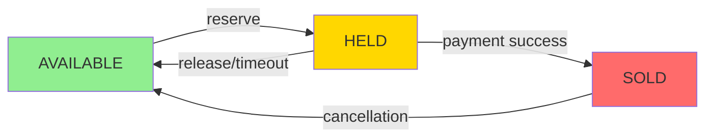
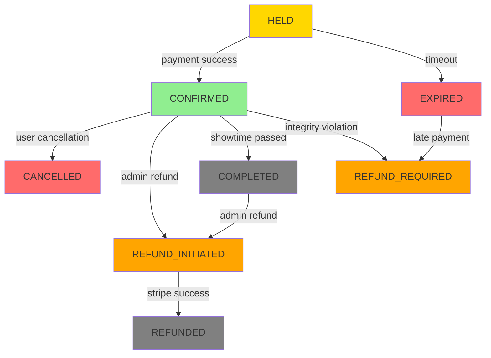
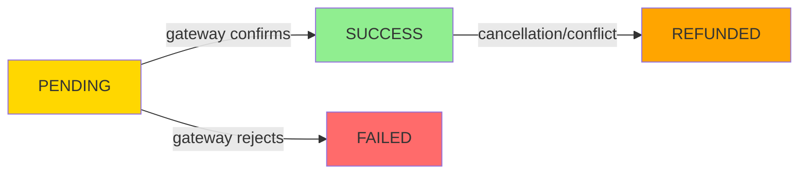
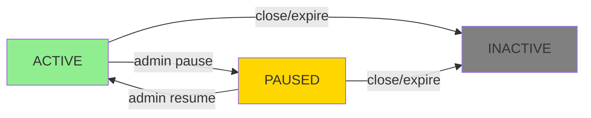

# TicketLedger: Lifecycle States & Transition Rules

## 📋 Purpose

This document defines the **allowed and denied state transitions** for all entities in TicketLedger. It serves as the **finite state machine contract** that governs system behavior.

### ✅ This file contains:
- State definitions
- Allowed transitions
- Denied/illegal transitions
- Inter-entity coupling rules

### ❌ This file does NOT contain:
- API flows
- Timing logic
- Retry mechanisms
- Implementation details

---

## 🎯 Entity States

### 🪑 Seat States

| State       | Description                                           |
| ----------- | ----------------------------------------------------- |
| `AVAILABLE` | Seat is free and can be reserved                      |
| `HELD`      | Seat is temporarily locked for a user during checkout |
| `SOLD`      | Seat is permanently booked and paid for               |

### 📝 Booking States

| State              | Description                                                            |
| ------------------ | ---------------------------------------------------------------------- |
| `HELD`             | Booking created, seats reserved, awaiting payment                      |
| `CONFIRMED`        | Payment successful, booking finalized                                  |
| `EXPIRED`          | Hold duration exceeded, booking invalidated                            |
| `CANCELLED`        | User-initiated cancellation (pre-refund or within cancellation window) |
| `REFUND_INITIATED` | Admin refund in progress, row locked, awaiting Stripe response         |
| `REFUNDED`         | Funds returned to user, financial ledger settled                       |
| `COMPLETED`        | Showtime passed, booking lifecycle ended                               |
| `REFUND_REQUIRED`  | Payment succeeded but booking integrity violated                       |
#### State Disambiguation: CANCELLED vs REFUNDED

**CANCELLED:**
- **Actor:** User-initiated or system timeout
- **Financial State:** May or may not involve refund (depends on cancellation policy)
- **Use Case:** User cancels before showtime (within refund window)
- **Seats:** Released back to AVAILABLE pool

**REFUNDED:**
- **Actor:** Admin-initiated privileged operation
- **Financial State:** Funds **explicitly returned** via payment gateway
- **Use Case:** Admin compensation, show cancellation, integrity violation
- **Seats:** Released back to AVAILABLE pool
- **Audit:** Requires reason and admin accountability trail

**Key Difference:** `REFUNDED` is unambiguous about financial settlement. `CANCELLED` may just mean "booking voided" without money movement.

#### REFUND_INITIATED: The Transient Lock State

**Purpose:** Prevent race conditions during admin refund operations.

**Behavior:**
- **Blocks Entry:** Users cannot scan this booking at showtime entry
- **Blocks Cancellation:** Users cannot cancel while admin refund is in-flight
- **Blocks Concurrent Refunds:** Second admin attempting refund receives `423 LOCKED`
- **Duration:** Held only during external Stripe API call (typically 1-3 seconds)

**Why Needed:**
Without this state, the following race occurs:
```
T1: Admin starts refund (booking still CONFIRMED)
T2: User scans ticket at entrance (entry allowed)
T3: Stripe refund succeeds
T4: Admin updates booking to REFUNDED
Result: User entered show but got refunded 💥
```

With `REFUND_INITIATED`:
```
T1: Admin starts refund (booking → REFUND_INITIATED)
T2: User scans ticket (entry DENIED: booking is being refunded)
T3: Stripe refund succeeds
T4: Admin updates booking to REFUNDED
Result: Consistent state ✅
```

**Recovery:** If admin process crashes during `REFUND_INITIATED`, reconciliation job detects orphaned state and either:
- Completes refund (if Stripe succeeded)
- Rolls back to CONFIRMED (if Stripe failed)
### 💳 Payment States

| State      | Description                                      |
| ---------- | ------------------------------------------------ |
| `PENDING`  | Payment initiated, awaiting gateway response     |
| `SUCCESS`  | Payment confirmed by gateway                     |
| `FAILED`   | Payment rejected by gateway                      |
| `REFUNDED` | Payment reversed due to cancellation or conflict |

### 🎬 Showtime States

| State      | Description                                              |
| ---------- | -------------------------------------------------------- |
| `ACTIVE`   | Showtime is open for bookings                            |
| `PAUSED`   | Showtime temporarily suspended (admin action)            |
| `INACTIVE` | Showtime closed permanently (past showtime or cancelled) |

---

## 🪑 Seat Transitions

### 🎯 Architecture: Seat Status as Locking Mechanism

**Critical Design Decision:**

`seats.status` is a **Materialized Lock State**, NOT the source of truth.

- **Source of Truth:** `bookings.status` (financial ledger)
- **Locking Mechanism:** `seats.status` (concurrency optimization)

**Why This Matters:**

Updating `seats.status` IS the locking mechanism. All seat transitions MUST occur within the same transaction as booking transitions to maintain consistency.

**Transaction Atomicity Rule:**
```sql
BEGIN TRANSACTION;
  -- Step 1: Lock the seat (this is the lock acquisition)
  UPDATE seats SET status = 'HELD' WHERE id = ? AND status = 'AVAILABLE';
  
  -- Step 2: Record the financial intent
  INSERT INTO bookings (status, ...) VALUES ('HELD', ...);
COMMIT;
```

If these operations are not atomic, you risk:
- Orphaned seat locks (seat HELD, no booking exists)
- Double bookings (booking exists, seat shows AVAILABLE)

### ✅ Allowed Transitions



| From        | To          | Trigger                                         |
| ----------- | ----------- | ----------------------------------------------- |
| `AVAILABLE` | `HELD`      | User initiates booking (with booking INSERT)    |
| `HELD`      | `AVAILABLE` | Hold expires or released (with booking UPDATE)  |
| `HELD`      | `SOLD`      | Payment confirmed (with booking UPDATE)         |
| `SOLD`      | `AVAILABLE` | Booking cancelled (via `CONFIRMED → CANCELLED`) |

### ❌ Denied Transitions

> **Rule:** Seat never transitions directly based on payment or time. Seat reacts only to Booking decisions inside a transaction.

| From        | To        | Reason                            |
| ----------- | --------- | --------------------------------- |
| `AVAILABLE` | `SOLD`    | ⚠️ Must go through `HELD` state    |
| `SOLD`      | `HELD`    | ⚠️ Cannot downgrade sold seat      |
| `SOLD`      | `EXPIRED` | ⚠️ Invalid state path              |
| `AVAILABLE` | `EXPIRED` | ⚠️ Seats don't expire, bookings do |

---

## 📝 Booking Transitions

### ✅ Allowed Transitions



| From               | To                 | Trigger                                |
| ------------------ | ------------------ | -------------------------------------- |
| `HELD`             | `CONFIRMED`        | Payment succeeds within hold window    |
| `HELD`             | `EXPIRED`          | Hold duration exceeded                 |
| `CONFIRMED`        | `CANCELLED`        | User cancels confirmed booking         |
| `CONFIRMED`        | `REFUND_INITIATED` | Admin initiates refund (locks row)     |
| `REFUND_INITIATED` | `REFUNDED`         | Stripe refund succeeds                 |
| `CONFIRMED`        | `COMPLETED`        | Showtime has passed                    |
| `COMPLETED`        | `REFUND_INITIATED` | Admin initiates refund (post-showtime) |
| `EXPIRED`          | `REFUND_REQUIRED`  | Late payment after hold expiry         |
| `CONFIRMED`        | `REFUND_REQUIRED`  | System integrity violation             |

### ❌ Denied Transitions

> **Rule:** Booking state is append-only in intent. You never "revive" a dead booking.

| From               | To                              | Reason                                                            |
| ------------------ | ------------------------------- | ----------------------------------------------------------------- |
| `EXPIRED`          | `CONFIRMED`                     | ⚠️ Cannot resurrect expired booking                                |
| `CANCELLED`        | `CONFIRMED`                     | ⚠️ Cannot un-cancel booking                                        |
| `HELD`             | `REFUNDED`                      | ⚠️ Cannot refund unpaid booking (must go through REFUND_INITIATED) |
| `EXPIRED`          | `REFUNDED`                      | ⚠️ Cannot refund expired booking                                   |
| `REFUND_INITIATED` | `CONFIRMED`                     | ⚠️ Cannot rollback initiated refund                                |
| `REFUNDED`         | `ANY`                           | ⚠️ Terminal state - refund completed                               |
| `COMPLETED`        | `ANY (except REFUND_INITIATED)` | ⚠️ Can only refund after completion                                |
| `REFUND_REQUIRED`  | `CONFIRMED`                     | ⚠️ Refund is irreversible                                          |

---

## 💳 Payment Transitions

### ✅ Allowed Transitions



| From      | To         | Trigger                             |
| --------- | ---------- | ----------------------------------- |
| `PENDING` | `SUCCESS`  | Payment gateway confirms            |
| `PENDING` | `FAILED`   | Payment gateway rejects             |
| `SUCCESS` | `REFUNDED` | Cancellation or conflict resolution |

### ❌ Denied Transitions

> **Rule:** Payment is an external truth recorder, not a controller.

| From       | To        | Reason                                    |
| ---------- | --------- | ----------------------------------------- |
| `FAILED`   | `SUCCESS` | ⚠️ Failed payment cannot become successful |
| `REFUNDED` | `SUCCESS` | ⚠️ Refunded payment is final               |
| `SUCCESS`  | `PENDING` | ⚠️ Cannot rollback to pending              |

---

## 🎬 Showtime Transitions

### ✅ Allowed Transitions



| From     | To         | Trigger                    |
| -------- | ---------- | -------------------------- |
| `ACTIVE` | `PAUSED`   | Admin temporarily suspends |
| `PAUSED` | `ACTIVE`   | Admin resumes              |
| `ACTIVE` | `INACTIVE` | Showtime ends or cancelled |
| `PAUSED` | `INACTIVE` | Cancelled while paused     |

### ❌ Denied Transitions

> **Rule:** Showtime is monotonic toward INACTIVE.

| From       | To       | Reason                              |
| ---------- | -------- | ----------------------------------- |
| `INACTIVE` | `ACTIVE` | ⚠️ Cannot reactivate closed showtime |
| `INACTIVE` | `PAUSED` | ⚠️ Terminal state - irreversible     |

---

## 🔗 Inter-Entity Transition Constraints

### Cross-Entity Dependencies

| Entity A Transition              | Requires Entity B State         | Enforcement          |
| -------------------------------- | ------------------------------- | -------------------- |
| `Seat: AVAILABLE → HELD`         | `Showtime == ACTIVE`            | Pre-condition check  |
| `Booking: HELD → CONFIRMED`      | `Payment == SUCCESS`            | Pre-condition check  |
| `Booking: HELD → EXPIRED`        | Forces `Seat: HELD → AVAILABLE` | Cascading transition |
| `Booking: CONFIRMED → CANCELLED` | Forces `Seat: SOLD → AVAILABLE` | Cascading transition |
| `Showtime: INACTIVE`             | Denies `Seat: AVAILABLE → HELD` | Global constraint    |

### 📐 Constraint Rules

1. **Atomic Coupling**: Seat transitions MUST occur within the same transaction as Booking transitions (seats.status is the lock, bookings.status is the truth)
2. **Showtime Guard**: No seat reservations allowed when showtime is not `ACTIVE`
3. **Payment Prerequisite**: Booking confirmation requires successful payment
4. **Cascade Cleanup**: Booking state changes automatically trigger dependent seat state changes
5. **Terminal Barriers**: Inactive showtimes block all new booking attempts
6. **Lock-Then-Record**: Always UPDATE seats.status BEFORE INSERT/UPDATE bookings (acquire lock, then record intent)
7. **Corruption Resolution**: If seats.status conflicts with bookings.status, bookings.status is the source of truth for reconciliation

---

## 📊 State Machine Summary

| Entity       | States | Terminal States                            | Reversible?              |
| ------------ | ------ | ------------------------------------------ | ------------------------ |
| **Seat**     | 3      | None                                       | ✅ Yes (via cancellation) |
| **Booking**  | 8      | `REFUNDED`, `COMPLETED`, `REFUND_REQUIRED` | ❌ No                     |
| **Payment**  | 4      | `REFUNDED`                                 | ❌ No (except refund)     |
| **Showtime** | 3      | `INACTIVE`                                 | ❌ No                     |

---

## 🎓 Design Principles

1. **Append-Only Intent**: Bookings never resurrect after termination
2. **Transaction Boundaries**: Seat and Booking transitions are atomic
3. **External Truth**: Payment records gateway reality, doesn't control it
4. **Monotonic Lifecycle**: Showtimes only move toward closure
5. **No Direct Jumps**: Seats cannot skip `HELD` state when becoming `SOLD`