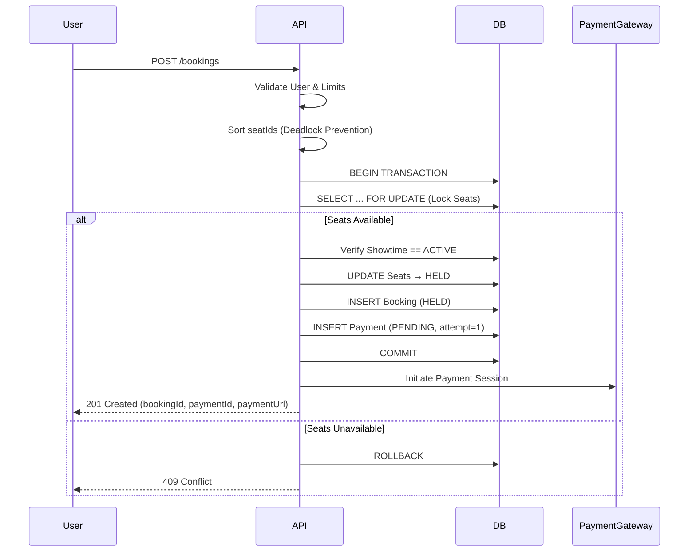
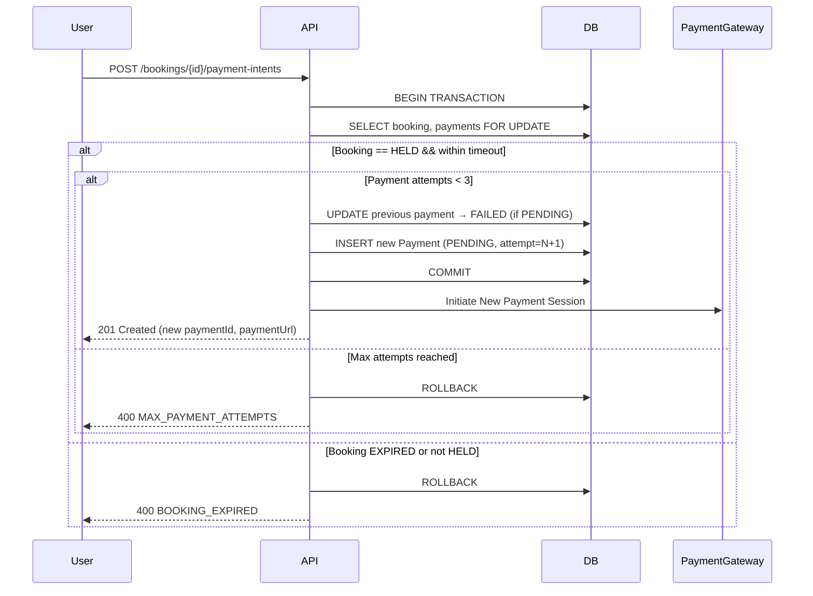
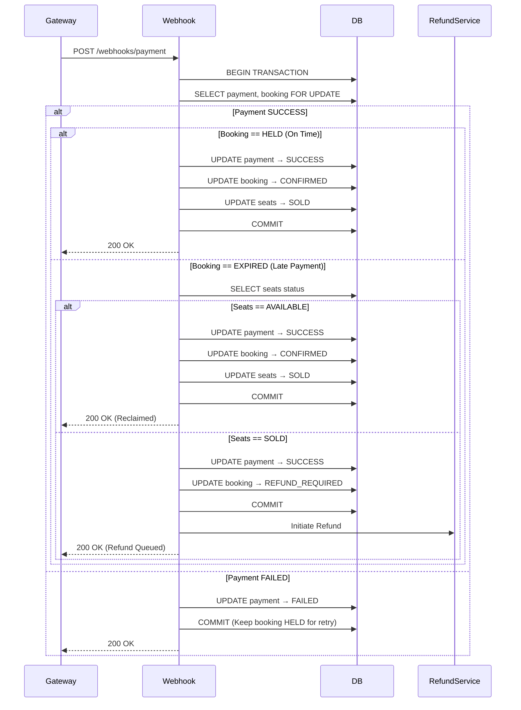
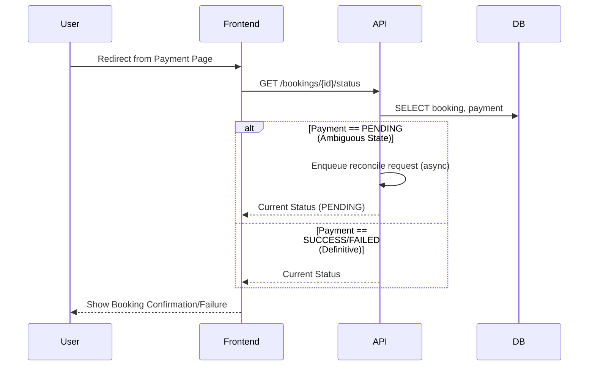
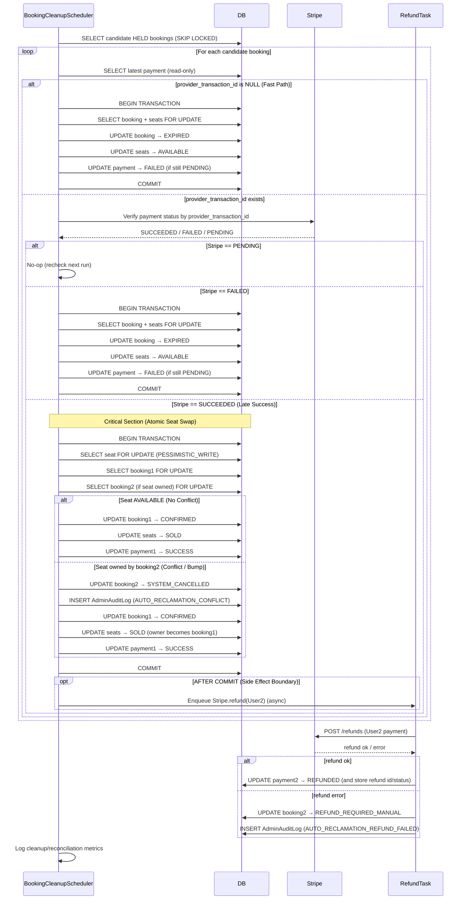
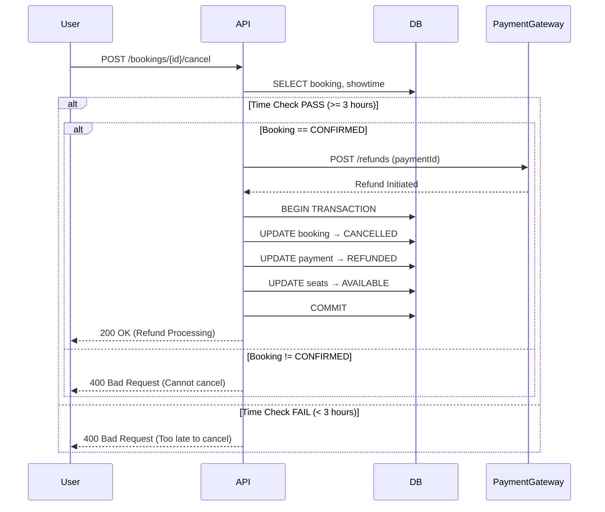
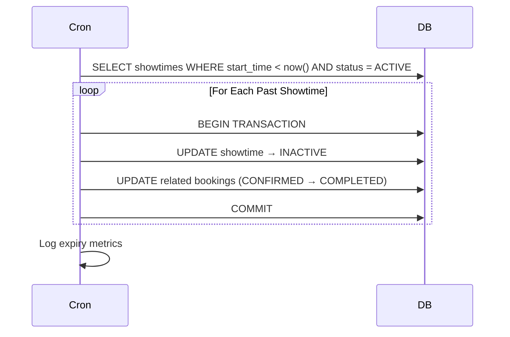
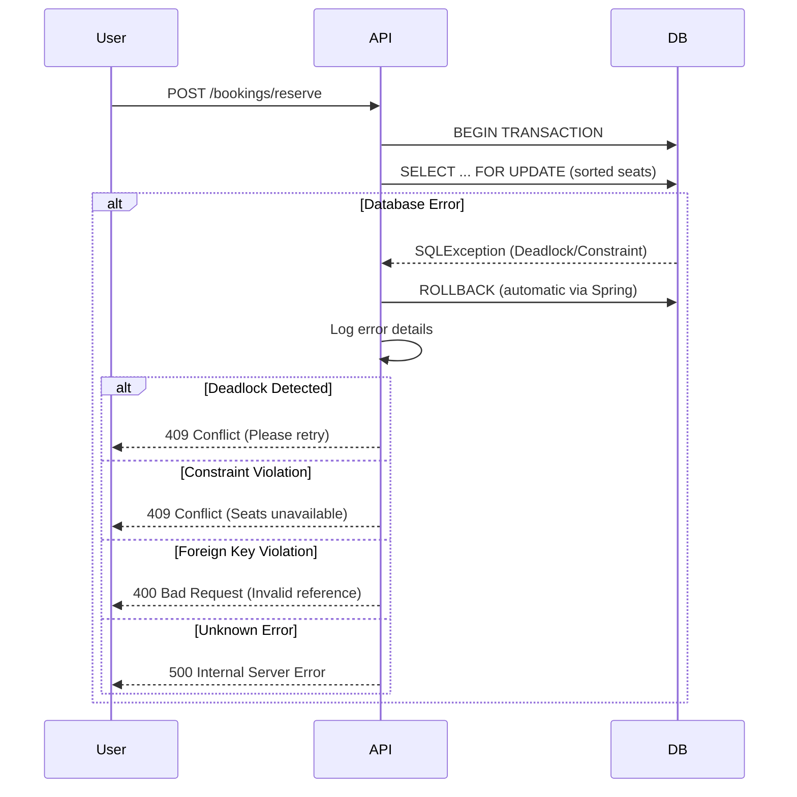
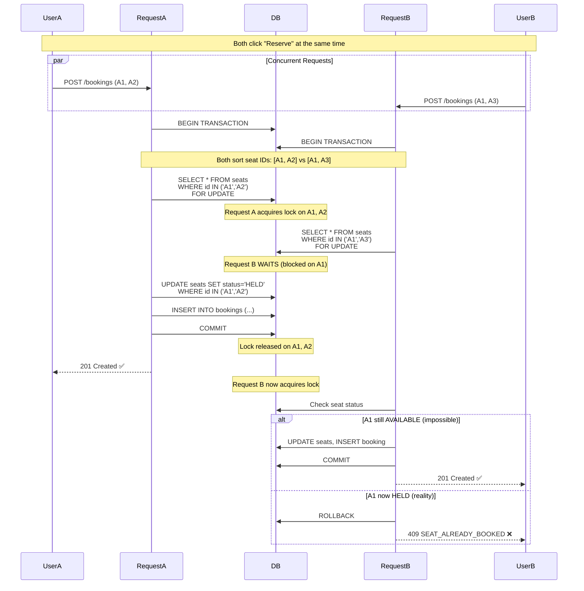

# TicketLedger: Sequence Flows

## 📋 Purpose

This document defines the **end-to-end transaction flows** for TicketLedger. Each flow represents a complete business operation from trigger to outcome, including both happy paths and failure scenarios.

### ✅ This file contains:
- API-triggered flows
- Asynchronous event flows
- Background job flows
- Transaction boundaries
- Error handling paths

### ❌ This file does NOT contain:
- State definitions (see `02_lifecycle_states.md`)
- Database schema details
- Implementation code
- Retry mechanisms

---

## 🎯 Flow Categories

| Category             | Flows        | Trigger Type              |
| -------------------- | ------------ | ------------------------- |
| **Core Transaction** | A, A.1, B, C | User API + Webhook + Cron |
| **Background Jobs**  | D, F         | Cron                      |
| **Refund & Cleanup** | E            | User API                  |
| **Error Handling**   | G            | System Exception          |
| **Concurrency**      | H            | Concurrent Requests       |

---

## 🔄 Core Transaction Flows

### Flow A: Reserve Seats (The Initiation)

**Trigger:** `POST /bookings`

**Input:**
```json
{
  "userId": "user123",
  "showtimeId": "show456",
  "seatIds": ["A1", "A2", "A3"]
}
```

**Purpose:** Lock seats, create booking with HELD status, initiate FIRST payment attempt

**Sequence:**



**Transaction Boundary:**
- **START:** `BEGIN TRANSACTION`
- **LOCKS:** `SELECT ... FOR UPDATE` on `seats` table (sorted by `seat_id`)
- **WRITES:**
  1. `UPDATE seats SET status = HELD` (Lock Acquisition - FIRST)
  2. `INSERT INTO bookings` (`status = HELD`, `locked_until = now() + 10 min`)
  3. `INSERT INTO payments` (`status = PENDING`, `attempt_number = 1`)
- **END:** `COMMIT` or `ROLLBACK`

**Validations:**
1. User exists and is active
2. Showtime exists and `status == ACTIVE`
3. All `seatIds` exist and `status == AVAILABLE`
4. User has not exceeded booking limits

**Outcome:**
- ✅ **Success:** Returns `bookingId`, `paymentId`, and `paymentUrl`
- ❌ **Failure:** `409 Conflict` (seats taken) or `400 Bad Request` (validation failure)

**Note:** If payment fails, user can retry via Flow A.1 without losing seat hold (if within 10 min window).

---

### Flow A.1: Retry Payment (The Retry)

**Trigger:** `POST /bookings/{id}/payment-intents`

**Input:**
```json
{
  "bookingId": "booking-uuid-123"
}
```

**Purpose:** Initiate NEW payment attempt for existing HELD booking after initial payment failure

**Business Context:**
- User reserved seats (Flow A)
- First payment attempt failed (card declined)
- Booking still HELD (within 10-minute window)
- User wants to try different payment method

**Sequence:**



**Transaction Boundary:**
- **START:** `BEGIN TRANSACTION`
- **LOCKS:** `SELECT ... FOR UPDATE` on `bookings` and `payments`
- **WRITES:**
  1. `UPDATE payments SET status = FAILED WHERE booking_id = ? AND status = PENDING`
  2. `INSERT INTO payments` (`status = PENDING`, `attempt_number = attempt_number + 1`)
- **END:** `COMMIT` or `ROLLBACK`

**Business Rules:**
- Maximum 3 payment attempts per booking
- Does NOT extend `locked_until` timestamp (original 10-min window remains)
- Only allowed when booking is `HELD`
- Seats remain locked during retry

**Key Difference from Flow A:**
- Flow A: Creates booking + first payment
- Flow A.1: Creates additional payment for existing booking
- Database supports 1:N relationship (bookings → payments)

**Outcome:**
- ✅ **Success:** New payment initiated, user redirected to payment gateway
- ❌ **Expired:** `400 BOOKING_EXPIRED` - seats already released
- ❌ **Max Attempts:** `400 MAX_PAYMENT_ATTEMPTS` - user must create new booking

---

### Flow B: Payment Webhook (The Resolution)

**Trigger:** Asynchronous Webhook from Payment Gateway

**Input:**
```json
{
  "paymentId": "pay789",
  "status": "SUCCESS" | "FAILED",
  "transactionId": "txn123",
  "timestamp": "2026-01-18T10:30:00Z"
}
```

**Sequence:**



**Transaction Boundary:**
- **START:** `BEGIN TRANSACTION`
- **LOCKS:** `SELECT ... FOR UPDATE` on `payments` and `bookings`
- **WRITES:**
  - `UPDATE payments SET status = SUCCESS/FAILED`
  - `UPDATE bookings SET status = CONFIRMED/REFUND_REQUIRED`
  - `UPDATE seats SET status = SOLD` (if applicable)
- **END:** `COMMIT`

**Decision Tree:**

| Payment Status | Booking Status | Seat Status | Action                                   |
| -------------- | -------------- | ----------- | ---------------------------------------- |
| `SUCCESS`      | `HELD`         | `HELD`      | Confirm booking → Seats `SOLD`           |
| `SUCCESS`      | `EXPIRED`      | `AVAILABLE` | Reclaim booking → Confirm + Seats `SOLD` |
| `SUCCESS`      | `EXPIRED`      | `SOLD`      | Mark `REFUND_REQUIRED` → Initiate refund |
| `FAILED`       | `HELD`         | `HELD`      | Update payment only (allow retry)        |
| `FAILED`       | `EXPIRED`      | N/A         | No action (already cleaned up)           |

**Idempotency:**
- Webhook endpoint must handle duplicate calls
- Check `payment.status` before processing
- Return `200 OK` if already processed

**Outcome:**
- ✅ **Success:** Booking confirmed or refund initiated
- ⚠️ **Late Success:** Seats reclaimed if available, else refunded
- ❌ **Failure:** Payment marked failed, booking remains `HELD`

---

### Flow C: User Redirect (DB-Only Status)

**Trigger:** User lands on `/booking-status?bookingId={id}`

**Purpose:** Provide a stable user-facing status without calling Stripe from read paths

**Sequence:**



**Polling Strategy:**
- Frontend polls every 2 seconds for up to 30 seconds
- After 30 seconds, show "Payment Processing" message
- Backend never blocks on Stripe for read endpoints (stability requirement)

**Transaction Boundary:**
- Read-only (no gateway calls). State convergence is achieved via webhook processing (Flow B) and background reconciliation (Flow D).

**Outcome:**
- ✅ **Sync Success:** User sees updated status immediately
- ⏳ **Pending:** User sees "Payment Processing" message
- ❌ **Timeout:** User advised to check email/contact support

---

### Flow D: Reliable Cleanup & Reclamation (Phase 2)

**Trigger:** Cron Job (Every 1 minute)

**Purpose:** Clean up expired holds, reconcile uncertain payments, and perform deterministic reclamation (“original payer wins”) without impacting read availability

**Sequence:**



**Transaction Boundary:**
- **Batch Size:** 100 bookings per run
- **Selection:** only includes bookings beyond threshold + **30s safety buffer**
- **Critical Section (Late Success):**
  - `BEGIN TRANSACTION`
  - `SELECT ... FOR UPDATE` on **seat** (first), then `booking1`, then `booking2` (stable order)
  - `UPDATE booking2 → SYSTEM_CANCELLED` (conflict case)
  - `INSERT admin_audit_log` inside the transaction (no “ghost swaps”)
  - `UPDATE booking1 → CONFIRMED` + `UPDATE seats → SOLD`
  - `COMMIT`
- **Async Side Effects:** Refund is executed **after commit** and updates DB status on completion/failure

**Query:**
```sql
SELECT id
FROM bookings
WHERE status = 'HELD'
  AND (
    (created_at < NOW() - INTERVAL '2 minutes 30 seconds')
    OR (locked_until < NOW() - INTERVAL '30 seconds')
  )
LIMIT 100
FOR UPDATE SKIP LOCKED;
```

**Outcome:**
- ✅ **Abandoned Holds:** Expired + seats released (fast path)
- ✅ **Late Success (No Conflict):** Seats reclaimed, booking confirmed
- ✅ **Late Success (Conflict):** User 2 bumped to `SYSTEM_CANCELLED`, User 1 confirmed, audit recorded; refund attempted asynchronously
- ⚠️ **Refund Debt:** User 2 marked `REFUND_REQUIRED_MANUAL` if refund fails
- 📊 **Metrics Logged:** Cleanup + reconciliation counts and error rates

---

## 💰 Refund & Cleanup Flows

### Flow E: User Cancellation (The Refund)

**Trigger:** `POST /bookings/{id}/cancel`

**Business Rule:** Cancellation allowed only if `showtime_start - current_time >= 3 hours`

**Sequence:**



**Transaction Boundary:**
- **START:** After successful refund initiation
- **LOCKS:** `SELECT ... FOR UPDATE` on booking and seats
- **WRITES:**
  - `UPDATE bookings SET status = CANCELLED, cancelled_at = now()`
  - `UPDATE payments SET status = REFUNDED`
  - `UPDATE seats SET status = AVAILABLE`
- **END:** `COMMIT`

**Validations:**
1. Booking exists and belongs to user
2. Booking status is `CONFIRMED`
3. Showtime start time is at least 3 hours away
4. Payment gateway accepts refund request

**Outcome:**
- ✅ **Success:** Refund initiated, seats freed
- ❌ **Too Late:** `400 Bad Request` with message
- ❌ **Invalid State:** `400 Bad Request` (cannot cancel non-confirmed booking)

**Refund Processing:**
- Gateway refund is asynchronous (3-7 business days)
- System immediately marks payment as `REFUNDED`
- User receives confirmation email

---

### Flow F: Showtime Expiry (The Gatekeeper)

**Trigger:** Cron Job (Every 1 hour) or Lazy Check on Booking Request

**Purpose:** Mark past showtimes as inactive and prevent new bookings

**Sequence:**



**Transaction Boundary:**
- **Per Showtime:**
  - `UPDATE showtimes SET status = INACTIVE`
  - `UPDATE bookings SET status = COMPLETED WHERE showtime_id = ? AND status = CONFIRMED`

**Query:**
```sql
SELECT id 
FROM showtimes 
WHERE start_time < NOW() 
  AND status IN ('ACTIVE', 'PAUSED')
LIMIT 50;
```

**Seat State:**
- **No explicit seat transition needed**
- Reliance on `showtime.status` check during booking validation
- `SOLD` seats remain `SOLD` (historical record)
- `AVAILABLE` seats become unbookable via showtime guard

**Lazy Check (Performance Optimization):**
```java
// In Reserve Seats Flow (Flow A)
if (showtime.getStatus() == ACTIVE && showtime.getStartTime().isBefore(now())) {
    throw new ShowtimeExpiredException("Showtime has ended");
}
```

**Outcome:**
- ✅ **Showtime Closed:** No new bookings accepted
- 📊 **Bookings Completed:** Lifecycle ended for confirmed bookings
- ⚡ **Performance:** No enum needed, single status check sufficient

---

## 🚨 Error Handling Flows

### Flow G: Transaction Failure (The Safety Net)

**Trigger:** Database Deadlock or Constraint Violation during Reserve

**Common Scenarios:**
1. **Deadlock:** Two users reserve overlapping seats in different order
2. **Unique Constraint Violation:** Duplicate booking attempt
3. **Foreign Key Violation:** Invalid `showtime_id` or `user_id`
4. **Optimistic Locking Failure:** Concurrent seat update

**Sequence:**



**Error Classification:**

| Exception Type                     | HTTP Status               | User Message                 | Action                 |
| ---------------------------------- | ------------------------- | ---------------------------- | ---------------------- |
| `DeadlockLoserDataAccessException` | `409 Conflict`            | "Seats locked, please retry" | Retry with backoff     |
| `DataIntegrityViolationException`  | `409 Conflict`            | "Seats no longer available"  | Select different seats |
| `ConstraintViolationException`     | `400 Bad Request`         | "Invalid booking data"       | Fix input              |
| `TransactionTimedOutException`     | `503 Service Unavailable` | "Service busy, retry"        | Retry after delay      |
| Generic `SQLException`             | `500 Internal Error`      | "System error"               | Contact support        |

**Rollback Guarantees:**
- Spring `@Transactional` ensures automatic rollback on exception
- No orphaned locks (`FOR UPDATE` released on rollback)
- No partial writes (all-or-nothing)

**Logging:**
```java
log.error("Booking reservation failed", 
    Map.of(
        "userId", userId,
        "showtimeId", showtimeId,
        "seatIds", seatIds,
        "errorType", e.getClass().getSimpleName(),
        "errorMessage", e.getMessage()
    )
);
```

**Retry Strategy (Client-Side):**
1. **Deadlock:** Exponential backoff (100ms, 200ms, 400ms)
2. **Constraint Violation:** No retry (show error)
3. **Timeout:** Linear backoff (1s, 2s, 3s)

**Outcome:**
- ✅ **Clean Failure:** No side effects, safe to retry
- 📋 **Detailed Logging:** Error traced and monitored
- 🔒 **No Orphaned Locks:** Database state consistent

---

## � Concurrency Control Flows

### Flow H: Concurrent Seat Reservation (The Race Condition)

**Trigger:** Two users attempt to book the same seat(s) simultaneously

**Purpose:** Demonstrate database-level locking prevents double-booking

**Business Context:** When concurrent requests target overlapping seat inventory, the system must ensure only one booking succeeds while maintaining data consistency and preventing deadlocks.

**Scenario:** User A and User B both attempt to book Seat A1 simultaneously

**Sequence:**



**Critical Implementation Details:**

1. **Sorted Lock Acquisition (Deadlock Prevention):**
```java
// ALWAYS sort seat IDs before locking
List<String> sortedSeatIds = seatIds.stream()
    .sorted()
    .collect(Collectors.toList());

// Query uses sorted list
SELECT * FROM seats 
WHERE id IN (?, ?, ?) -- sorted parameters
FOR UPDATE;
```

**Why Sort?**
- Request A: Wants [A3, A1] → Sorted to [A1, A3]
- Request B: Wants [A1, A2] → Sorted to [A1, A2]
- Both lock A1 first → No circular wait → No deadlock

2. **FOR UPDATE Behavior:**
```sql
-- PostgreSQL lock modes
SELECT ... FOR UPDATE;          -- Exclusive lock, blocks all other FOR UPDATE
SELECT ... FOR UPDATE NOWAIT;   -- Fails immediately if locked (alternative)
SELECT ... FOR UPDATE SKIP LOCKED; -- Skips locked rows (not suitable for bookings)
```

**We use FOR UPDATE (blocking) because:**
- User expects "first-come, first-served" fairness
- `NOWAIT` would force client-side retry loops
- `SKIP LOCKED` would silently skip requested seats (data integrity violation)

3. **Lock Holding Time:**
```
Lock Acquisition → Seat Update → Booking Insert → COMMIT
Total: ~10-50ms (single-datacenter)
```

**Transaction Isolation Level:**
```sql
SET TRANSACTION ISOLATION LEVEL READ COMMITTED;  -- Default
```

- `READ COMMITTED` is sufficient (we use explicit locks)
- `SERIALIZABLE` would be overkill (performance penalty)

**Edge Cases Handled:**

| Scenario                             | Outcome                                  |
| ------------------------------------ | ---------------------------------------- |
| 3+ concurrent requests for same seat | Queued serially, first wins, others fail |
| Deadlock (circular wait)             | Prevented by sorted lock acquisition     |
| Request A crashes before COMMIT      | Postgres auto-rollback, lock released    |
| Request B timeout while waiting      | Connection pool timeout → 503 error      |

**Concurrency Properties:**

The system handles concurrent booking requests using PostgreSQL's `SELECT ... FOR UPDATE` pessimistic locking. When multiple requests target the same seats:

1. **Lock Acquisition:** First request to acquire row-level lock proceeds immediately
2. **Blocking:** Subsequent requests wait for lock release (typically <50ms)
3. **Validation:** Upon lock acquisition, request validates seat availability
4. **Resolution:** If seat is unavailable (HELD/SOLD), transaction rolls back with 409 Conflict

**Deadlock Prevention:** Sorting seat IDs before locking ensures consistent lock acquisition order across all requests, eliminating circular wait conditions.

**Outcome:**
- ✅ **Correctness:** Only one booking succeeds (no double-booking)
- ✅ **Performance:** Minimal lock holding time (~25ms)
- ✅ **Fairness:** First request to acquire lock wins
- ✅ **No Deadlocks:** Sorted lock acquisition guarantees

---

## 🎓 Design Principles

1. **Atomic Transitions:** All state changes within transaction boundaries
2. **Sorted Locking:** Prevents deadlocks via consistent lock ordering
3. **Idempotent Webhooks:** Safe to replay without side effects
4. **Graceful Degradation:** Sync checks compensate for async delays
5. **Clean Failures:** Rollbacks guarantee no partial state
6. **Performance Over Enums:** Showtime status check > seat state enums
7. **Explicit Boundaries:** Every flow documents transaction scope

---

## 🔍 Cross-Reference

- **State Definitions:** See `lifecycle_states.md`
- **API Contracts:** See `api_contracts.md` (future)
- **Database Schema:** See `database_schema.md` (future)
- **Error Catalog:** See `error_handling.md` (future)
