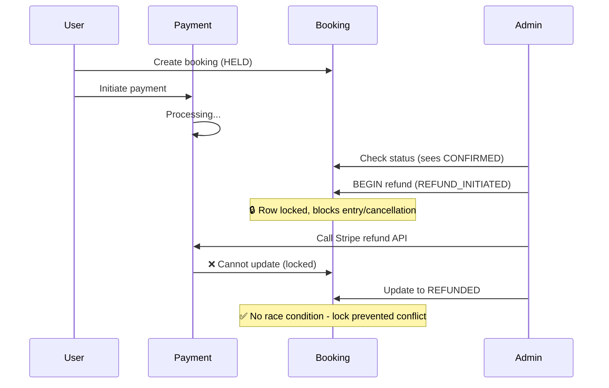
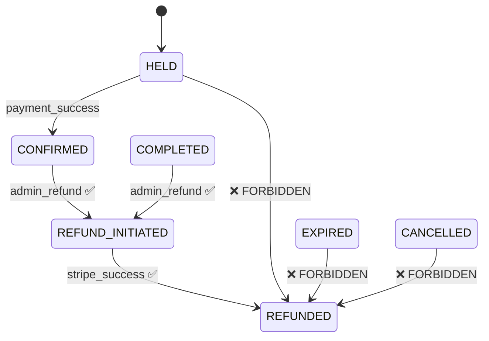
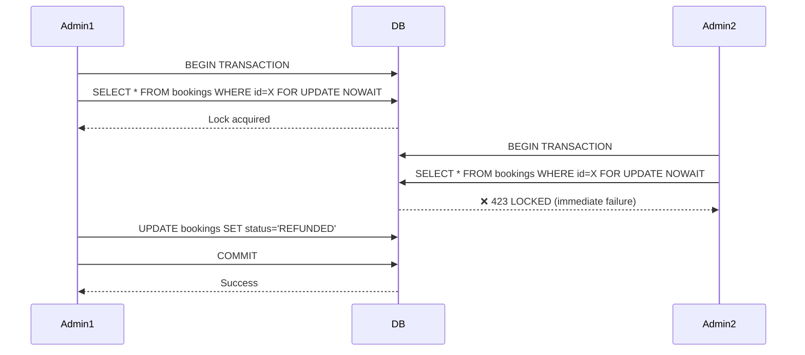
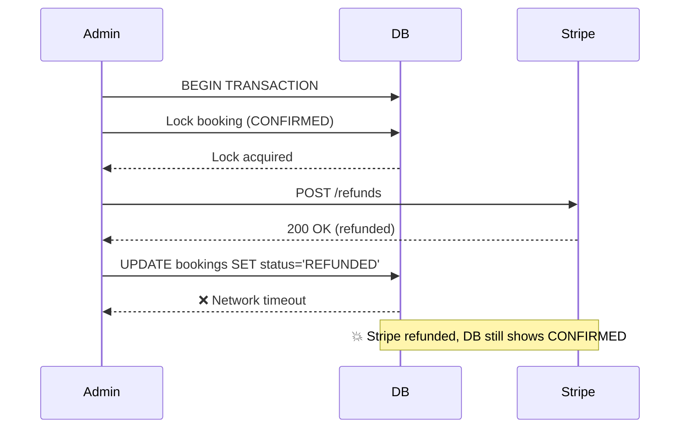
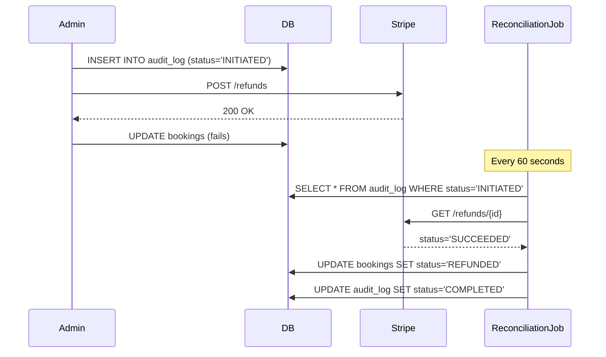
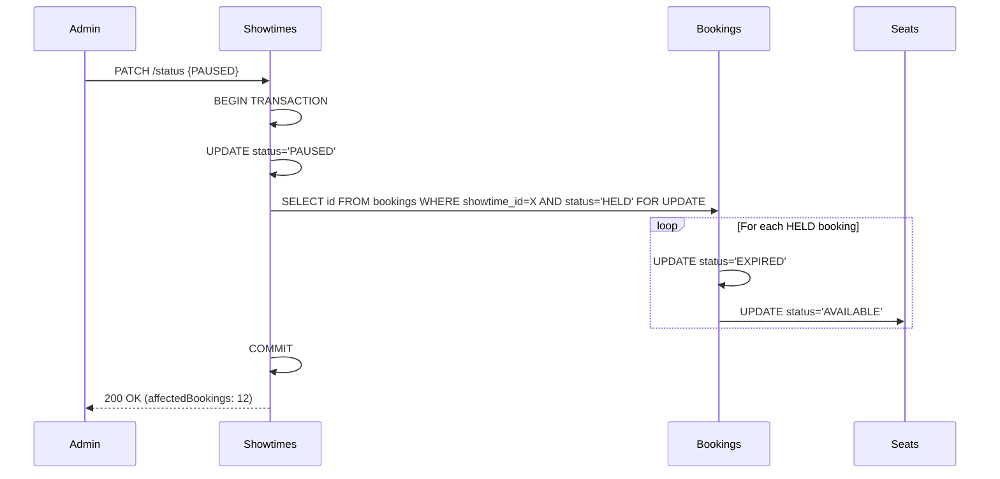

# TicketLedger: Admin Workflows & Privileged Operations

## 📋 Purpose

This document defines the **consistency guarantees and transaction safety** for admin-initiated operations. Admin workflows require stronger isolation because they involve privileged write access to financial state.

### ✅ This file contains:
- Admin operation types and constraints
- Concurrency control mechanisms
- State transition rules for privileged operations
- Compensating transaction patterns
- Audit trail requirements

### ❌ This file does NOT contain:
- API endpoint definitions (see `05_api_contracts.md`)
- Implementation code
- UI/frontend logic
- Authorization/RBAC policies

---

## 🎯 The Core Problem

**Question:** How do we prevent an Admin from refunding a booking that is currently being paid for by a user?

**Challenge:** Admin operations are **privileged writes** that can corrupt financial state if they race with user transactions.

### The Race Condition



### Failure Modes

| Failure              | Description                                                       | Impact                  |
| -------------------- | ----------------------------------------------------------------- | ----------------------- |
| **Lost Update**      | Admin refund overwrites concurrent payment confirmation           | Financial inconsistency |
| **Phantom Read**     | Admin sees HELD state, payment commits to CONFIRMED before refund | Duplicate charge        |
| **Premature Refund** | Admin refunds before payment settlement completes                 | Stripe error            |
| **Double Refund**    | Two admins process same refund concurrently                       | Negative balance        |

---

## 🔒 Consistency Guarantees

### 1. State Machine Enforcement

**Rule:** Admin operations MUST respect booking lifecycle constraints.



**Valid Admin Refund States:** `CONFIRMED`, `COMPLETED`  
**Transient Lock State:** `REFUND_INITIATED` (row locked during Stripe call)  
**Terminal State:** `REFUNDED` (funds returned)

**Rationale:**  
- **REFUND_INITIATED** prevents race conditions by locking the booking while calling external payment gateway
- Blocks concurrent admin refunds, user cancellations, and entry scans during refund processing
- Only moves to `REFUNDED` after Stripe confirms successful refund
- Cannot refund HELD (not yet paid), EXPIRED (already cleaned up), or CANCELLED bookings

---

### 2. Pessimistic Locking

**Mechanism:** `SELECT ... FOR UPDATE NOWAIT`

**Purpose:** Serialize access to booking records during admin operations to prevent concurrent modifications.



**Key Design Decisions:**

| Decision       | Rationale                                                             |
| -------------- | --------------------------------------------------------------------- |
| `NOWAIT`       | Fail fast instead of blocking (admin gets immediate feedback)         |
| Row-level lock | Only lock specific booking (doesn't block other bookings)             |
| Explicit lock  | Prevent optimistic locking failures under concurrent admin operations |

---

### 3. Idempotency for Admin Actions

**Requirement:** All admin operations MUST be idempotent using `Idempotency-Key` header.

**Key Format:**
```
admin-refund:{bookingId}:admin-{adminId}:ts-{timestamp}
```

**Cache Structure:**
```
idempotency:admin:{adminId}:{idempotencyKey} → {statusCode, responseBody, expiresAt}
TTL: 24 hours
```

**Behavior:**

| Scenario                       | Response                                    |
| ------------------------------ | ------------------------------------------- |
| Same key, same body            | Return cached response (200 OK)             |
| Same key, different body       | Reject with `409 IDEMPOTENCY_CONFLICT`      |
| Network retry (same operation) | Safe replay (no duplicate refund in Stripe) |

---

### 4. Compensating Transactions

**Problem:** External payment gateway succeeds, but database update fails.



**Solution: Audit Log + Reconciliation**



**Recovery Strategy:**

1. **Write-Ahead Audit Log:** Record intent before calling Stripe
2. **Reconciliation Job:** Poll incomplete audit logs every 60 seconds
3. **Query Stripe:** Check actual refund status
4. **Synchronize State:** If Stripe succeeded, force-update DB to `REFUNDED`

---

## 👨‍💼 Admin Operation Types

### Operation 1: Manual Refund

**Trigger:** Admin explicitly refunds a confirmed booking.

**Constraints:**
- Booking must be in `CONFIRMED` or `COMPLETED` state
- Must provide audit reason (min 10 chars)
- Requires `Idempotency-Key` header

**Pre-Flight Authorization:**
```
0. Theater Scope Validation (No Locks Acquired)
   - Resolve booking → showtime → screen → theater
   - Query admin_theater_access: admin has access to theater?
   - If NO: Return 403 FORBIDDEN immediately (no DB locks acquired)
   - If YES: Proceed to transaction
```

**Transaction Boundary:**
```
BEGIN TRANSACTION (Isolation: SERIALIZABLE)
  1. Lock booking (SELECT ... FOR UPDATE NOWAIT)
  2. Validate state (must be CONFIRMED or COMPLETED)
  3. Update booking status to REFUND_INITIATED
  4. Create audit log entry (INITIATED)
COMMIT

-- Outside transaction (external call)
  5. Call Stripe refund API

-- If Stripe succeeds:
BEGIN TRANSACTION
  6. Update booking status to REFUNDED
  7. Update seats to AVAILABLE
  8. Update audit log entry (COMPLETED)
COMMIT

-- If Stripe fails:
BEGIN TRANSACTION
  6. Rollback booking status to CONFIRMED
  7. Update audit log entry (FAILED)
COMMIT
```

**Failure Handling:**

| Failure Point      | Action                                                |
| ------------------ | ----------------------------------------------------- |
| Theater access     | Return `403 THEATER_ACCESS_DENIED` (immediate)        |
| Lock acquisition   | Return `423 LOCKED` (retry after 30s)                 |
| State validation   | Return `409 INVALID_STATE_TRANSITION`                 |
| Stripe API failure | Rollback transaction, no compensation needed          |
| DB update failure  | Schedule reconciliation job to sync state from Stripe |

---

### Operation 2: Showtime Pause (Kill Switch)

**Trigger:** Admin pauses a showtime (emergency shutdown).

**Behavior:** Atomically expire all `HELD` bookings and release seats.

**Pre-Flight Authorization:**
```
0. Theater Scope Validation (No Locks Acquired)
   - Resolve showtime → screen → theater
   - Query admin_theater_access: admin has access to theater?
   - If NO: Return 403 FORBIDDEN immediately (no DB locks acquired)
   - If YES: Proceed to transaction
```

**Transaction Flow:**



**Atomicity Guarantee:**
- All updates occur in a **single transaction**
- If any step fails, entire operation rolls back
- No partial state (either all bookings expire or none)

**Use Cases:**
- Theater technical failure
- Show cancellation by distributor
- Capacity reduction due to emergency

---

## 📊 Audit Trail Requirements

### Audit Log Schema

```
admin_audit_log:
  - id (UUID, PK)
  - booking_id (UUID, FK)
  - admin_user_id (UUID, FK)
  - action (ENUM: REFUND, PAUSE_SHOWTIME, FORCE_EXPIRE)
  - previous_state (VARCHAR)
  - new_state (VARCHAR)
  - reason (TEXT, required)
  - idempotency_key (VARCHAR, UNIQUE)
  - provider (VARCHAR, nullable)
  - provider_refund_id (VARCHAR, nullable)
  - status (ENUM: INITIATED, COMPLETED, FAILED)
  - created_at (TIMESTAMP)
  - completed_at (TIMESTAMP, nullable)
```

**Purpose:**

| Purpose            | Benefit                                                 |
| ------------------ | ------------------------------------------------------- |
| **Forensics**      | Trace every admin action for financial audit            |
| **Idempotency**    | Prevent duplicate operations via unique key             |
| **Reconciliation** | Detect orphaned operations (INITIATED but no COMPLETED) |
| **Accountability** | Immutable log of who did what and when                  |

---

## 🛠️ Implementation Guidelines

### When to Use AdminAuditLog?

Use `AdminAuditLogService` ONLY for operations that:

1. **Mutate Financial State**: Refunds, Cancellations, Price changes.
2. **Disrupt Availability**: Pausing showtimes, locking theaters, blocking seats.
3. **Bypass Standard Rules**: Overrides, manual entry.

**Do NOT use for:**

- Read-only operations (Viewing reports).
- Standard user flows (User booking a ticket).
- System background tasks (Scheduled cleanup).

### Developer Checklist

Before implementing a new admin operation, verify:

- [ ] Does this operation require a `PESSIMISTIC_WRITE` lock?
- [ ] Is there an `Idempotency-Key` header in the API contract?
- [ ] Is the `reason` field mandatory (user-facing explanation)?
- [ ] Does success/failure need reconciliation (async external call)?

### Examples

**✅ REQUIRES Audit Log:**

- Admin refunds booking → Financial mutation + External API call
- Admin pauses showtime → Availability disruption + Expires HELD bookings
- Admin overrides seat lock → Bypasses business rules

**❌ DOES NOT Require Audit Log:**

- Admin views booking list → Read-only query
- Admin exports sales report → No state mutation
- Cron job expires bookings → System automation (not privileged)

---

## ⚡ Performance Considerations

### Does Locking Hurt Throughput?

**No.** Admin operations are low-frequency (1-2% of traffic).

**Benchmark Expectations:**

| Operation      | Frequency | Latency (p99) | Lock Duration | Impact on Users |
| -------------- | --------- | ------------- | ------------- | --------------- |
| User Payment   | 500 req/s | 300ms         | 50ms          | Primary traffic |
| Admin Refund   | 10 req/s  | 800ms         | 200ms         | Negligible      |
| Showtime Pause | 1 req/hr  | 1200ms        | 500ms         | One-time event  |

**Why Admin Latency is Higher:**
1. Stripe round-trip (2x: refund + verify)
2. Audit log writes
3. Pessimistic lock wait for commit

**Trade-off:** Correctness > Speed for privileged operations.

---

## 🔍 Edge Cases

### Case 1: Admin Attempts to Refund HELD Booking

**Rule:** **Forbidden.**  
**Rationale:** User hasn't paid yet. Refunding creates negative balance.  
**Response:** `409 INVALID_STATE_TRANSITION`  
**Correct Action:** Admin should cancel (not refund) HELD bookings.

**State Guard:**
```
if (booking.status == HELD || booking.status == EXPIRED) {
    throw InvalidStateTransitionException(
        "Cannot refund booking in state: " + booking.status
    );
}
```

---

### Case 2: Partial Refunds

**Scenario:** Admin refunds $50 on a $100 booking.

**Implementation Strategy:**
- Track `total_amount` and `refunded_amount` separately
- Allow multiple partial refunds until `refunded_amount == total_amount`
- Enforce constraint: `refunded_amount <= total_amount`

**State Transition:**
- Booking remains `CONFIRMED` after partial refund
- Transitions to `REFUNDED` only when fully refunded

---

### Case 3: Concurrent Admin Actions

**Scenario:** Two admins refund same booking simultaneously.

**Protection:** Database unique constraint on `idempotency_key` in audit log.

**Outcome:**
- First admin: Lock acquired → Refund succeeds
- Second admin: `423 LOCKED` → Retry with exponential backoff

---

## 🔍 Cross-Reference

- **State Machines:** See `02_lifecycle_states.md`
- **API Contracts:** See `05_api_contracts.md`
- **Sequence Flows:** See `03_sequence_flows.md`
- **Error Handling:** See `06_error_handling.md`

---

## ✅ Design Checklist

- [x] State machine constraints enforced
- [x] Pessimistic locking with NOWAIT
- [x] Idempotency for all admin operations
- [x] Compensating transactions for external failures
- [x] Audit trail for accountability
- [x] Atomic batch operations (showtime pause)
- [x] Clear error responses for conflicts
- [x] Performance impact analyzed and acceptable
