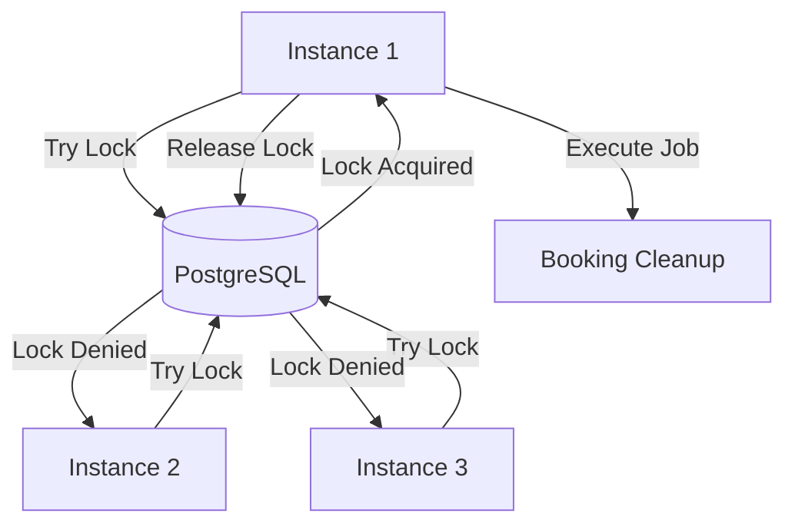

# 012 Distributed Locking Strategy

## 📋 Purpose
To ensure background jobs (Schedulers) execute **at most once** across the entire cluster, preventing race conditions and data corruption in a multi-node environment.

## 🛑 The Problem
In a horizontal scaling scenario (e.g., 3 instances of TicketLedger running behind a Load Balancer), standard Spring `@Scheduled` methods run on **every instance** simultaneously.

**Risks:**
- **Double Refunds:** Two nodes pick up the same "Failed Payment" and refund it twice.
- **Race Conditions:** Two nodes try to release the same "Expired Hold" simultaneously.
- **Database Locking Storms:** Multiple nodes hammering the DB for the same cleanup query.

## 🛠️ The Solution: ShedLock
We use **ShedLock** with a **PostgreSQL (JDBC)** provider. This uses a dedicated database table as a centralized mutex.

### Architecture



### Schema

The `shedlock` table manages the locks.

```sql
CREATE TABLE shedlock (
    name VARCHAR(64) NOT NULL,
    lock_until TIMESTAMP NOT NULL,
    locked_at TIMESTAMP NOT NULL,
    locked_by VARCHAR(255) NOT NULL,
    PRIMARY KEY (name)
);

```

## ⚙️ Configuration Standards

| Parameter | Value | Reason |
| --- | --- | --- |
| **`lockAtLeastFor`** | `30s` | **Prevents Clock Skew.** Ensures the lock is held for a minimum time, even if the task finishes in 1ms. prevents a generic "fast flickering" node from running the job multiple times if clocks are slightly out of sync. |
| **`lockAtMostFor`** | `10m` | **Safety Net.** If a node crashes while holding the lock, it is automatically released after 10 minutes so other nodes can take over. |

## 📦 Usage Pattern

Annotate scheduled tasks with `@SchedulerLock`.

```java
@Scheduled(cron = "0 * * * * *") // Run every minute
@SchedulerLock(
    name = "BookingCleanupScheduler_cleanupExpiredBookings", 
    lockAtLeastFor = "30s", 
    lockAtMostFor = "10m"
)
public void cleanupExpiredBookings() {
    // ... logic
}

```

## 🚨 Operational Failure Modes

1. **Lock Table Contention:** Minimal, as writes only happen once per job execution (e.g., once per minute).
2. **Zombie Locks:** If a job hangs forever (e.g., infinite loop), the lock is released after `10m`. The job will be retried by another node in the next cycle.
3. **Clock Drift:** `lockAtLeastFor` mitigates minor clock differences between nodes.

## 📝 Compliance Checklist

* [ ] Dependency `shedlock-spring` added.
* [ ] Dependency `shedlock-provider-jdbc-template` added.
* [ ] Migration `V4__add_shedlock.sql` applied.
* [ ] `SchedulerConfig` enabled with `@EnableSchedulerLock`.

