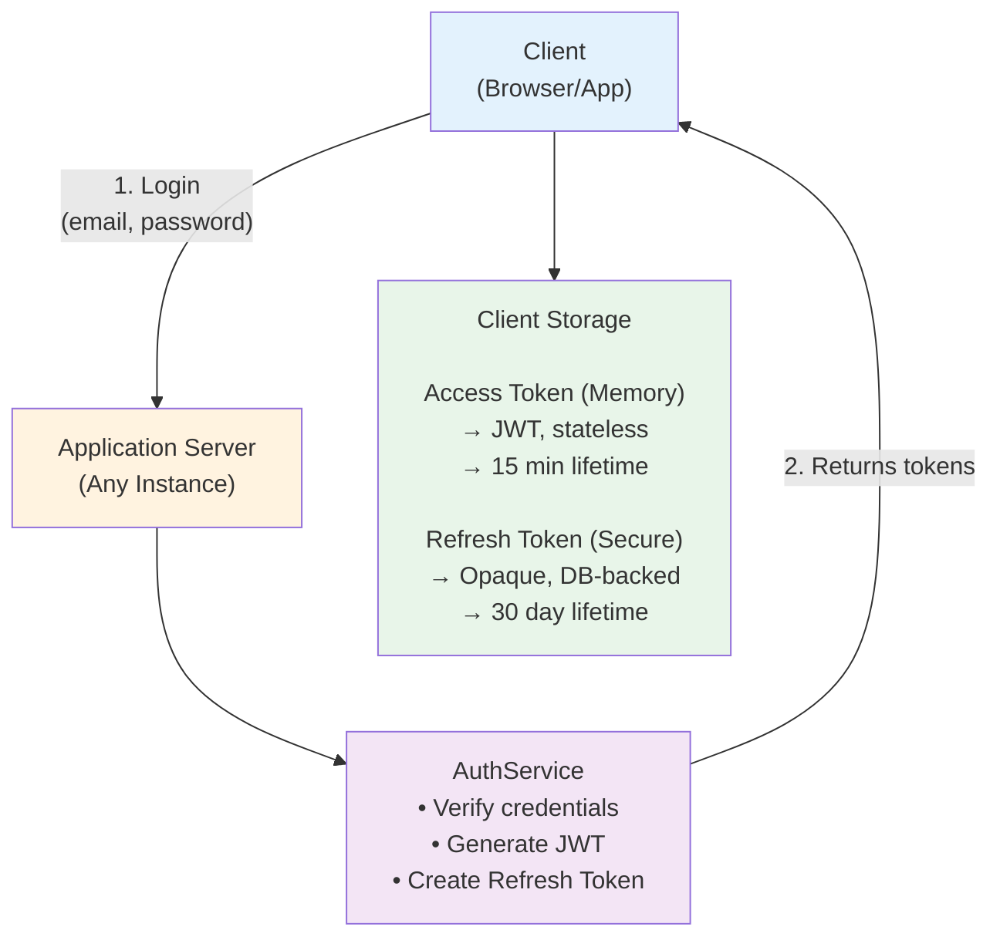
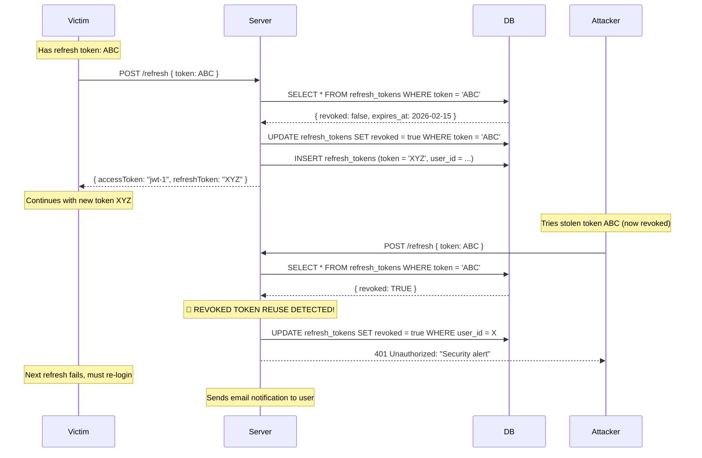

# TicketLedger: Authentication Strategy

## 📋 Purpose

This document explains the **authentication and authorization decisions** for TicketLedger. It answers fundamental questions about why we chose stateless JWT authentication combined with database-backed refresh tokens.

### ✅ This file contains:
- Context: Why stateless authentication?
- Decision: JWT for access + Opaque token for refresh
- Security rationale: Token rotation strategy
- Trade-offs: Performance vs security analysis
- Token lifecycle flows

### ❌ This file does NOT contain:
- Implementation details (see code in `security/` package)
- API contracts (see `05_api_contracts.md`)
- Database schema for `refresh_tokens` (see `04_database_schema.md`)

---

## 🎯 Context: Why Stateless Authentication?

### The Problem

**Traditional Session-Based Auth (Stateful)**
```
Client → Login → Server creates session → Session stored in DB/Redis
Client → Protected endpoint → Server queries session store → Validates
```

**Issues:**
1. **Scalability bottleneck:** Every request hits session store (DB/Redis)
2. **Horizontal scaling complexity:** Requires sticky sessions or shared session storage
3. **Memory overhead:** Active sessions consume server memory
4. **Microservices hostile:** Session state doesn't distribute well across services

### Our Requirements

| Requirement                | Priority | Rationale                                                |
| -------------------------- | -------- | -------------------------------------------------------- |
| **Horizontal scalability** | Critical | Must support multiple app instances behind load balancer |
| **Low latency**            | High     | Ticket booking is time-sensitive (10-min hold window)    |
| **Stateless API**          | High     | RESTful principles, easier caching                       |
| **Revocation capability**  | Medium   | Security: logout, password change must invalidate tokens |
| **Multi-device support**   | Medium   | User can login from web + mobile simultaneously          |

### The Decision: Hybrid Stateless/Stateful

**Solution:** JWT (stateless) for most requests + Database-backed refresh tokens (stateful) for rotation



---

## 🔐 Decision: JWT for Access + Opaque Reference Token for Refresh

### Why Two Token Types?

| Token Type      | Access Token (JWT)     | Refresh Token (Opaque)          |
| --------------- | ---------------------- | ------------------------------- |
| **Purpose**     | Authorize API requests | Obtain new access token         |
| **Storage**     | In-memory (client)     | Secure storage + Database       |
| **Lifetime**    | Short (15 minutes)     | Long (30 days dev, 7 days prod) |
| **Stateless?**  | ✅ Yes (self-contained) | ❌ No (DB lookup required)       |
| **Revocable?**  | ❌ No (until expiry)    | ✅ Yes (DB flag)                 |
| **Transmitted** | Every API call         | Only on `/refresh` endpoint     |
| **Size**        | ~200-400 bytes (JWT)   | 43 bytes (Base64 encoded)       |

### Access Token: JWT (Stateless)

**Structure:**
```
Header.Payload.Signature
```

**Payload Example:**
```json
{
  "sub": "user@example.com",  // Subject (user identifier)
  "iat": 1737283200,           // Issued at
  "exp": 1737284100            // Expires at (15 min later)
}
```

**Why JWT for Access Tokens?**

✅ **Stateless validation:** Server verifies signature without DB lookup
- Parse JWT → Verify HMAC-SHA256 signature → Check expiry → Done
- **Zero database calls** for 99% of requests

✅ **Low latency:** Cryptographic validation is ~0.1ms vs 5-10ms DB query

✅ **Horizontal scaling:** Any server instance can validate JWT independently

✅ **Standard format:** Widespread library support (jjwt, nimbus-jose-jwt)

❌ **Cannot revoke before expiry:** Acceptable trade-off with short TTL (15 min)

**Security Properties:**
- Signature prevents tampering (HMAC-SHA256)
- Short expiry limits stolen token damage (15 min window)
- No sensitive data in payload (email only, not password/PII)

### Refresh Token: Opaque Reference (Stateful)

**Structure:**
```
43-character Base64 URL-safe string
Example: "aH8kL9mN3pQ5rT7vX2zB4dF6gJ8kL0mN3pQ5rT7vX2"
```

**Generation:**
```java
// 32 random bytes → Base64 URL encoding = 43 chars
byte[] randomBytes = new byte[32];
secureRandom.nextBytes(randomBytes);
String token = Base64.getUrlEncoder().withoutPadding().encodeToString(randomBytes);
```

**Why Opaque Tokens for Refresh?**

✅ **Revocable:** Single UPDATE query invalidates token
```sql
UPDATE refresh_tokens SET revoked = TRUE WHERE token = ?;
```

✅ **Rotation-friendly:** Old token invalidated, new token issued (see below)

✅ **Database audit trail:** Track all refresh events per user

✅ **Secure random:** `SecureRandom` provides cryptographically strong entropy

❌ **DB lookup required:** Acceptable because `/refresh` is infrequent (every 15 min max)

**Why Not Store JWT in Database?**
- JWT payload is large (~200 bytes) vs opaque token (~43 bytes)
- JWT structure adds unnecessary complexity for reference token
- Opaque tokens are more efficient for DB indexing

---

## 🛡️ Security: Token Rotation Strategy

### The Attack: Refresh Token Theft

**Scenario:** Attacker steals refresh token (e.g., XSS, browser debug tools, device theft)

**Without Rotation:**
```
Attacker → Uses stolen refresh token → Gets new access token
Victim   → Uses same refresh token    → Gets new access token
⚠️ Both continue indefinitely (30 days!)
```

**With Rotation:**
```
Victim   → Uses refresh token (token-ABC)  → Gets new access token + token-XYZ
         → Old token-ABC is REVOKED in DB

Attacker → Uses stolen token-ABC           → ⚠️ SECURITY ALERT!
         → Server detects revoked token
         → Revokes ALL user's refresh tokens
         → Forces re-login on all devices
```

### How Rotation Prevents Reuse Attacks

**Implementation:**
```java
@Transactional
public AuthResponse refresh(RefreshTokenRequest request) {
    String incomingToken = request.refreshToken();
    
    // 1. Find token in DB
    var refreshToken = findByToken(incomingToken)
        .orElseThrow(() -> new RuntimeException("Token not found"));
    
    // 2. CRITICAL: Detect reuse of revoked token
    if (refreshToken.isRevoked()) {
        revokeAllUserTokens(refreshToken.getUser());  // 🔥 Nuclear option
        throw new SecurityException("Token reuse detected!");
    }
    
    // 3. Verify expiry
    if (refreshToken.getExpiresAt().isBefore(Instant.now())) {
        throw new RuntimeException("Token expired");
    }
    
    // 4. Token Rotation: Revoke old, issue new
    refreshToken.setRevoked(true);            // Mark old as used
    save(refreshToken);
    
    var newAccessToken = generateJWT(user);
    var newRefreshToken = createRefreshToken(user);  // Generate new
    
    return new AuthResponse(newAccessToken, newRefreshToken);
}
```

### Attack Timeline: Stolen Token Detection



### Security Properties

**Token rotation provides:**
- **Forward secrecy:** New token issued invalidates previous token
- **Revocation detection:** Reuse of invalidated token triggers security response
- **Theft detection:** Either legitimate user or attacker will trigger alarm on next refresh
- **Cascade revocation:** Single compromised token can trigger revocation of all user sessions

---

## ⚖️ Trade-off: Database Hit on Every /refresh Call

### The Cost

**With Refresh Tokens:**
```
Client → POST /refresh → 3 DB queries:
  1. SELECT refresh_tokens WHERE token = ?  (indexed, ~2ms)
  2. UPDATE refresh_tokens SET revoked = true
  3. INSERT refresh_tokens (new token)
```

### Why This Is Acceptable

- **Infrequent:** Only on access token expiry (15 min intervals)
- **Indexed query:** `refresh_tokens.token` has unique index (~1-2ms)
- **Predictable load:** Fixed 3 queries per refresh
- **Worth it:** Revocation capability justifies ~4% DB overhead

---

## 🔒 Security Best Practices

### 1. Short Access Token TTL (15 minutes)
Limits stolen JWT damage window.

### 2. Token Rotation on Every Refresh  
Detects stolen token usage, locks down all user sessions.

### 3. HTTPS Only + Secure Storage
Access tokens in memory, refresh tokens in HttpOnly cookies or encrypted storage.

---

## 📋 Endpoints Implemented

| Endpoint         | Method | Auth Required | Purpose                        |
| ---------------- | ------ | ------------- | ------------------------------ |
| `/auth/login`    | POST   | ❌ No          | Initial authentication         |
| `/auth/refresh`  | POST   | ❌ No          | Rotate tokens                  |
| `/auth/register` | POST   | ❌ No          | User signup & auto-login       |
| `/auth/logout`   | POST   | ✅ Yes         | Revoke all user refresh tokens |

**Registration:**
- Users self-register with email and password
- Email verification skipped for MVP (`isVerified: true` by default)
- Auto-login: Returns access token + refresh token immediately

**Logout:**
- Requires valid JWT in Authorization header
- Revokes all refresh tokens for the authenticated user
- Access token remains valid until natural expiry (stateless limitation)

---

## 🎯 Key Takeaways

### Why Stateless?
**Answer:** Horizontal scalability, low latency, RESTful design. JWT validation is in-memory (0ms DB), enabling 1000s of RPS per instance.

### Why Two Token Types?
**Answer:** Access token (JWT) for performance, refresh token (opaque) for security. JWT is fast but un-revocable; opaque token is slow but revocable.

### Why Rotation?
**Answer:** Prevents stolen token reuse. Either victim or attacker triggers alarm on next refresh, forcing re-authentication and killing all sessions.

### What's the Cost?
**Answer:** 3 DB queries per refresh (every 15 min). At 4% of total DB load, this is acceptable for security gain. Can cache in Redis if needed.

---

## 🔍 Cross-Reference

- **API Endpoints:** See [05_api_contracts.md](../architecture/05_api_contracts.md#-authentication-endpoints)
- **Database Schema:** See [04_database_schema.md](../architecture/04_database_schema.md#2-refresh_tokens--jwt-refresh-token-storage)
- **Implementation:** See `src/main/java/com/ticketledger/security/` and `AuthService.java`

---

## ✅ Decision Checklist

- [x] Stateless authentication chosen for scalability
- [x] JWT (HMAC-SHA256) for access tokens
- [x] Opaque tokens (SecureRandom) for refresh tokens
- [x] Token rotation implemented for security
- [x] Multi-device support (multiple refresh tokens per user)
- [x] DB performance impact analyzed (4% overhead)
- [x] Revocation capability via `revoked` flag
- [x] Registration endpoint implemented (MVP: skip email verification)
- [x] Logout endpoint implemented (revokes all user tokens)
- [x] BCrypt password hashing (cost factor 12)
