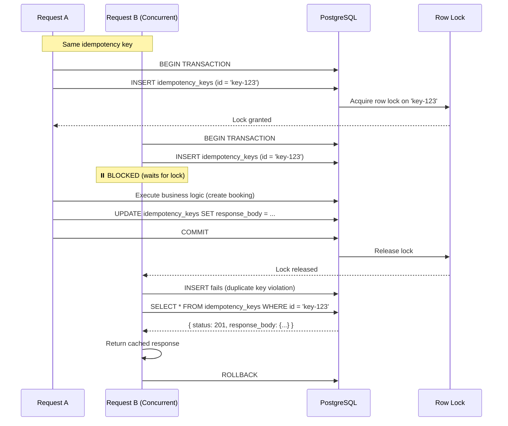

# TicketLedger: Idempotency Storage Strategy

## 📋 Purpose

This document defines the **idempotency key storage architecture** for TicketLedger. It explains how we prevent duplicate request processing using database-backed idempotency keys with row-level locking.

### ✅ This file contains:
- Context: Multi-entity idempotency requirements
- Decision: Single generic table vs entity-specific tables
- Schema design: Generic `idempotency_keys` table
- Transaction strategy: ACID guarantees via row-level locking
- Lifecycle: Insert, execute, update, expiry

### ❌ This file does NOT contain:
- API usage patterns (see `05_api_contracts.md`)
- Implementation details (see `IdempotencyService.java`)
- Business logic for bookings or payments

---

## 🎯 Context: Requirements & Constraints

### Business Requirements

**Duplicate Prevention Needed For:**
1. **Booking Creation** (`POST /api/v1/bookings`)
   - Network timeout → Client retries → Must not create duplicate bookings
   - Same seat reservation should return original booking ID

2. **Payment Processing** (Future)
   - Payment gateway timeout → Retry → Must not double-charge
   - Critical for financial integrity

3. **Refunds** (Future)
   - Retry should return same refund transaction
   - Prevent duplicate refund issuance

### Technical Constraints

**Cannot Use Redis:**
- PostgreSQL is our single source of truth
- Redis would introduce distributed consensus complexity
- No additional infrastructure dependencies for MVP

**Must Be Strictly Atomic:**
- Idempotency check + business logic must be in same transaction
- Either both succeed or both fail (no partial states)
- Rollback of business logic must rollback idempotency record

### Design Goals

| Goal                   | Requirement                   | Rationale                                      |
| ---------------------- | ----------------------------- | ---------------------------------------------- |
| **Generic storage**    | Single table for all entities | Avoid schema explosion (N entities = N tables) |
| **Concurrency safety** | PostgreSQL row-level locks    | Built-in mechanism, no external coordination   |
| **Flexible payloads**  | JSONB for response storage    | Support varying response schemas               |
| **Owner isolation**    | User-scoped keys              | Prevent key collision across users             |
| **Conflict detection** | Request hash comparison       | Detect malicious/accidental payload changes    |
| **Auto-expiry**        | Time-based cleanup            | Prevent unbounded storage growth               |

---

## 🗄️ Decision: Single Generic Table

### Alternatives Considered

#### ❌ Option 1: Entity-Specific Tables
```sql
CREATE TABLE booking_idempotency_keys (...);
CREATE TABLE payment_idempotency_keys (...);
CREATE TABLE refund_idempotency_keys (...);
```

**Rejected because:**
- Schema duplication (3+ tables with identical structure)
- Maintenance burden (each new entity requires new table)
- Complex queries (UNION across tables for monitoring)

#### ❌ Option 2: Redis Cache
```
Key: idempotency:{userId}:{key}
Value: { status, response }
TTL: 24 hours
```

**Rejected because:**
- Introduces external dependency (Redis cluster)
- No ACID guarantees with business logic transaction
- Distributed consensus problem (Redis + PostgreSQL)
- Data consistency risk (cache invalidation complexity)

#### ✅ Option 3: Single Generic PostgreSQL Table

**Selected because:**
- ✅ Single schema, extensible for all entities
- ✅ ACID transaction with business logic
- ✅ Row-level locking handles concurrency natively
- ✅ JSONB supports heterogeneous response types
- ✅ No additional infrastructure

---

## 📋 Schema Design

### Table: `idempotency_keys`

```sql
CREATE TABLE idempotency_keys (
    id UUID PRIMARY KEY,                   -- Client-provided idempotency key
    user_id UUID NOT NULL,
    request_hash VARCHAR(64),
    response_status INT,
    response_body JSONB,
    created_at TIMESTAMPTZ NOT NULL DEFAULT NOW(),
    updated_at TIMESTAMPTZ NOT NULL DEFAULT NOW(),
    expires_at TIMESTAMPTZ NOT NULL
);

CREATE INDEX idx_idempotency_user_id ON idempotency_keys(user_id);
CREATE INDEX idx_idempotency_expires_at ON idempotency_keys(expires_at);
```

### Column Definitions

| Column            | Type          | Constraints     | Description                                       |
| ----------------- | ------------- | --------------- | ------------------------------------------------- |
| `id`              | `UUID`        | `PRIMARY KEY`   | Client-provided idempotency key (from header)     |
| `user_id`         | `UUID`        | `NOT NULL`      | User who initiated the request (for isolation)    |
| `request_hash`    | `VARCHAR(64)` | `NULL`          | SHA-256 hash of request body (conflict detection) |
| `response_status` | `INT`         | `NULL`          | HTTP status code of original response             |
| `response_body`   | `JSONB`       | `NULL`          | Complete response payload (flexible schema)       |
| `created_at`      | `TIMESTAMPTZ` | `DEFAULT NOW()` | Initial insert timestamp                          |
| `updated_at`      | `TIMESTAMPTZ` | `DEFAULT NOW()` | Last modification timestamp                       |
| `expires_at`      | `TIMESTAMPTZ` | `NOT NULL`      | Expiry time for cleanup (created_at + 24h)        |

### Index Strategy

**Primary Key:**
```sql
PRIMARY KEY (id)
```
- Enforces uniqueness
- Enables row-level locking on INSERT

**User Isolation:**
```sql
CREATE INDEX idx_idempotency_user_id ON idempotency_keys(user_id);
```
- Fast lookup for user-specific keys
- Monitoring: "How many idempotent retries per user?"

**Expiry Cleanup:**
```sql
CREATE INDEX idx_idempotency_expires_at ON idempotency_keys(expires_at);
```
- Efficient reaper job: `DELETE WHERE expires_at < NOW()`
- Prevents full table scan

---

## ⚙️ Transaction Strategy: Row-Level Locking

### How PostgreSQL Handles Concurrency

**Key Insight:** INSERT with PRIMARY KEY constraint provides built-in row-level locking.



### Atomicity Properties

**Same-Transaction Insertion:**
```java
@Transactional
public BookingResponse createBooking(CreateBookingRequest request, String idempotencyKey) {
    // 1. Insert idempotency key (locks row)
    IdempotencyKey key = new IdempotencyKey();
    key.setId(idempotencyKey);
    key.setUserId(currentUser.getId());
    key.setRequestHash(sha256(request));
    key.setExpiresAt(Instant.now().plus(24, ChronoUnit.HOURS));
    idempotencyRepository.save(key);  // INSERT (blocks concurrent requests)
    
    // 2. Execute business logic
    Booking booking = bookingService.createBooking(request);
    
    // 3. Update idempotency key with response
    key.setResponseStatus(201);
    key.setResponseBody(objectMapper.valueToTree(booking));
    idempotencyRepository.save(key);  // UPDATE
    
    return booking;
    // 4. COMMIT (releases lock)
}
```

**Failure Invariant:**
```java
@Transactional
public BookingResponse createBooking(...) {
    idempotencyRepository.save(key);  // INSERT
    
    // Business logic throws exception
    bookingService.createBooking(request);  // ❌ FAILS
    
    // Transaction rolls back
    // ✅ Idempotency key is rolled back as well
    // ✅ Client can safely retry with same key
}
```

**Critical Property:** If the transaction rolls back, the idempotency row is rolled back as well, allowing safe retries.

---

## 🧹 Cleanup Strategy

### The Reaper Job

**Purpose:** Delete expired idempotency keys to prevent unbounded table growth.

**Implementation:**
```java
@Scheduled(cron = "0 0 * * * *")  // Every hour
@Transactional
public void cleanupExpiredKeys() {
    Instant cutoff = Instant.now();
    
    int deleted = idempotencyRepository.deleteByExpiresAtBefore(cutoff);
    
    log.info("Idempotency cleanup: {} expired keys deleted", deleted);
}
```

**Query:**
```sql
DELETE FROM idempotency_keys
WHERE expires_at < NOW();
```

**Index Usage:**
- Uses `idx_idempotency_expiry` for efficient filtering
- No full table scan
- Typical execution time: <100ms for 1M rows

**Expiry Configuration:**
```yaml
idempotency:
  ttl-hours: 24  # Keep keys for 24 hours
```

**Why 24 Hours?**
- Balances storage cost vs retry window
- Most client retries happen within minutes
- 24h covers extended network outages
- Prevents infinite storage growth

---

## 🔒 Security Considerations

### 1. User Isolation

**Problem:** User A could guess User B's idempotency key and steal their response.

**Solution:** Always include `user_id` in key lookup.

```java
// ❌ VULNERABLE
idempotencyRepository.findById(idempotencyKey);

// ✅ SECURE
idempotencyRepository.findByIdAndUserId(idempotencyKey, currentUser.getId());
```

### 2. Request Hash Validation

**Purpose:** Detect accidental or malicious payload changes.

**Implementation:**
```java
String requestHash = DigestUtils.sha256Hex(objectMapper.writeValueAsString(request));

if (existingKey.getRequestHash() != null && 
    !existingKey.getRequestHash().equals(requestHash)) {
    throw new IdempotencyConflictException();
}
```

**Hash Algorithm:** SHA-256 (64 characters hex)
- Collision-resistant
- Fast computation (~0.1ms)
- Deterministic (same input → same hash)

### 3. Response Sanitization

**Problem:** Storing full response may leak sensitive data in logs.

**Solution:** Store only necessary fields in `response_body`.

```java
// ❌ BAD: Store entire response including sensitive headers
key.setResponseBody(fullResponse);

// ✅ GOOD: Store only business payload
BookingResponse sanitized = new BookingResponse(
    booking.getId(),
    booking.getStatus(),
    booking.getSeats()  // No payment details
);
key.setResponseBody(objectMapper.valueToTree(sanitized));
```

---

##  Cross-Reference

- **API Usage:** See [05_api_contracts.md](../architecture/05_api_contracts.md#1-idempotency)
- **Database Schema:** See [04_database_schema.md](../architecture/04_database_schema.md#idempotency_keys)
- **Error Handling:** See [06_error_handling.md](../architecture/06_error_handling.md) (IDEMPOTENCY_CONFLICT)
- **Implementation:** See `IdempotencyService.java` and `IdempotencyFilter.java`

---

## ✅ Architecture Checklist

- [x] Single generic table for all entities
- [x] JSONB for flexible response storage
- [x] Row-level locking via PRIMARY KEY constraint
- [x] User-scoped keys for security isolation
- [x] Request hash for conflict detection
- [x] Automatic expiry (24 hours)
- [x] Reaper job for cleanup
- [x] Same-transaction atomicity with business logic
- [x] Rollback safety (failed requests can be retried)
- [x] Performance overhead: <2ms per request
