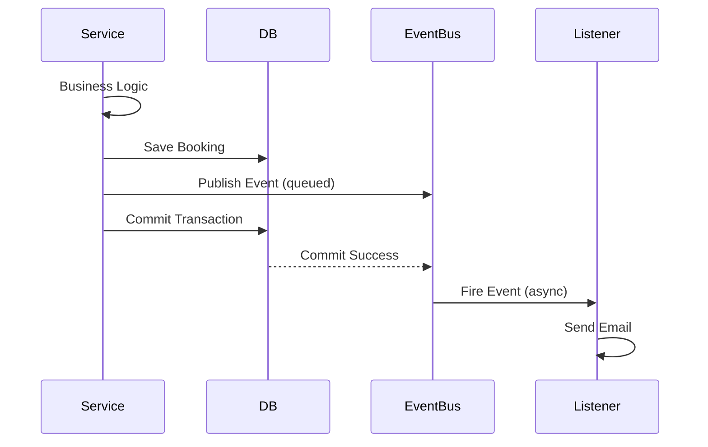
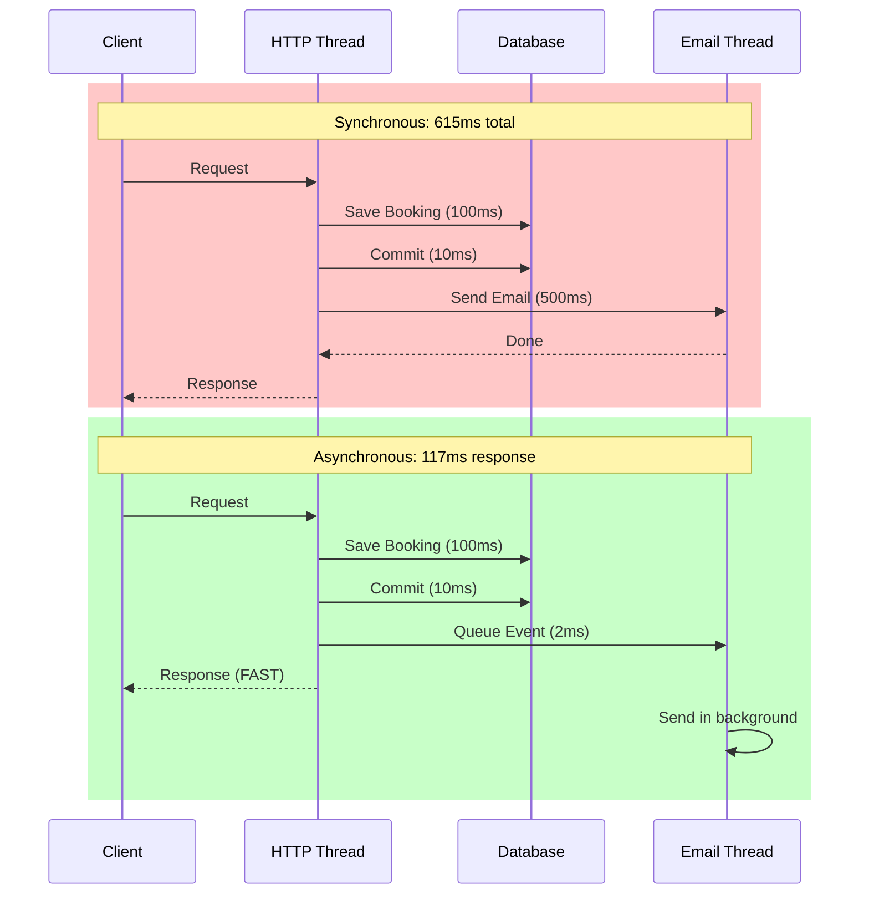
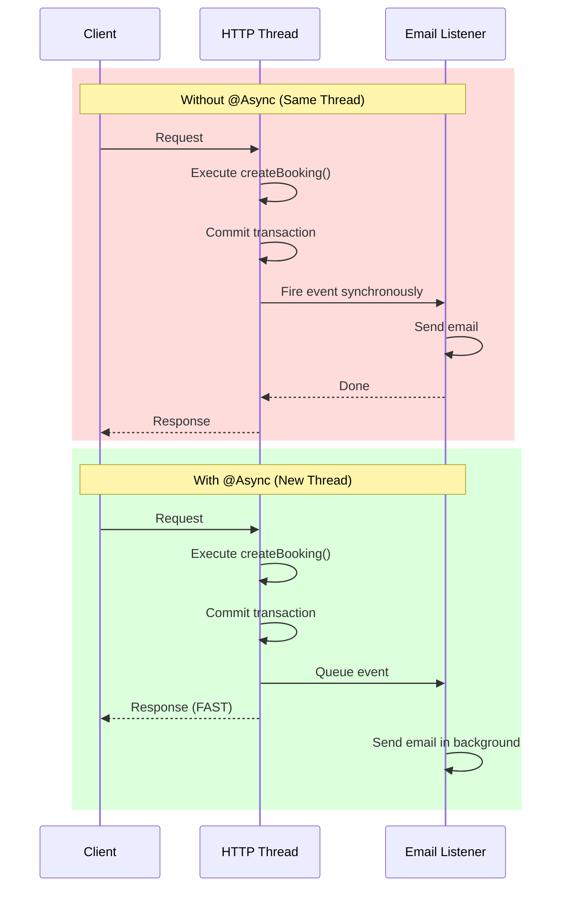

# Decision 004: Event-Driven Notifications

## 📋 Purpose

This document explains the **event-driven architecture** for handling side effects (emails, notifications) in TicketLedger and why we use Spring Application Events with transactional listeners.

### ✅ This file contains:
- Context: Why decouple notifications from core transactions
- Decision: Spring `@TransactionalEventListener` pattern
- Rationale: Consistency guarantees and failure isolation
- Trade-offs: At-most-once delivery vs complexity
- Implementation patterns

### ❌ This file does NOT contain:
- Email service implementation (see `EmailService` class)
- Event class definitions (see `domain.events` package)
- Retry logic (Future: Outbox Pattern in Phase 3)

---

## 1. Context

After a booking is confirmed (money charged, seats reserved), we must perform **side effects**:

- **Send confirmation email** to user
- **Send SMS notification** (future)
- **Update analytics dashboard** (future)
- **Trigger loyalty points** (future)

### The Critical Requirement

**Financial transactions (Booking/Payment) must NEVER be rolled back due to non-critical failures (Email service down).**

---

## 2. Problem

### 2.1 Latency: SMTP is Slow

**Synchronous Email Sending:**
```java
@Transactional
public BookingResponse createBooking(CreateBookingRequest request) {
    // 1. Lock seats (50ms)
    // 2. Create booking (20ms)
    // 3. Charge payment (80ms)
    bookingRepository.save(booking);
    
    // 4. Send email synchronously (500ms) ◄── USER WAITS HERE
    emailService.sendConfirmation(booking);
    
    return toResponse(booking); // Total: 650ms
}
```

**Problem:** User waits 500ms for email to send before seeing confirmation screen.

### 2.2 Atomicity: Email Failure Should Not Rollback Transaction

**Problematic Flow:**
```java
@Transactional
public BookingResponse createBooking(CreateBookingRequest request) {
    booking = bookingRepository.save(booking); // ✅ Booking saved
    
    emailService.sendConfirmation(booking); // ❌ Email server down!
    // Throws exception → Transaction rolls back → Booking lost!
    
    return toResponse(booking);
}
```

**Disaster:** User's card was charged (external API call, not rolled back), but booking was deleted due to email failure.

### 2.3 Consistency: Email Must Not Send if Transaction Fails

**Race Condition:**
```java
@Transactional
public BookingResponse createBooking(CreateBookingRequest request) {
    booking = bookingRepository.save(booking);
    
    // Async email (fires immediately)
    asyncEmailService.sendConfirmation(booking); // ✅ Email sent
    
    // Transaction fails (constraint violation)
    throw new DataIntegrityViolationException(); // Transaction rolls back
    
    // Result: User got email for non-existent booking!
}
```

**Problem:** Email was sent before transaction committed, leading to false confirmation.

---

## 3. Decision

Use **Spring Application Events** with `@TransactionalEventListener` configured for `AFTER_COMMIT` phase.

### Key Components

**Event Publishing:**
- Service publishes domain events after business logic
- Events queued until transaction commits
- No event fires if transaction rolls back

**Event Listening:**
- Listeners annotated with `@TransactionalEventListener(phase = AFTER_COMMIT)`
- Marked with `@Async` to run on separate thread
- Exception handling prevents transaction rollback

**Flow:**


---

## 4. Implementation Details

### 4.1 Transaction Phase: `AFTER_COMMIT`

**Why `AFTER_COMMIT`?**

| Phase              | Timing                   | Risk                                            |
| ------------------ | ------------------------ | ----------------------------------------------- |
| `BEFORE_COMMIT`    | Before DB commit         | ❌ Email sent, transaction fails → Inconsistency |
| `AFTER_COMMIT`     | After successful commit  | ✅ Email only sent if booking persisted          |
| `AFTER_ROLLBACK`   | After transaction fails  | ⚠️ Useful for cleanup, not notifications         |
| `AFTER_COMPLETION` | After commit or rollback | ⚠️ Too broad, not suitable here                  |

**Guarantee:** Event listeners ONLY execute if the database transaction commits successfully.

### 4.2 Async Execution: `@Async`

**Why asynchronous?**



**Configuration:**
```yaml
spring:
  threads:
    virtual:
      enabled: true  # @Async uses virtual threads
```

**Result:** Email listener runs on a separate virtual thread, unblocking HTTP response.

### 4.3 Reliability: "At-Most-Once" Delivery (MVP)

**Current Guarantee:** "Best Effort" delivery

**Failure Scenarios:**

| Scenario                 | Outcome                     | Acceptable? |
| ------------------------ | --------------------------- | ----------- |
| Transaction commits      | ✅ Email sent                | Yes         |
| Transaction fails        | ✅ Email NOT sent            | Yes         |
| Email service down       | ❌ Email lost (logged)       | ✅ Yes (MVP) |
| App crashes after commit | ❌ Email lost (not retried)  | ✅ Yes (MVP) |
| Network timeout          | ❌ Email may/may not be sent | ✅ Yes (MVP) |

**Why Acceptable for MVP?**
- User can check booking status manually (GET /bookings/{id})
- Support team can resend emails on request
- Financial transaction is safe (never rolled back)
- **Better UX than rollback:** User has valid booking even if email fails

---

## 5. Trade-offs

### 5.1 At-Most-Once vs At-Least-Once

**Current: At-Most-Once (Best Effort)**
- ✅ Simple implementation
- ✅ No external dependencies (Kafka, RabbitMQ)
- ❌ Email lost if app crashes after commit

**Alternative: At-Least-Once (Outbox Pattern)**
- ✅ Guaranteed delivery (persistent queue)
- ✅ Retry on failure
- ❌ Complex: Requires outbox table + polling/CDC
- ❌ Possible duplicate emails

**Decision:** At-Most-Once is sufficient for MVP. We prioritize **simplicity** over **guaranteed delivery** for non-critical notifications.

### 5.2 Failure Handling

**What happens if email service is down?**

**Current Approach (MVP):**
- Log error and continue
- No retry mechanism
- Email is lost (acceptable for MVP)

**Future Approach (Phase 3: Outbox Pattern):**
- Write event to database table
- Background job polls and retries
- Guaranteed delivery with idempotency

**Trade-off:** Outbox adds complexity (separate table, polling job, idempotency) but guarantees delivery.

---

## 6. Consistency Model

### 6.1 Event Ordering

**Guarantee:** Events published within a single transaction fire in order.

**No Guarantee:** Event order across different transactions or threads.

### 6.2 Transaction Isolation

**Question:** Does the event listener see uncommitted data?

**Answer:** No. `AFTER_COMMIT` listeners execute after transaction commits, ensuring they always see the final consistent state.

**Example:** Listener reading booking status will always see `CONFIRMED` (never intermediate states).

---

## 7. Thread Isolation

### 7.1 Does the listener run in the same thread?



**Key Point:** `@Async` + Virtual Threads decouples email sending from HTTP response.

### 7.2 Context Propagation: RequestId in Logs

**Problem:** How do we track logs across threads?

**Solution:** Spring Boot 3.2+ automatically propagates MDC (Mapped Diagnostic Context) to virtual threads.

**Result:** All logs from the same request (across threads) share the same `requestId`.

---

## 8. Future Enhancements (Phase 3)

### 8.1 Outbox Pattern

**Problem:** At-Most-Once delivery loses emails on crashes

**Solution:** Transactional Outbox Pattern

**Flow:**
```sql
-- Same transaction as booking
INSERT INTO bookings (...) VALUES (...);
INSERT INTO outbox_events (event_type, payload, status) 
VALUES ('BookingConfirmed', '{"bookingId": "..."}', 'PENDING');

-- Background job (separate transaction)
SELECT * FROM outbox_events WHERE status = 'PENDING' LIMIT 100;
-- Send emails
UPDATE outbox_events SET status = 'PROCESSED' WHERE id IN (...);
```

**Benefits:**
- ✅ At-Least-Once delivery
- ✅ Survives crashes
- ✅ Retry on failure

**Drawbacks:**
- ❌ Complexity: Polling job, idempotency handling
- ❌ Possible duplicate emails (need idempotency key)

### 8.2 Message Broker (Kafka/RabbitMQ)

**Problem:** Outbox still requires polling

**Solution:** Change Data Capture (CDC) + Kafka

**Flow:**
```
Booking Saved → Postgres WAL → Debezium CDC → Kafka Topic → Email Consumer
```

**Benefits:**
- ✅ Event sourcing
- ✅ Scalable (multiple consumers)
- ✅ Replay capability

**Drawbacks:**
- ❌ Operational complexity (Kafka cluster)
- ❌ Overkill for MVP

---

## 9. Implementation Checklist

- [x] Create event classes (`BookingConfirmedEvent`, etc.)
- [x] Publish events in `BookingService` using `ApplicationEventPublisher`
- [x] Create listener class with `@TransactionalEventListener(phase = AFTER_COMMIT)`
- [x] Annotate listener with `@Async` for background execution
- [ ] Configure MDC propagation for `requestId` in logs
- [ ] Add monitoring for event processing failures (alert on error logs)
- [ ] Document email failure SOP (Support team can resend manually)

---

## 10. References

- [Spring Events Documentation](https://docs.spring.io/spring-framework/reference/core/beans/context-introduction.html#context-functionality-events)
- [Transactional Event Listeners](https://docs.spring.io/spring-framework/reference/data-access/transaction/event.html)
- [Transactional Outbox Pattern](https://microservices.io/patterns/data/transactional-outbox.html)
- [Spring Async Documentation](https://docs.spring.io/spring-framework/reference/integration/scheduling.html#scheduling-annotation-support-async)