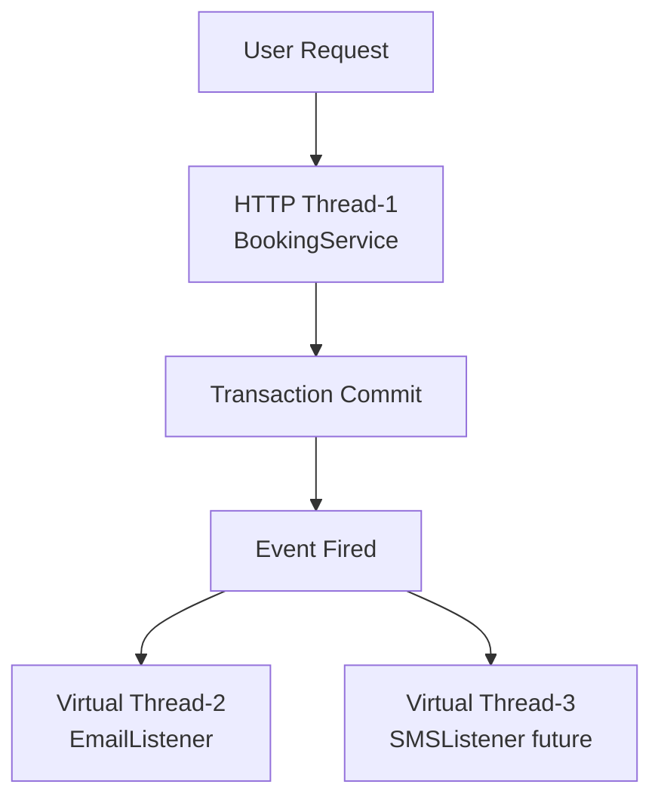
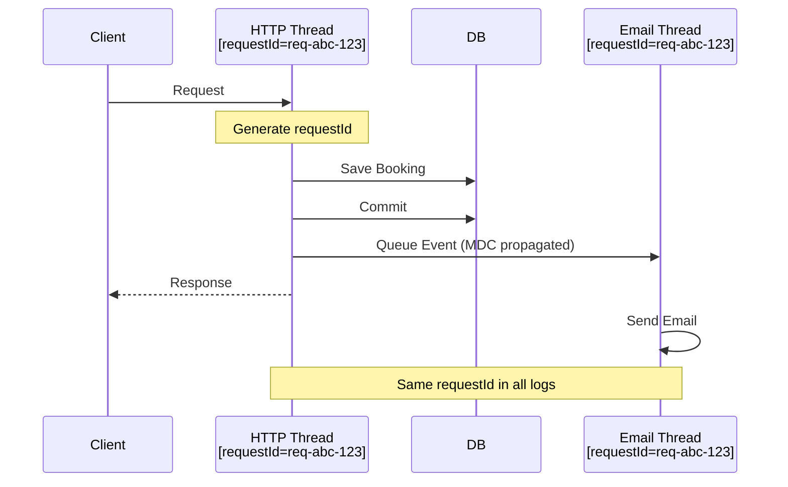

# Decision 005: Observability & Structured Logging

## 📋 Purpose

This document explains the **observability strategy** for TicketLedger, focusing on structured logging, distributed tracing, and monitoring in a concurrent/async environment.

### ✅ This file contains:
- Context: Why observability is critical for async systems
- Decision: MDC-based correlation + Structured logging
- Rationale: Tracking requests across threads/events
- Standards: Log format, key fields, retention
- Trade-offs: JSON logs vs readability

### ❌ This file does NOT contain:
- Metrics/APM tooling (see separate monitoring docs)
- Log aggregation infrastructure (ELK/Splunk setup)
- Alerting rules (see runbooks)

---

## 1. Context

With **async events** and **concurrent virtual threads**, a single user request executes across **multiple threads**:



### The Observability Problem

**Standard logs are disjointed:**
```
2026-01-20 10:30:15 [http-thread-1] BookingService: Creating booking
2026-01-20 10:30:16 [virtual-thread-42] EmailListener: Sending email
2026-01-20 10:30:17 [http-thread-5] BookingService: Creating booking
2026-01-20 10:30:18 [virtual-thread-89] EmailListener: Sending email
```

**Questions we cannot answer:**
- Which email belongs to which booking?
- Did the email for Booking-123 succeed or fail?
- How long did the entire flow take (HTTP → Email)?

---

## 2. Problem

### 2.1 Context Loss Across Threads

When `@Async` listeners run on new threads, they lose context:

```java
@Transactional
public void createBooking() {
    log.info("Creating booking for user {}", userId); // ✅ Has userId
    eventPublisher.publishEvent(new BookingConfirmedEvent(...));
}

@Async
@TransactionalEventListener(phase = AFTER_COMMIT)
public void sendEmail(BookingConfirmedEvent event) {
    log.info("Sending email"); // ❌ Lost userId, no correlation
}
```

**Impact:** Cannot trace a request end-to-end in logs.

### 2.2 High Concurrency = Noisy Logs

With 10,000 concurrent virtual threads, logs from different requests are interleaved:

```
[Thread-A] Step 1
[Thread-B] Step 1
[Thread-A] Step 2
[Thread-C] Step 1
[Thread-B] Step 2
```

**Impact:** Cannot filter logs for a specific request without a correlation ID.

### 2.3 Debugging Production Issues

**Scenario:** User reports: "I didn't receive a confirmation email."

**Current:** Search logs for user email → Find thousands of unrelated logs → No way to trace the specific request.

**Needed:** A unique `requestId` that appears in every log line related to that request.

---

## 3. Decision

Use **MDC (Mapped Diagnostic Context)** to inject correlation IDs into all log lines, with **structured logging** (JSON format) in production.

### 3.1 Core Components

#### MDC Fields

| Field       | Type   | Purpose                            | Example                            |
| ----------- | ------ | ---------------------------------- | ---------------------------------- |
| `requestId` | UUID   | Unique identifier for HTTP request | `req-019535d9-3df7-79fb-b466`      |
| `userId`    | UUID   | Authenticated user ID              | `user-123e4567-e89b-12d3-a456`     |
| `traceId`   | String | Distributed tracing ID (future)    | `4bf92f3577b34da6a3ce929d0e0e4736` |
| `spanId`    | String | Sub-operation ID (future)          | `00f067aa0ba902b7`                 |

#### Log Format (Development)

**Console (Human-Readable):**
```
2026-01-20 10:30:15 INFO [requestId=req-abc-123, userId=user-xyz-789] BookingService: Creating booking
2026-01-20 10:30:16 INFO [requestId=req-abc-123, userId=user-xyz-789] EmailListener: Sending email
```

#### Log Format (Production)

**JSON (Machine-Parsable):**
```json
{
  "timestamp": "2026-01-20T10:30:15.123Z",
  "level": "INFO",
  "logger": "com.ticketledger.service.BookingService",
  "message": "Creating booking",
  "requestId": "req-abc-123",
  "userId": "user-xyz-789",
  "thread": "virtual-thread-1",
  "bookingId": "booking-456"
}
```

---

## 4. Implementation Details

### 4.1 MDC Initialization (Web Filter)

**Create Servlet Filter:**
- Generate unique `requestId` for each HTTP request
- Store in MDC (ThreadLocal available to all logs)
- Add to response header for client correlation
- Clean up MDC on request completion

### 4.2 Context Propagation to Virtual Threads

**Spring Boot 3.2+ automatically propagates MDC to `@Async` methods on virtual threads.**

**Result:** Async event listeners automatically inherit `requestId` from parent thread.

### 4.3 Structured Logging Configuration

**Production:** JSON format using Logstash encoder
**Development:** Console format with MDC fields

**Dependency:**
```gradle
implementation 'net.logstash.logback:logstash-logback-encoder:7.4'
```

---

## 5. Key Fields & Standards

### 5.1 Required Fields (All Logs)

| Field       | Source            | When Set       |
| ----------- | ----------------- | -------------- |
| `timestamp` | Logback           | Every log line |
| `level`     | Logger            | Every log line |
| `logger`    | Class name        | Every log line |
| `message`   | Log statement     | Every log line |
| `requestId` | `RequestIdFilter` | HTTP requests  |
| `thread`    | JVM               | Every log line |

### 5.2 Optional Fields (Context-Specific)

| Field       | Source                 | When Set               |
| ----------- | ---------------------- | ---------------------- |
| `userId`    | `SecurityContext`      | Authenticated requests |
| `bookingId` | Application code       | Booking-related logs   |
| `email`     | Application code       | Email-related logs     |
| `errorCode` | Exception handler      | Error logs             |
| `traceId`   | OpenTelemetry (future) | Distributed tracing    |
| `spanId`    | OpenTelemetry (future) | Sub-operations         |

### 5.3 Logging Standards

**Log Levels:**

| Level   | Usage                               | Example                           |
| ------- | ----------------------------------- | --------------------------------- |
| `ERROR` | Business logic failures, exceptions | "Payment gateway returned 500"    |
| `WARN`  | Recoverable issues, degraded state  | "Email service timeout, retrying" |
| `INFO`  | Business events, state changes      | "Booking created for user X"      |
| `DEBUG` | Detailed flow, variable values      | "Locking seats: [A1, A2]"         |
| `TRACE` | Ultra-verbose (disabled in prod)    | "Entering method createBooking()" |

**What to Log:**

```java
// ✅ GOOD: Business-relevant events
log.info("Booking {} created for user {}", bookingId, userId);
log.info("Payment charged: ${} for booking {}", amount, bookingId);
log.warn("Email delivery failed for booking {}, retrying", bookingId);

// ❌ BAD: Noisy, non-actionable
log.debug("Entering createBooking method");
log.debug("Variable x = {}", x);
log.info("Method returned successfully");
```

---

## 6. Correlation Examples

### 6.1 End-to-End Request Tracing

**Single request across multiple threads:**



**Query in Log Aggregator:**
```
requestId="req-abc-123" | sort timestamp
```

**Result:** See entire flow chronologically, even across threads.

---

## 7. Trade-offs

### 7.1 JSON Logs vs Readability

| Format      | Pros                     | Cons                             |
| ----------- | ------------------------ | -------------------------------- |
| **Console** | ✅ Human-readable         | ❌ Hard to parse programmatically |
|             | ✅ Easier local debugging | ❌ Unstructured                   |
| **JSON**    | ✅ Machine-parsable       | ❌ Hard to read raw               |
|             | ✅ Works with ELK/Splunk  | ❌ Requires log aggregation tool  |
|             | ✅ Structured queries     |                                  |

**Decision:**
- **Development:** Console format (readability)
- **Production:** JSON format (query performance)

### 7.2 Performance Impact

**MDC Overhead:**
- Minimal: ~10-50ns per log line
- ThreadLocal lookup is highly optimized

**JSON Serialization:**
- ~100-500ns per log line (depends on field count)
- Negligible compared to I/O operations (ms-scale)

**Monitoring:** Track `jvm.logging.events` metric to detect log storms.

---

## 8. Future Enhancements

### 8.1 OpenTelemetry Integration

**Current:** MDC-based correlation

**Future (Phase 3):** Full distributed tracing with OpenTelemetry

**Benefits:**
- Automatic span creation for HTTP requests, DB queries, external APIs
- Visual trace timeline (Jaeger/Zipkin UI)
- Latency breakdown per operation

**Configuration:**
```yaml
management:
  tracing:
    sampling:
      probability: 0.1  # Sample 10% of requests
```

### 8.2 Log Aggregation

**Current:** Logs written to stdout

**Future:** Ship logs to centralized platform

**Options:**
- **ELK Stack:** Elasticsearch + Logstash + Kibana
- **Splunk:** Enterprise log management
- **Datadog:** SaaS APM + Logs
- **AWS CloudWatch Logs:** Native AWS integration

### 8.3 Alerting

**Critical Events to Alert On:**
```java
// Payment failure
log.error("Payment gateway error: {}", errorCode);

// Email failure (after retries)
log.error("Email delivery failed permanently for booking {}", bookingId);

// Database connection pool exhausted
log.error("HikariCP: Timeout waiting for connection");
```

**Alert Rules:**
- `ERROR` count > 100 in 5 minutes → Page on-call
- `WARN` count > 500 in 5 minutes → Slack notification
- Email failure rate > 10% → Alert product team

---

## 9. Context Propagation: Deep Dive

### 9.1 How Spring Boot Propagates MDC

Spring Boot 3.2+ uses `ContextPropagatingTaskDecorator` to automatically:
1. Capture MDC from parent thread before `@Async` method runs
2. Restore MDC in child thread
3. Clear MDC after method completes

**No manual configuration needed** for Virtual Threads + `@Async`.

### 9.2 Verification

Test MDC propagation:
1. Add `requestId` in filter
2. Trigger async event
3. Verify same `requestId` appears in event listener logs

---

## 10. Implementation Checklist

- [ ] Add `RequestIdFilter` to inject `requestId` into MDC
- [ ] Configure Logback for JSON logging (prod) and console logging (dev)
- [ ] Add `logstash-logback-encoder` dependency
- [ ] Test MDC propagation to `@Async` listeners
- [ ] Add `userId` to MDC after authentication
- [ ] Document standard log patterns in team wiki
- [ ] Set up log aggregation (ELK/Splunk) for staging/prod
- [ ] Configure alerts for ERROR/WARN thresholds

---

## 11. References

- [MDC Documentation](https://logback.qos.ch/manual/mdc.html)
- [Logstash Logback Encoder](https://github.com/logfellow/logstash-logback-encoder)
- [Spring Boot Logging](https://docs.spring.io/spring-boot/reference/features/logging.html)
- [OpenTelemetry Java](https://opentelemetry.io/docs/languages/java/)
