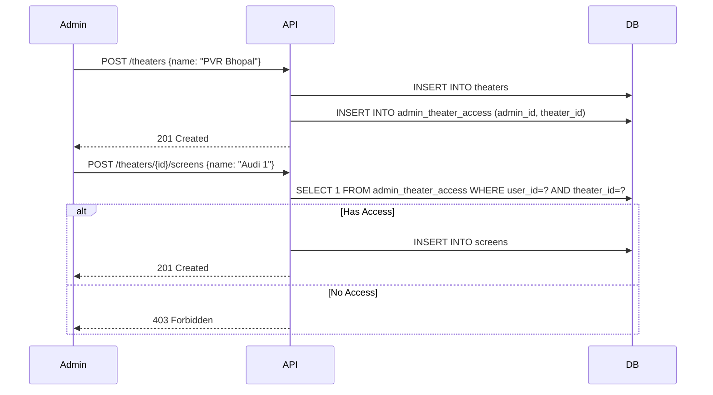

# 006. Theater-Scoped Admin & Enhanced Schema

## 1. Context

TicketLedger is evolving from a simple booking engine to a **multi-tenant SaaS platform**. The current architecture has limitations:

- **Admins:** Have global access to all resources without scope boundaries
- **Users:** Lack profile information needed for personalization
- **Movies:** Missing rich metadata (posters, descriptions) required for frontend UX
- **Audit Trail:** No dedicated table for tracking privileged admin operations

As we scale, we need:
1. **Theater-scoped administration** where admins manage specific theaters, not the entire system
2. **Rich user profiles** for better UX and customer support
3. **Movie metadata** for display purposes
4. **Audit accountability** for financial operations

---

## 2. Decision: Theater-Scoped Administration

We will implement a **Strict Ownership Model** for admin operations:

### Access Model

- An `ADMIN` user starts with **0 theaters** upon registration
- When an Admin **creates** a theater, they are automatically granted access to it
- Admins can **only manage resources** (Screens, Showtimes, Refunds) attached to theaters they have explicit access to
- No "Global Super Admin" role (DevOps uses direct database access for system-level operations)

### Authorization Invariant

Before any `WRITE` operation on Theater/Screen/Showtime/Booking:

```sql
ASSERT EXISTS (
    SELECT 1 FROM admin_theater_access 
    WHERE user_id = :current_user 
    AND theater_id = :target_theater
)
```

### Example Flow



---

## 3. Schema Changes

### A. New Entities

#### 1. `theaters` - The Scope Root

Represents the physical building/multiplex. Parent entity of `screens`.

| Column       | Type      | Constraints | Description                 |
| ------------ | --------- | ----------- | --------------------------- |
| `id`         | UUID      | PK          | Theater identifier          |
| `name`       | VARCHAR   | NOT NULL    | Theater name                |
| `city`       | VARCHAR   | NOT NULL    | City location               |
| `address`    | TEXT      | NULL        | Full address                |
| `created_at` | TIMESTAMP | NOT NULL    | Record creation timestamp   |
| `updated_at` | TIMESTAMP | NOT NULL    | Last modification timestamp |

**Rationale:** Theaters are the **ownership boundary**. All admin operations are scoped to theaters they have access to.

---

#### 2. `admin_theater_access` - The Scope Map

Many-to-many relationship between admins and theaters.

| Column       | Type      | Constraints             | Description              |
| ------------ | --------- | ----------------------- | ------------------------ |
| `id`         | UUID      | PK                      | Access record identifier |
| `user_id`    | UUID      | FK → users, NOT NULL    | Admin user identifier    |
| `theater_id` | UUID      | FK → theaters, NOT NULL | Theater identifier       |
| `created_at` | TIMESTAMP | NOT NULL                | When access was granted  |

**Constraints:**
- Unique constraint on `(user_id, theater_id)` to prevent duplicate grants
- Cascade behavior: Deleting theater removes all access records

**Rationale:** Explicit many-to-many relationship allows flexible access control (future: support for admin collaboration on same theater).

---

#### 3. `admin_audit_log` - Immutable Accountability Ledger

Tracks all privileged admin operations for forensics and reconciliation.

| Column               | Type      | Constraints          | Description                              |
| -------------------- | --------- | -------------------- | ---------------------------------------- |
| `id`                 | UUID      | PK                   | Audit log identifier                     |
| `booking_id`         | UUID      | FK → bookings, NULL  | Target booking (for refund operations)   |
| `showtime_id`        | UUID      | FK → showtimes, NULL | Target showtime (for pause operations)   |
| `theater_id`         | UUID      | FK → theaters, NULL  | Target theater (for scope validation)    |
| `admin_user_id`      | UUID      | FK → users, NOT NULL | Admin who performed action               |
| `action`             | VARCHAR   | NOT NULL             | Action type: REFUND, PAUSE, FORCE_EXPIRE |
| `status`             | VARCHAR   | NOT NULL             | Status: INITIATED, COMPLETED, FAILED     |
| `reason`             | TEXT      | NOT NULL             | Human-readable justification             |
| `idempotency_key`    | VARCHAR   | UNIQUE, NOT NULL     | Prevents duplicate operations            |
| `provider`           | VARCHAR   | NULL                 | Payment provider (STRIPE, PAYPAL, etc.)  |
| `provider_refund_id` | VARCHAR   | NULL                 | External payment gateway reference       |
| `completed_at`       | TIMESTAMP | NULL                 | When action completed                    |
| `created_at`         | TIMESTAMP | NOT NULL             | When action was initiated                |
| `updated_at`         | TIMESTAMP | NOT NULL             | Last modification timestamp              |

**Indexes:**
- `idx_audit_booking` on `booking_id` (fast lookup during reconciliation)
- `idx_audit_theater` on `theater_id` (admin dashboard queries)

**Rationale:**
- **Forensics:** Trace every privileged action (who, what, when, why)
- **Idempotency:** Unique key prevents duplicate refunds
- **Reconciliation:** `INITIATED` but not `COMPLETED` records trigger automated recovery
- **Explicit FKs:** Ensure referential integrity (cannot delete booking with pending audit log)

---

### B. Entity Enhancements

#### 1. `users` - User Profile Enrichment

| New Column          | Type    | Constraints | Description              |
| ------------------- | ------- | ----------- | ------------------------ |
| `full_name`         | VARCHAR | NULL        | User's display name      |
| `profile_image_url` | TEXT    | NULL        | Avatar URL (S3/CDN link) |

**Rationale:**
- `email` is for authentication; `full_name` is for display
- `profile_image_url` enables personalized UI and customer support
- Nullable because existing users don't have these fields

---

#### 2. `movies` - Metadata Enrichment

| New Column         | Type    | Constraints | Description                       |
| ------------------ | ------- | ----------- | --------------------------------- |
| `description`      | TEXT    | NULL        | Movie synopsis/plot               |
| `thumbnail_url`    | TEXT    | NULL        | Poster image URL (for listings)   |
| `genre`            | VARCHAR | NULL        | Movie genre (Action, Drama, etc.) |
| `language`         | VARCHAR | NULL        | Primary language (Hindi, English) |
| `duration_minutes` | INTEGER | NULL        | Movie runtime in minutes          |

**Rationale:**
- Frontend needs rich metadata for movie cards and detail pages
- Nullable because movies can be created by admins without full metadata initially
- Genre/Language enable filtering and search features

---

### C. Schema Modifications

#### 1. `screens` - Add Theater Relationship

```sql
ALTER TABLE screens ADD COLUMN theater_id UUID NOT NULL 
    REFERENCES theaters(id);
```

**Impact:**
- Existing screens will be **deleted** during migration (acceptable for dev phase)
- Going forward, every screen **must belong** to a theater
- Admin can only create screens in theaters they have access to

**Rationale:** Theaters are the ownership boundary. Screens cannot exist without a parent theater.

---

#### 2. `booking_status` Enum - Add Refund States

```sql
ALTER TYPE booking_status ADD VALUE IF NOT EXISTS 'REFUND_INITIATED';
ALTER TYPE booking_status ADD VALUE IF NOT EXISTS 'REFUNDED';
ALTER TYPE booking_status ADD VALUE IF NOT EXISTS 'REFUND_REQUIRED';
```

**Rationale:** Supports admin refund workflows documented in `07_admin_workflows.md`.

---

#### 3. `showtime_status` Enum - Add Paused State

```sql
ALTER TYPE showtime_status ADD VALUE IF NOT EXISTS 'PAUSED';
```

**Rationale:** Enables admin "kill switch" to temporarily suspend bookings for a showtime.

---

## 4. Authorization Implementation

### Pre-Flight Check for Admin Operations

Every admin endpoint must validate theater access:

```java
@Service
public class AdminAuthorizationService {
    
    public void assertTheaterAccess(UUID userId, UUID theaterId) {
        boolean hasAccess = adminTheaterAccessRepository
            .existsByUserIdAndTheaterId(userId, theaterId);
        
        if (!hasAccess) {
            throw new ForbiddenException(
                "User does not have access to theater: " + theaterId
            );
        }
    }
    
    public void assertScreenAccess(UUID userId, UUID screenId) {
        Screen screen = screenRepository.findById(screenId)
            .orElseThrow(() -> new NotFoundException("Screen not found"));
        
        assertTheaterAccess(userId, screen.getTheater().getId());
    }
}
```

### Example Controller Usage

```java
@PostMapping("/admin/theaters/{theaterId}/screens")
@PreAuthorize("hasRole('ADMIN')")
public ScreenResponse createScreen(
    @PathVariable UUID theaterId,
    @RequestBody CreateScreenRequest request
) {
    UUID currentUserId = SecurityContext.getCurrentUserId();
    
    // 1. Verify theater access
    adminAuthService.assertTheaterAccess(currentUserId, theaterId);
    
    // 2. Proceed with operation
    return screenService.createScreen(theaterId, request);
}
```

---

## 5. Admin Registration Flow

### Current Behavior
Users register as `CUSTOMER` role by default.

### New Behavior
Users can optionally register as `ADMIN`, but they start with **0 theater access**.

```java
@PostMapping("/auth/register")
public AuthResponse register(@RequestBody RegisterRequest request) {
    // 1. Create user with requested role (CUSTOMER or ADMIN)
    User user = authService.register(
        request.getEmail(),
        request.getPassword(),
        request.getRole() // Can be ADMIN
    );
    
    // 2. If ADMIN, they start with empty theater access
    // No automatic grants - admin must create or be granted access to theaters
    
    return authService.generateTokens(user);
}
```

### First Theater Creation

```java
@PostMapping("/admin/theaters")
@PreAuthorize("hasRole('ADMIN')")
public TheaterResponse createTheater(@RequestBody CreateTheaterRequest request) {
    UUID currentUserId = SecurityContext.getCurrentUserId();
    
    // 1. Create theater
    Theater theater = theaterService.create(request);
    
    // 2. Auto-grant access to creator
    adminTheaterAccessService.grantAccess(currentUserId, theater.getId());
    
    return TheaterResponse.from(theater);
}
```

---

## 6. Migration Strategy

### Development Phase (Current)
- **V6 Migration:** Drops existing screens (acceptable data loss for dev)
- Clean slate for theater-scoped architecture

### Production Phase (Future)
- Create default "Legacy Theater" for existing screens
- Migrate all existing screens to default theater
- Grant all existing admins access to default theater
- Gradually migrate to proper theater scoping

---

## 7. Non-Goals

### What We're NOT Doing

1. **Global Super Admin Role**
   - Rationale: DevOps uses direct database access for system-level operations
   - Admin with access to all theaters can be simulated by granting access to each theater

2. **Fine-Grained Permissions**
   - No "read-only admin" vs "read-write admin"
   - Access implies full control of that theater
   - Rationale: Simplicity. Phase 1 doesn't require complex RBAC

3. **Theater Hierarchy**
   - No "chain of theaters" or "franchise" concept
   - Each theater is independent
   - Rationale: YAGNI - add when business requirements demand it

4. **User-Initiated Admin Approval Flow**
   - Admins must be created manually (via registration with ADMIN role)
   - No "request admin access" workflow
   - Rationale: Security - prevent unauthorized elevation

---

## 8. API Impact

### New Endpoints

```
POST   /admin/theaters              Create theater (auto-grants access)
GET    /admin/theaters              List theaters admin has access to
POST   /admin/theaters/{id}/screens Create screen in theater
PATCH  /admin/showtimes/{id}/status Pause showtime (logs to audit table)
POST   /admin/bookings/{id}/refund  Refund booking (logs to audit table)
```

### Modified Endpoints

All existing admin endpoints now require theater access validation:

```
POST   /admin/screens              → Requires theater_id in request body
POST   /admin/showtimes            → Screen must belong to accessible theater
GET    /admin/bookings             → Filtered by accessible theaters
```

---

## 9. Cross-Reference

- **State Machines:** See `02_lifecycle_states.md` (REFUND_INITIATED, REFUNDED)
- **Admin Workflows:** See `07_admin_workflows.md` (refund consistency model)
- **API Contracts:** See `05_api_contracts.md` (admin endpoints)
- **Database Schema:** See `04_database_schema.md` (entity relationships)

---

## 10. Acceptance Criteria

- [x] Decision document created
- [ ] V6 migration created and tested
- [ ] Entity classes updated (User, Movie, Theater, AdminTheaterAccess, AdminAuditLog)
- [ ] Repository interfaces created for new entities
- [ ] AdminAuthorizationService implemented
- [ ] Auth service updated to allow ADMIN registration
- [ ] Admin endpoints secured with theater access checks
- [ ] Audit logging integrated into refund/pause operations
- [ ] Documentation updated (API contracts, database schema)

---

## 11. Risks and Mitigations

| Risk                                   | Mitigation                                                     |
| -------------------------------------- | -------------------------------------------------------------- |
| Existing data loss during V6           | Document as breaking change; acceptable for dev phase          |
| Admin locked out after registration    | Clear UI messaging: "Create your first theater to get started" |
| Orphaned audit logs if booking deleted | Use explicit FKs with ON DELETE RESTRICT                       |
| Performance of theater access checks   | Add indexes on admin_theater_access(user_id)                   |
| Audit log table growth                 | Future: Implement archival strategy (retain 2 years)           |
