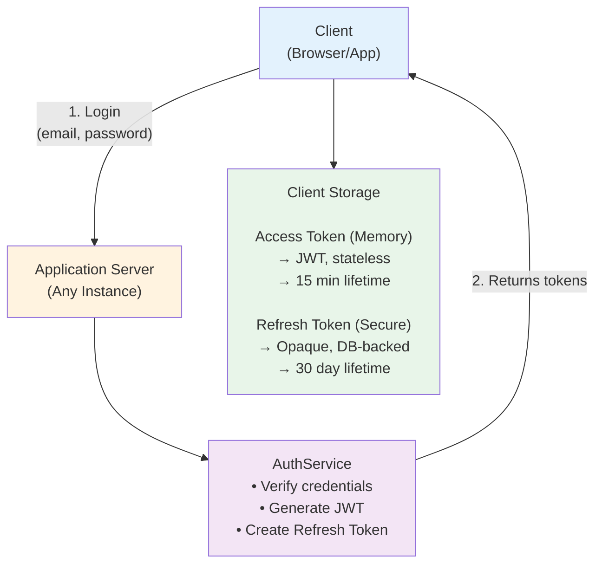
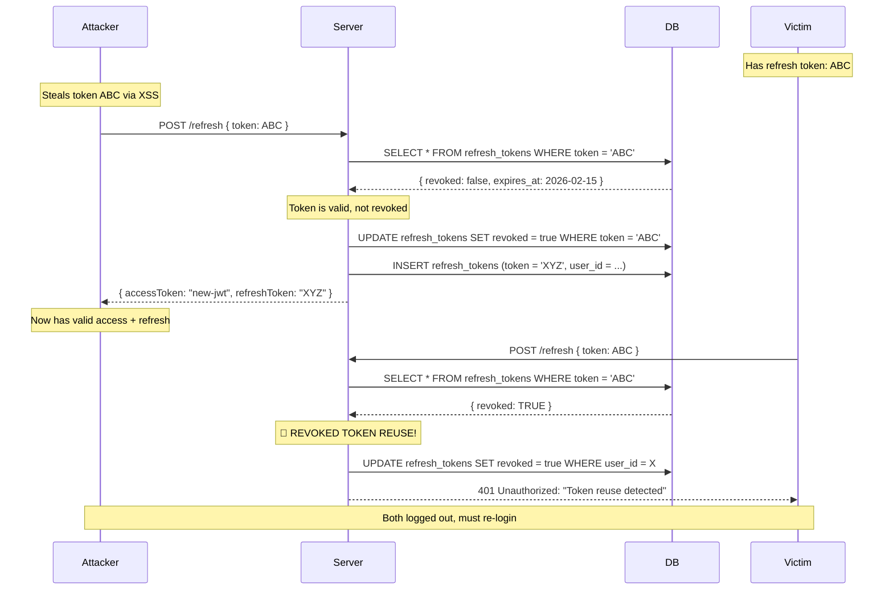
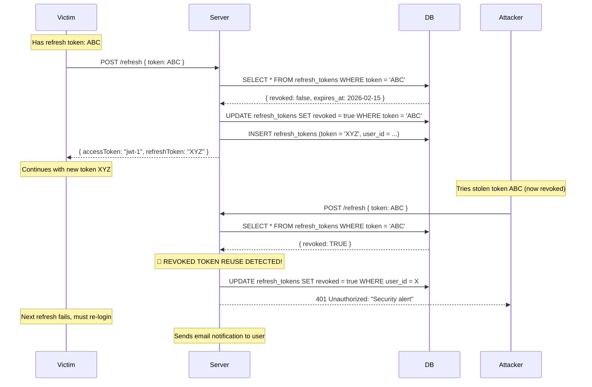
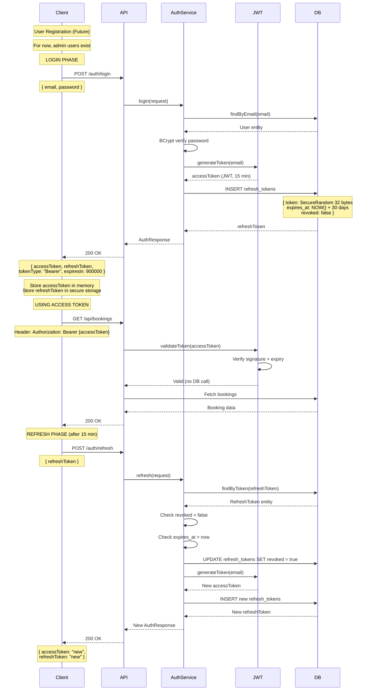
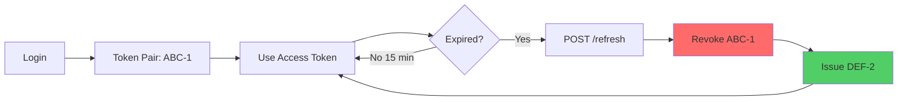
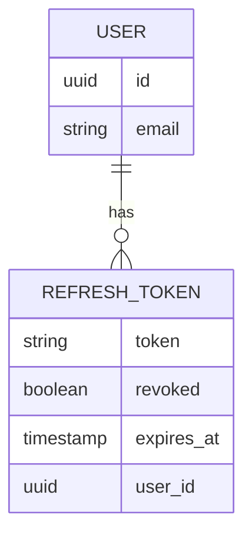

# TicketLedger: Authentication Strategy

## 📋 Purpose

This document explains the **authentication and authorization decisions** for TicketLedger. It answers fundamental questions about why we chose stateless JWT authentication combined with database-backed refresh tokens.

### ✅ This file contains:
- Context: Why stateless authentication?
- Decision: JWT for access + Opaque token for refresh
- Security rationale: Token rotation strategy
- Trade-offs: Performance vs security analysis
- Token lifecycle flows

### ❌ This file does NOT contain:
- Implementation details (see code in `security/` package)
- API contracts (see `05_api_contracts.md`)
- Database schema for `refresh_tokens` (see `04_database_schema.md`)

---

## 🎯 Context: Why Stateless Authentication?

### The Problem

**Traditional Session-Based Auth (Stateful)**
```
Client → Login → Server creates session → Session stored in DB/Redis
Client → Protected endpoint → Server queries session store → Validates
```

**Issues:**
1. **Scalability bottleneck:** Every request hits session store (DB/Redis)
2. **Horizontal scaling complexity:** Requires sticky sessions or shared session storage
3. **Memory overhead:** Active sessions consume server memory
4. **Microservices hostile:** Session state doesn't distribute well across services

### Our Requirements

| Requirement                | Priority | Rationale                                                |
| -------------------------- | -------- | -------------------------------------------------------- |
| **Horizontal scalability** | Critical | Must support multiple app instances behind load balancer |
| **Low latency**            | High     | Ticket booking is time-sensitive (10-min hold window)    |
| **Stateless API**          | High     | RESTful principles, easier caching                       |
| **Revocation capability**  | Medium   | Security: logout, password change must invalidate tokens |
| **Multi-device support**   | Medium   | User can login from web + mobile simultaneously          |

### The Decision: Hybrid Stateless/Stateful

**Solution:** JWT (stateless) for most requests + Database-backed refresh tokens (stateful) for rotation



---

## 🔐 Decision: JWT for Access + Opaque Reference Token for Refresh

### Why Two Token Types?

| Token Type      | Access Token (JWT)     | Refresh Token (Opaque)          |
| --------------- | ---------------------- | ------------------------------- |
| **Purpose**     | Authorize API requests | Obtain new access token         |
| **Storage**     | In-memory (client)     | Secure storage + Database       |
| **Lifetime**    | Short (15 minutes)     | Long (30 days dev, 7 days prod) |
| **Stateless?**  | ✅ Yes (self-contained) | ❌ No (DB lookup required)       |
| **Revocable?**  | ❌ No (until expiry)    | ✅ Yes (DB flag)                 |
| **Transmitted** | Every API call         | Only on `/refresh` endpoint     |
| **Size**        | ~200-400 bytes (JWT)   | 43 bytes (Base64 encoded)       |

### Access Token: JWT (Stateless)

**Structure:**
```
Header.Payload.Signature
```

**Payload Example:**
```json
{
  "sub": "user@example.com",  // Subject (user identifier)
  "iat": 1737283200,           // Issued at
  "exp": 1737284100            // Expires at (15 min later)
}
```

**Why JWT for Access Tokens?**

✅ **Stateless validation:** Server verifies signature without DB lookup
- Parse JWT → Verify HMAC-SHA256 signature → Check expiry → Done
- **Zero database calls** for 99% of requests

✅ **Low latency:** Cryptographic validation is ~0.1ms vs 5-10ms DB query

✅ **Horizontal scaling:** Any server instance can validate JWT independently

✅ **Standard format:** Widespread library support (jjwt, nimbus-jose-jwt)

❌ **Cannot revoke before expiry:** Acceptable trade-off with short TTL (15 min)

**Security Properties:**
- Signature prevents tampering (HMAC-SHA256)
- Short expiry limits stolen token damage (15 min window)
- No sensitive data in payload (email only, not password/PII)

### Refresh Token: Opaque Reference (Stateful)

**Structure:**
```
43-character Base64 URL-safe string
Example: "aH8kL9mN3pQ5rT7vX2zB4dF6gJ8kL0mN3pQ5rT7vX2"
```

**Generation:**
```java
// 32 random bytes → Base64 URL encoding = 43 chars
byte[] randomBytes = new byte[32];
secureRandom.nextBytes(randomBytes);
String token = Base64.getUrlEncoder().withoutPadding().encodeToString(randomBytes);
```

**Why Opaque Tokens for Refresh?**

✅ **Revocable:** Single UPDATE query invalidates token
```sql
UPDATE refresh_tokens SET revoked = TRUE WHERE token = ?;
```

✅ **Rotation-friendly:** Old token invalidated, new token issued (see below)

✅ **Database audit trail:** Track all refresh events per user

✅ **Secure random:** `SecureRandom` provides cryptographically strong entropy

❌ **DB lookup required:** Acceptable because `/refresh` is infrequent (every 15 min max)

**Why Not Store JWT in Database?**
- JWT payload is large (~200 bytes) vs opaque token (~43 bytes)
- JWT structure adds unnecessary complexity for reference token
- Opaque tokens are more efficient for DB indexing

---

## 🛡️ Security: Token Rotation Strategy

### The Attack: Refresh Token Theft

**Scenario:** Attacker steals refresh token (e.g., XSS, browser debug tools, device theft)

**Without Rotation:**
```
Attacker → Uses stolen refresh token → Gets new access token
Victim   → Uses same refresh token    → Gets new access token
⚠️ Both continue indefinitely (30 days!)
```

**With Rotation:**
```
Victim   → Uses refresh token (token-ABC)  → Gets new access token + token-XYZ
         → Old token-ABC is REVOKED in DB

Attacker → Uses stolen token-ABC           → ⚠️ SECURITY ALERT!
         → Server detects revoked token
         → Revokes ALL user's refresh tokens
         → Forces re-login on all devices
```

### How Rotation Prevents Reuse Attacks

**Implementation:**
```java
@Transactional
public AuthResponse refresh(RefreshTokenRequest request) {
    String incomingToken = request.refreshToken();
    
    // 1. Find token in DB
    var refreshToken = findByToken(incomingToken)
        .orElseThrow(() -> new RuntimeException("Token not found"));
    
    // 2. CRITICAL: Detect reuse of revoked token
    if (refreshToken.isRevoked()) {
        revokeAllUserTokens(refreshToken.getUser());  // 🔥 Nuclear option
        throw new SecurityException("Token reuse detected!");
    }
    
    // 3. Verify expiry
    if (refreshToken.getExpiresAt().isBefore(Instant.now())) {
        throw new RuntimeException("Token expired");
    }
    
    // 4. Token Rotation: Revoke old, issue new
    refreshToken.setRevoked(true);            // Mark old as used
    save(refreshToken);
    
    var newAccessToken = generateJWT(user);
    var newRefreshToken = createRefreshToken(user);  // Generate new
    
    return new AuthResponse(newAccessToken, newRefreshToken);
}
```

### Attack Timeline: Before Victim Refreshes



### Attack Timeline: Attacker Uses Stolen Token AFTER Victim



### Why This Matters

**Without Rotation:** Stolen token valid for 30 days, no detection

**With Rotation:** 
- **Best case:** Victim refreshes first → Attacker locked out immediately
- **Worst case:** Attacker refreshes first → Victim locked out, gets security alert

**Key insight:** Either the victim or attacker will trigger the alarm, forcing re-authentication and killing all sessions.

### Security Properties

**Token rotation provides:**
- **Forward secrecy:** New token issued invalidates previous token
- **Revocation detection:** Reuse of invalidated token triggers security response
- **Theft detection:** Either legitimate user or attacker will trigger alarm on next refresh
- **Cascade revocation:** Single compromised token can trigger revocation of all user sessions

---

## ⚖️ Trade-off: Database Hit on Every /refresh Call

### The Cost

**Without Refresh Tokens (Pure JWT):**
```
Client → POST /api/bookings → JWT validated in-memory → 0 DB calls
```

**With Refresh Tokens (Our Approach):**
```
Client → POST /refresh → 3 DB queries:
  1. SELECT refresh_tokens WHERE token = ?  (indexed, ~2ms)
  2. UPDATE refresh_tokens SET revoked = true
  3. INSERT refresh_tokens (new token)
```

### Performance Analysis

| Metric                      | Pure JWT   | JWT + Refresh Token       |
| --------------------------- | ---------- | ------------------------- |
| **Access token validation** | 0 DB calls | 0 DB calls                |
| **Refresh frequency**       | N/A        | Every 15 min per user     |
| **DB load per refresh**     | 0 queries  | 3 queries (~5-8ms total)  |
| **Typical user session**    | 1 hour     | 4 refreshes = 12 DB calls |
| **Revocation capability**   | ❌ None     | ✅ Instant                 |

### When Is This Acceptable?

**Refresh Request Frequency:**
```
Access Token TTL: 15 minutes
User Session: 1 hour browsing
Refresh calls: 60 min ÷ 15 min = 4 refreshes

vs

Booking creation: 1-2 per session
Seat lock queries: 10-20 per booking (selecting seats)
```

**Ratio:** 4 refresh DB calls vs 100+ business logic DB calls
- Refresh overhead: **~4% of total DB load**

### Why DB Load Is Acceptable

✅ **Infrequent:** Only on access token expiry (15 min intervals)

✅ **Indexed query:** `refresh_tokens.token` has unique index
```sql
CREATE UNIQUE INDEX idx_refresh_token ON refresh_tokens(token);
-- Query time: ~1-2ms
```

✅ **Async from critical path:** Refresh happens before user action, not during booking

✅ **Predictable load:** No N+1 queries, fixed 3 queries per refresh

✅ **Buys security:** Revocation capability worth 4% overhead

### Optimization Strategies

#### 1. Read Replica for Refresh Validation
```
Primary DB: Write operations (booking, payment)
Read Replica: Token validation (SELECT refresh_tokens)
```

#### 2. Connection Pool Tuning
```yaml
spring:
  datasource:
    hikari:
      maximum-pool-size: 20  # Higher for token validation load
      minimum-idle: 5
      connection-timeout: 5000
```

#### 3. Monitoring & Alerting
```
Metric: refresh_token_query_time_p95
Alert if: p95 > 20ms (indicates index issue)
```

### The Alternative: Redis Cache

**If DB becomes bottleneck:**
```
Layer 1: Redis cache (refresh token metadata)
Layer 2: PostgreSQL (source of truth)

On refresh:
1. Check Redis for token → O(1), ~0.5ms
2. If miss or revoked flag → Query PostgreSQL
3. Cache new token in Redis (15 min TTL)
```

**Trade-off:** Adds Redis complexity for premature optimization (not needed for MVP)

---

## 📊 Token Lifecycle Flow

### Full Authentication Flow



### Token Rotation Cycle



### Multi-Device Scenario

**Architecture:** Multiple active refresh tokens per user enable concurrent device sessions.



**Before Web Refresh:**

| token   | revoked | user_id | device      |
| ------- | ------- | ------- | ----------- |
| Token-A | false   | user-1  | Web Browser |
| Token-B | false   | user-1  | Mobile App  |

**After Web Refresh:**

| token   | revoked  | user_id | device               |
| ------- | -------- | ------- | -------------------- |
| Token-A | **TRUE** | user-1  | Web (old, revoked)   |
| Token-B | false    | user-1  | Mobile (still valid) |
| Token-C | false    | user-1  | Web (new, active)    |

**Key Property:** Each device maintains independent token rotation cycle without affecting other devices.

---

## 🔒 Security Best Practices Implemented

### 1. Short Access Token TTL
```yaml
security:
  jwt:
    access-token-expiration: 900000  # 15 minutes
```
**Why:** Limits stolen JWT damage window to 15 minutes

### 2. Secure Random Generation
```java
private final SecureRandom secureRandom = new SecureRandom();
```
**Why:** `SecureRandom` uses OS entropy pool, not pseudo-random

### 3. Token Revocation Detection
```java
if (refreshToken.isRevoked()) {
    revokeAllUserTokens(user);  // Nuclear option
    throw new SecurityException("Reuse detected");
}
```
**Why:** Detects stolen token usage, locks down all user sessions

### 4. HTTPS Only (Production)
```
Access tokens and refresh tokens MUST only be transmitted over TLS
```
**Why:** Prevents man-in-the-middle token theft

### 5. No Token in URL
```
❌ BAD: GET /api/bookings?token=eyJhbGc...
✅ GOOD: Header: Authorization: Bearer eyJhbGc...
```
**Why:** URLs are logged in server logs, browser history, analytics

### 6. Separate Storage for Token Types
```
Access Token:  In-memory JavaScript variable (cleared on tab close)
Refresh Token: HttpOnly cookie OR secure localStorage with encryption
```
**Why:** Limits XSS attack surface

### 7. Password Change → Revoke All
```java
public void changePassword(User user, String newPassword) {
    user.setPasswordHash(bcrypt(newPassword));
    revokeAllUserTokens(user);  // Force re-login everywhere
}
```
**Why:** Compromised account recovery

### 8. Email Verification Required
```java
@Column(nullable = false)
private boolean isVerified;

// In CustomUserDetailsService
return new AuthenticatedUser(
    user.getId(),
    user.getEmail(),
    user.getPasswordHash(),
    user.isVerified(),  // enabled = false blocks login
    authorities
);
```
**Why:** Prevents fake account spam

---

## 📋 Endpoints Implemented

| Endpoint         | Method | Auth Required | Purpose                           |
| ---------------- | ------ | ------------- | --------------------------------- |
| `/auth/login`    | POST   | ❌ No          | Initial authentication            |
| `/auth/refresh`  | POST   | ❌ No          | Rotate tokens                     |
| `/auth/register` | POST   | ❌ No          | **🚧 Future:** Customer signup     |
| `/auth/logout`   | POST   | ✅ Yes         | **🚧 Future:** Explicit revocation |

**Note on Registration:**
- Customer registration (`/auth/register`) is NOT yet implemented
- For MVP, assume admin users exist in database
- Future: Will allow customers to self-register with email verification flow

---

## 🎯 Key Takeaways

### Why Stateless?
**Answer:** Horizontal scalability, low latency, RESTful design. JWT validation is in-memory (0ms DB), enabling 1000s of RPS per instance.

### Why Two Token Types?
**Answer:** Access token (JWT) for performance, refresh token (opaque) for security. JWT is fast but un-revocable; opaque token is slow but revocable.

### Why Rotation?
**Answer:** Prevents stolen token reuse. Either victim or attacker triggers alarm on next refresh, forcing re-authentication and killing all sessions.

### What's the Cost?
**Answer:** 3 DB queries per refresh (every 15 min). At 4% of total DB load, this is acceptable for security gain. Can cache in Redis if needed.

---

## 🔍 Cross-Reference

- **API Endpoints:** See [05_api_contracts.md](../architecture/05_api_contracts.md#-authentication-endpoints)
- **Database Schema:** See [04_database_schema.md](../architecture/04_database_schema.md#2-refresh_tokens--jwt-refresh-token-storage)
- **Implementation:** See `src/main/java/com/ticketledger/security/` and `AuthService.java`

---

## ✅ Decision Checklist

- [x] Stateless authentication chosen for scalability
- [x] JWT (HMAC-SHA256) for access tokens
- [x] Opaque tokens (SecureRandom) for refresh tokens
- [x] Token rotation implemented for security
- [x] Multi-device support (multiple refresh tokens per user)
- [x] DB performance impact analyzed (4% overhead)
- [x] Revocation capability via `revoked` flag
- [x] Email verification required for login
- [x] BCrypt password hashing (cost factor 12)
- [x] Future: Registration endpoint planned
