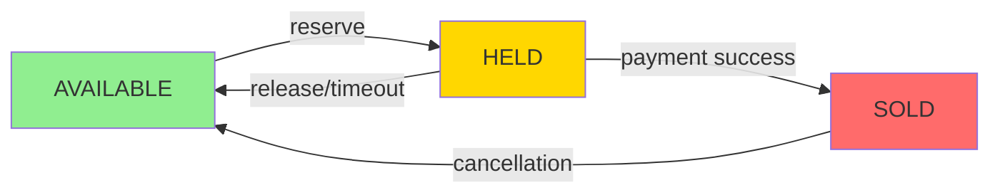
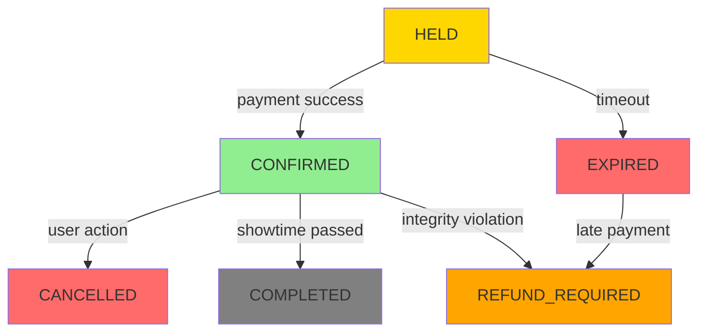
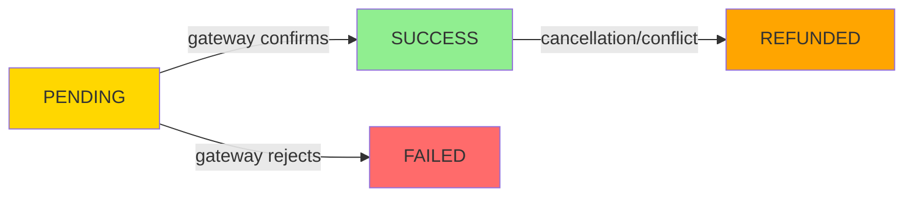
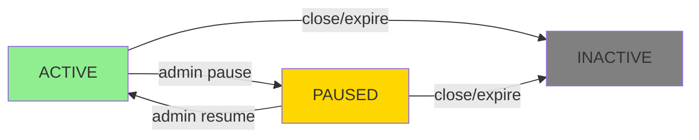

# TicketLedger: Lifecycle States & Transition Rules

## 📋 Purpose

This document defines the **allowed and denied state transitions** for all entities in TicketLedger. It serves as the **finite state machine contract** that governs system behavior.

### ✅ This file contains:
- State definitions
- Allowed transitions
- Denied/illegal transitions
- Inter-entity coupling rules

### ❌ This file does NOT contain:
- API flows
- Timing logic
- Retry mechanisms
- Implementation details

---

## 🎯 Entity States

### 🪑 Seat States

| State       | Description                                           |
| ----------- | ----------------------------------------------------- |
| `AVAILABLE` | Seat is free and can be reserved                      |
| `HELD`      | Seat is temporarily locked for a user during checkout |
| `SOLD`      | Seat is permanently booked and paid for               |

### 📝 Booking States

| State             | Description                                       |
| ----------------- | ------------------------------------------------- |
| `HELD`            | Booking created, seats reserved, awaiting payment |
| `CONFIRMED`       | Payment successful, booking finalized             |
| `EXPIRED`         | Hold duration exceeded, booking invalidated       |
| `CANCELLED`       | User-initiated cancellation after confirmation    |
| `COMPLETED`       | Showtime passed, booking lifecycle ended          |
| `REFUND_REQUIRED` | Payment succeeded but booking integrity violated  |

### 💳 Payment States

| State      | Description                                      |
| ---------- | ------------------------------------------------ |
| `PENDING`  | Payment initiated, awaiting gateway response     |
| `SUCCESS`  | Payment confirmed by gateway                     |
| `FAILED`   | Payment rejected by gateway                      |
| `REFUNDED` | Payment reversed due to cancellation or conflict |

### 🎬 Showtime States

| State      | Description                                              |
| ---------- | -------------------------------------------------------- |
| `ACTIVE`   | Showtime is open for bookings                            |
| `PAUSED`   | Showtime temporarily suspended (admin action)            |
| `INACTIVE` | Showtime closed permanently (past showtime or cancelled) |

---

## 🪑 Seat Transitions

### ✅ Allowed Transitions

| From        | To          | Trigger                                         |
| ----------- | ----------- | ----------------------------------------------- |
| `AVAILABLE` | `HELD`      | User initiates booking                          |
| `HELD`      | `AVAILABLE` | Hold expires or released                        |
| `HELD`      | `SOLD`      | Payment confirmed                               |
| `SOLD`      | `AVAILABLE` | Booking cancelled (via `CONFIRMED → CANCELLED`) |

### ❌ Denied Transitions

> **Rule:** Seat never transitions directly based on payment or time. Seat reacts only to Booking decisions inside a transaction.

| From        | To        | Reason                            |
| ----------- | --------- | --------------------------------- |
| `AVAILABLE` | `SOLD`    | ⚠️ Must go through `HELD` state    |
| `SOLD`      | `HELD`    | ⚠️ Cannot downgrade sold seat      |
| `SOLD`      | `EXPIRED` | ⚠️ Invalid state path              |
| `AVAILABLE` | `EXPIRED` | ⚠️ Seats don't expire, bookings do |

---

## 📝 Booking Transitions

### ✅ Allowed Transitions

| From        | To                | Trigger                             |
| ----------- | ----------------- | ----------------------------------- |
| `HELD`      | `CONFIRMED`       | Payment succeeds within hold window |
| `HELD`      | `EXPIRED`         | Hold duration exceeded              |
| `CONFIRMED` | `CANCELLED`       | User cancels confirmed booking      |
| `CONFIRMED` | `COMPLETED`       | Showtime has passed                 |
| `EXPIRED`   | `REFUND_REQUIRED` | Late payment after hold expiry      |
| `CONFIRMED` | `REFUND_REQUIRED` | System integrity violation          |

### ❌ Denied Transitions

> **Rule:** Booking state is append-only in intent. You never "revive" a dead booking.

| From              | To          | Reason                             |
| ----------------- | ----------- | ---------------------------------- |
| `EXPIRED`         | `CONFIRMED` | ⚠️ Cannot resurrect expired booking |
| `CANCELLED`       | `CONFIRMED` | ⚠️ Cannot un-cancel booking         |
| `COMPLETED`       | `ANY`       | ⚠️ Terminal state - lifecycle ended |
| `REFUND_REQUIRED` | `CONFIRMED` | ⚠️ Refund is irreversible           |

---

## 💳 Payment Transitions

### ✅ Allowed Transitions

| From      | To         | Trigger                             |
| --------- | ---------- | ----------------------------------- |
| `PENDING` | `SUCCESS`  | Payment gateway confirms            |
| `PENDING` | `FAILED`   | Payment gateway rejects             |
| `SUCCESS` | `REFUNDED` | Cancellation or conflict resolution |

### ❌ Denied Transitions

> **Rule:** Payment is an external truth recorder, not a controller.

| From       | To        | Reason                                    |
| ---------- | --------- | ----------------------------------------- |
| `FAILED`   | `SUCCESS` | ⚠️ Failed payment cannot become successful |
| `REFUNDED` | `SUCCESS` | ⚠️ Refunded payment is final               |
| `SUCCESS`  | `PENDING` | ⚠️ Cannot rollback to pending              |

---

## 🎬 Showtime Transitions

### ✅ Allowed Transitions

| From     | To         | Trigger                    |
| -------- | ---------- | -------------------------- |
| `ACTIVE` | `PAUSED`   | Admin temporarily suspends |
| `PAUSED` | `ACTIVE`   | Admin resumes              |
| `ACTIVE` | `INACTIVE` | Showtime ends or cancelled |
| `PAUSED` | `INACTIVE` | Cancelled while paused     |

### ❌ Denied Transitions

> **Rule:** Showtime is monotonic toward INACTIVE.

| From       | To       | Reason                              |
| ---------- | -------- | ----------------------------------- |
| `INACTIVE` | `ACTIVE` | ⚠️ Cannot reactivate closed showtime |
| `INACTIVE` | `PAUSED` | ⚠️ Terminal state - irreversible     |

---

## 🔗 Inter-Entity Transition Constraints

### Cross-Entity Dependencies

| Entity A Transition              | Requires Entity B State         | Enforcement          |
| -------------------------------- | ------------------------------- | -------------------- |
| `Seat: AVAILABLE → HELD`         | `Showtime == ACTIVE`            | Pre-condition check  |
| `Booking: HELD → CONFIRMED`      | `Payment == SUCCESS`            | Pre-condition check  |
| `Booking: HELD → EXPIRED`        | Forces `Seat: HELD → AVAILABLE` | Cascading transition |
| `Booking: CONFIRMED → CANCELLED` | Forces `Seat: SOLD → AVAILABLE` | Cascading transition |
| `Showtime: INACTIVE`             | Denies `Seat: AVAILABLE → HELD` | Global constraint    |

### 📐 Constraint Rules

1. **Atomic Coupling**: Seat transitions must occur within the same transaction as Booking transitions
2. **Showtime Guard**: No seat reservations allowed when showtime is not `ACTIVE`
3. **Payment Prerequisite**: Booking confirmation requires successful payment
4. **Cascade Cleanup**: Booking state changes automatically trigger dependent seat state changes
5. **Terminal Barriers**: Inactive showtimes block all new booking attempts

---

## 📊 State Machine Summary

| Entity       | States | Terminal States                | Reversible?              |
| ------------ | ------ | ------------------------------ | ------------------------ |
| **Seat**     | 3      | None                           | ✅ Yes (via cancellation) |
| **Booking**  | 6      | `COMPLETED`, `REFUND_REQUIRED` | ❌ No                     |
| **Payment**  | 4      | `REFUNDED`                     | ❌ No (except refund)     |
| **Showtime** | 3      | `INACTIVE`                     | ❌ No                     |

---

## 🎓 Design Principles

1. **Append-Only Intent**: Bookings never resurrect after termination
2. **Transaction Boundaries**: Seat and Booking transitions are atomic
3. **External Truth**: Payment records gateway reality, doesn't control it
4. **Monotonic Lifecycle**: Showtimes only move toward closure
5. **No Direct Jumps**: Seats cannot skip `HELD` state when becoming `SOLD`