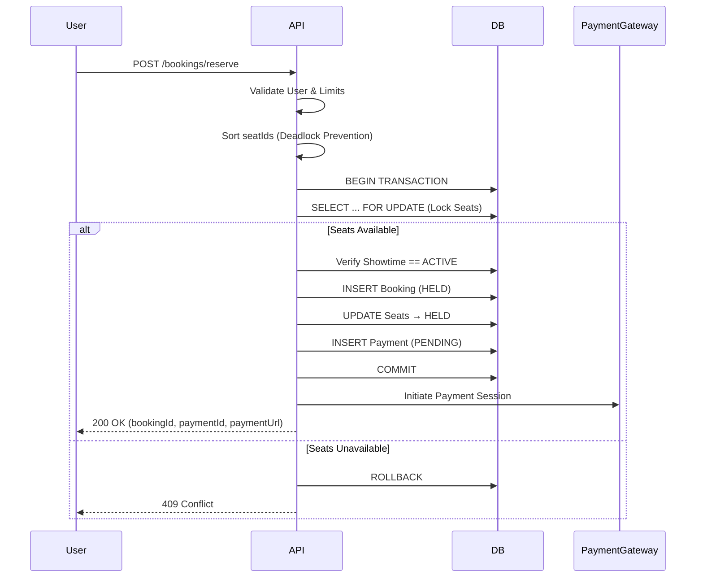
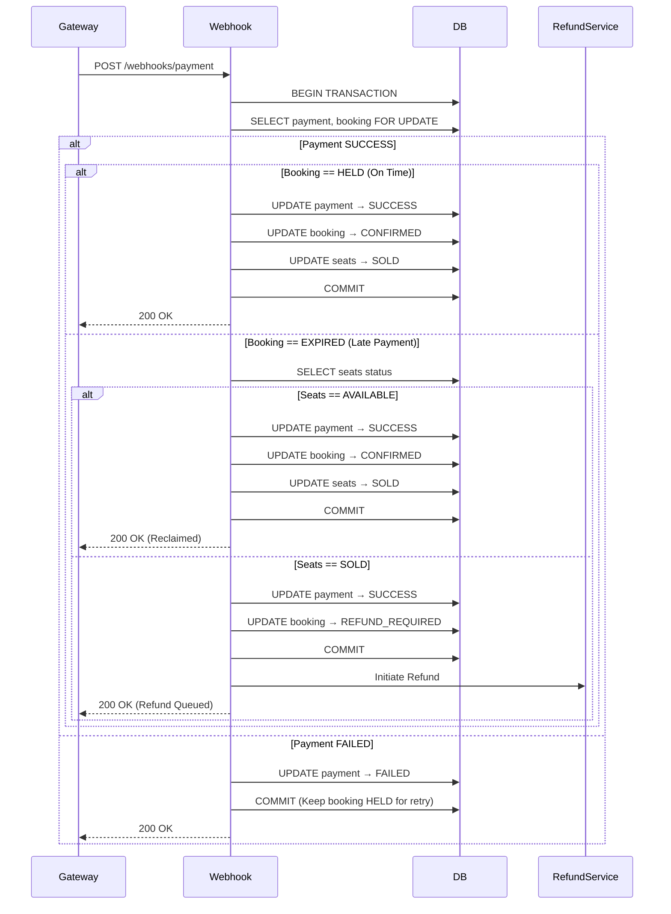
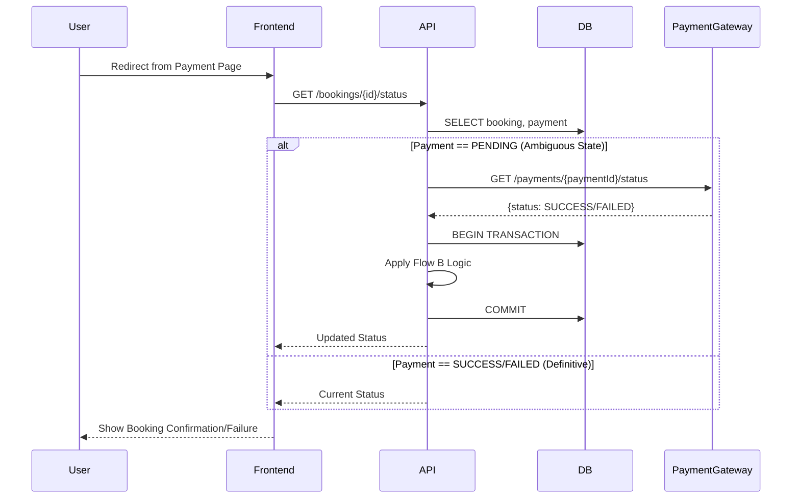
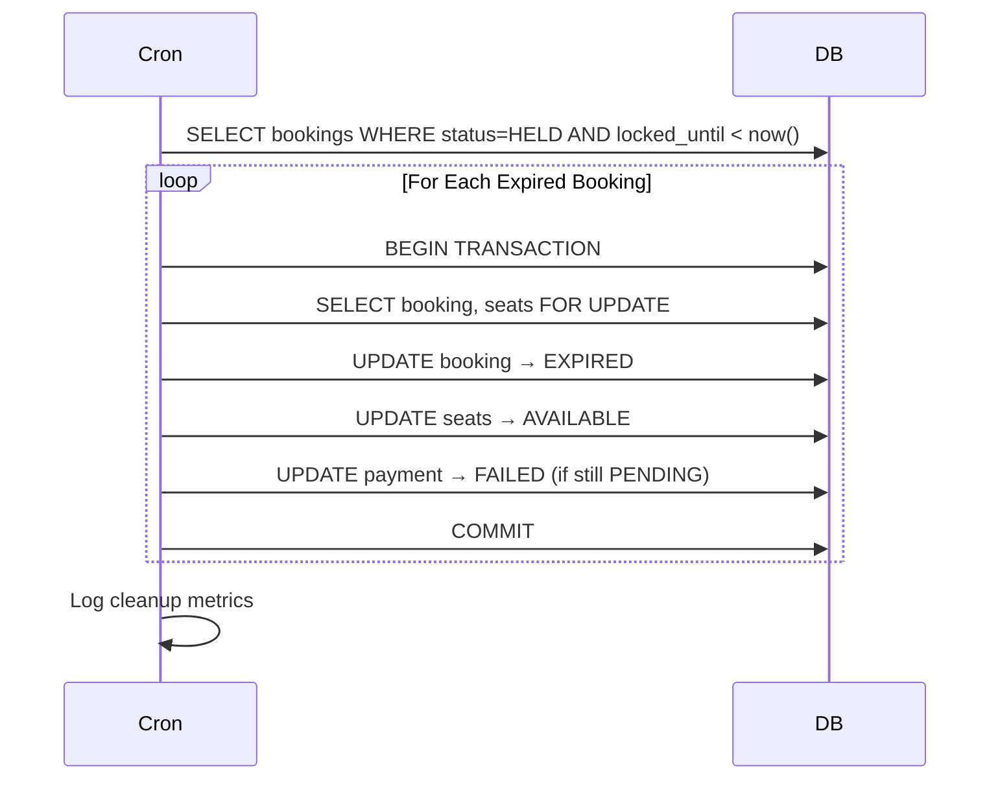
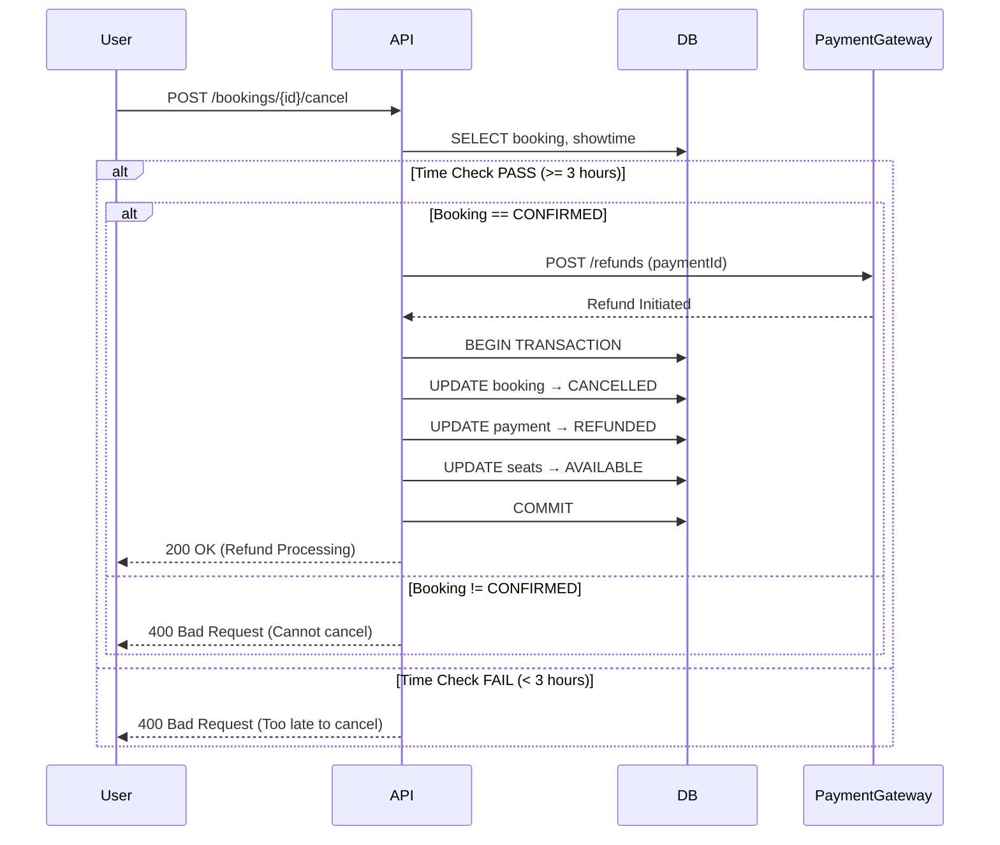
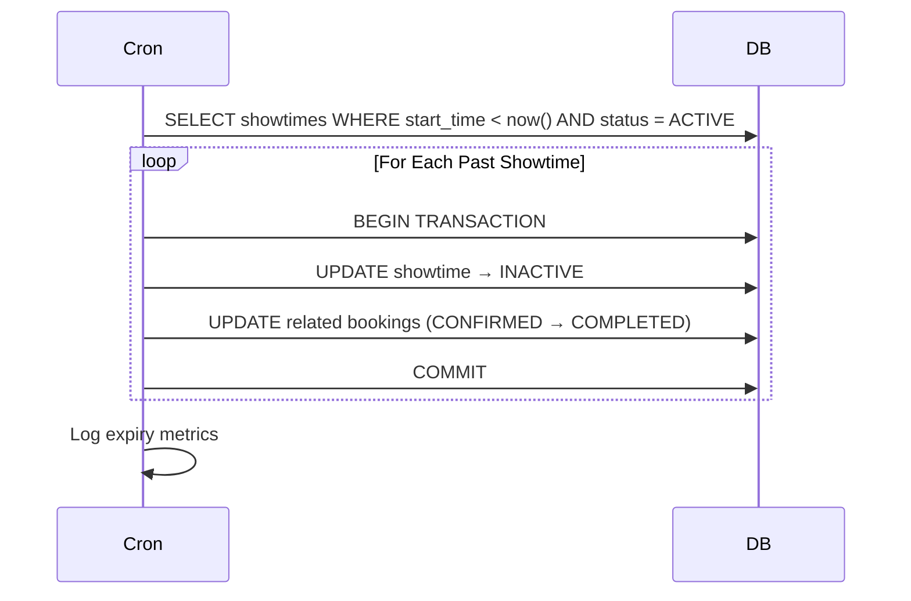
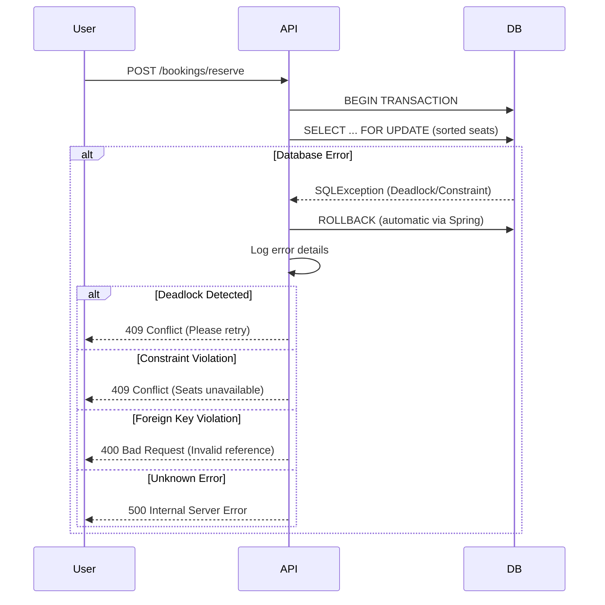

# TicketLedger: Sequence Flows

## 📋 Purpose

This document defines the **end-to-end transaction flows** for TicketLedger. Each flow represents a complete business operation from trigger to outcome, including both happy paths and failure scenarios.

### ✅ This file contains:
- API-triggered flows
- Asynchronous event flows
- Background job flows
- Transaction boundaries
- Error handling paths

### ❌ This file does NOT contain:
- State definitions (see `02_lifecycle_states.md`)
- Database schema details
- Implementation code
- Retry mechanisms

---

## 🎯 Flow Categories

| Category             | Flows      | Trigger Type              |
| -------------------- | ---------- | ------------------------- |
| **Core Transaction** | A, B, C, D | User API + Webhook + Cron |
| **Refund & Cleanup** | E, F       | User API + Cron           |
| **Error Handling**   | G          | System Exception          |

---

## 🔄 Core Transaction Flows

### Flow A: Reserve Seats (The Initiation)

**Trigger:** `POST /bookings/reserve`

**Input:**
```json
{
  "userId": "user123",
  "showtimeId": "show456",
  "seatIds": ["A1", "A2", "A3"]
}
```

**Sequence:**



**Transaction Boundary:**
- **START:** `BEGIN TRANSACTION`
- **LOCKS:** `SELECT ... FOR UPDATE` on `seats` table (sorted by `seat_id`)
- **WRITES:**
  1. `INSERT INTO bookings` (`status = HELD`, `locked_until = now() + 10 min`)
  2. `UPDATE seats SET status = HELD`
  3. `INSERT INTO payments` (`status = PENDING`)
- **END:** `COMMIT` or `ROLLBACK`

**Validations:**
1. User exists and is active
2. Showtime exists and `status == ACTIVE`
3. All `seatIds` exist and `status == AVAILABLE`
4. User has not exceeded booking limits

**Outcome:**
- ✅ **Success:** Returns `bookingId`, `paymentId`, and `paymentUrl`
- ❌ **Failure:** `409 Conflict` (seats taken) or `400 Bad Request` (validation failure)

---

### Flow B: Payment Webhook (The Resolution)

**Trigger:** Asynchronous Webhook from Payment Gateway

**Input:**
```json
{
  "paymentId": "pay789",
  "status": "SUCCESS" | "FAILED",
  "transactionId": "txn123",
  "timestamp": "2026-01-18T10:30:00Z"
}
```

**Sequence:**



**Transaction Boundary:**
- **START:** `BEGIN TRANSACTION`
- **LOCKS:** `SELECT ... FOR UPDATE` on `payments` and `bookings`
- **WRITES:**
  - `UPDATE payments SET status = SUCCESS/FAILED`
  - `UPDATE bookings SET status = CONFIRMED/REFUND_REQUIRED`
  - `UPDATE seats SET status = SOLD` (if applicable)
- **END:** `COMMIT`

**Decision Tree:**

| Payment Status | Booking Status | Seat Status | Action                                   |
| -------------- | -------------- | ----------- | ---------------------------------------- |
| `SUCCESS`      | `HELD`         | `HELD`      | Confirm booking → Seats `SOLD`           |
| `SUCCESS`      | `EXPIRED`      | `AVAILABLE` | Reclaim booking → Confirm + Seats `SOLD` |
| `SUCCESS`      | `EXPIRED`      | `SOLD`      | Mark `REFUND_REQUIRED` → Initiate refund |
| `FAILED`       | `HELD`         | `HELD`      | Update payment only (allow retry)        |
| `FAILED`       | `EXPIRED`      | N/A         | No action (already cleaned up)           |

**Idempotency:**
- Webhook endpoint must handle duplicate calls
- Check `payment.status` before processing
- Return `200 OK` if already processed

**Outcome:**
- ✅ **Success:** Booking confirmed or refund initiated
- ⚠️ **Late Success:** Seats reclaimed if available, else refunded
- ❌ **Failure:** Payment marked failed, booking remains `HELD`

---

### Flow C: User Redirect (The Sync)

**Trigger:** User lands on `/booking-status?bookingId={id}`

**Purpose:** Force synchronization with payment gateway when webhook may be delayed

**Sequence:**



**Polling Strategy:**
- Frontend polls every 2 seconds for up to 30 seconds
- After 30 seconds, show "Payment Processing" message
- Backend forces gateway fetch only once per booking

**Transaction Boundary:**
- Same as Flow B if update required
- Read-only if status is already definitive

**Outcome:**
- ✅ **Sync Success:** User sees updated status immediately
- ⏳ **Pending:** User sees "Payment Processing" message
- ❌ **Timeout:** User advised to check email/contact support

---

### Flow D: The Reaper (Background Cleanup)

**Trigger:** Cron Job (Every 1 minute)

**Purpose:** Clean up expired holds and free seats

**Sequence:**



**Transaction Boundary:**
- **Batch Size:** 100 bookings per run
- **Per Booking:**
  - `BEGIN TRANSACTION`
  - `SELECT ... FOR UPDATE` on booking and related seats
  - `UPDATE bookings SET status = EXPIRED`
  - `UPDATE seats SET status = AVAILABLE`
  - `UPDATE payments SET status = FAILED` (if `PENDING`)
  - `COMMIT`

**Query:**
```sql
SELECT id, seat_ids 
FROM bookings 
WHERE status = 'HELD' 
  AND locked_until < NOW()
LIMIT 100
FOR UPDATE SKIP LOCKED;
```

**Outcome:**
- ✅ **Seats Released:** Available for new bookings
- 📊 **Metrics Logged:** Number of expired bookings cleaned
- ⚠️ **Race Condition:** `SKIP LOCKED` prevents conflicts with concurrent webhooks

---

## 💰 Refund & Cleanup Flows

### Flow E: User Cancellation (The Refund)

**Trigger:** `POST /bookings/{id}/cancel`

**Business Rule:** Cancellation allowed only if `showtime_start - current_time >= 3 hours`

**Sequence:**



**Transaction Boundary:**
- **START:** After successful refund initiation
- **LOCKS:** `SELECT ... FOR UPDATE` on booking and seats
- **WRITES:**
  - `UPDATE bookings SET status = CANCELLED, cancelled_at = now()`
  - `UPDATE payments SET status = REFUNDED`
  - `UPDATE seats SET status = AVAILABLE`
- **END:** `COMMIT`

**Validations:**
1. Booking exists and belongs to user
2. Booking status is `CONFIRMED`
3. Showtime start time is at least 3 hours away
4. Payment gateway accepts refund request

**Outcome:**
- ✅ **Success:** Refund initiated, seats freed
- ❌ **Too Late:** `400 Bad Request` with message
- ❌ **Invalid State:** `400 Bad Request` (cannot cancel non-confirmed booking)

**Refund Processing:**
- Gateway refund is asynchronous (3-7 business days)
- System immediately marks payment as `REFUNDED`
- User receives confirmation email

---

### Flow F: Showtime Expiry (The Gatekeeper)

**Trigger:** Cron Job (Every 1 hour) or Lazy Check on Booking Request

**Purpose:** Mark past showtimes as inactive and prevent new bookings

**Sequence:**



**Transaction Boundary:**
- **Per Showtime:**
  - `UPDATE showtimes SET status = INACTIVE`
  - `UPDATE bookings SET status = COMPLETED WHERE showtime_id = ? AND status = CONFIRMED`

**Query:**
```sql
SELECT id 
FROM showtimes 
WHERE start_time < NOW() 
  AND status IN ('ACTIVE', 'PAUSED')
LIMIT 50;
```

**Seat State:**
- **No explicit seat transition needed**
- Reliance on `showtime.status` check during booking validation
- `SOLD` seats remain `SOLD` (historical record)
- `AVAILABLE` seats become unbookable via showtime guard

**Lazy Check (Performance Optimization):**
```java
// In Reserve Seats Flow (Flow A)
if (showtime.getStatus() == ACTIVE && showtime.getStartTime().isBefore(now())) {
    throw new ShowtimeExpiredException("Showtime has ended");
}
```

**Outcome:**
- ✅ **Showtime Closed:** No new bookings accepted
- 📊 **Bookings Completed:** Lifecycle ended for confirmed bookings
- ⚡ **Performance:** No enum needed, single status check sufficient

---

## 🚨 Error Handling Flows

### Flow G: Transaction Failure (The Safety Net)

**Trigger:** Database Deadlock or Constraint Violation during Reserve

**Common Scenarios:**
1. **Deadlock:** Two users reserve overlapping seats in different order
2. **Unique Constraint Violation:** Duplicate booking attempt
3. **Foreign Key Violation:** Invalid `showtime_id` or `user_id`
4. **Optimistic Locking Failure:** Concurrent seat update

**Sequence:**



**Error Classification:**

| Exception Type                     | HTTP Status               | User Message                 | Action                 |
| ---------------------------------- | ------------------------- | ---------------------------- | ---------------------- |
| `DeadlockLoserDataAccessException` | `409 Conflict`            | "Seats locked, please retry" | Retry with backoff     |
| `DataIntegrityViolationException`  | `409 Conflict`            | "Seats no longer available"  | Select different seats |
| `ConstraintViolationException`     | `400 Bad Request`         | "Invalid booking data"       | Fix input              |
| `TransactionTimedOutException`     | `503 Service Unavailable` | "Service busy, retry"        | Retry after delay      |
| Generic `SQLException`             | `500 Internal Error`      | "System error"               | Contact support        |

**Rollback Guarantees:**
- Spring `@Transactional` ensures automatic rollback on exception
- No orphaned locks (`FOR UPDATE` released on rollback)
- No partial writes (all-or-nothing)

**Logging:**
```java
log.error("Booking reservation failed", 
    Map.of(
        "userId", userId,
        "showtimeId", showtimeId,
        "seatIds", seatIds,
        "errorType", e.getClass().getSimpleName(),
        "errorMessage", e.getMessage()
    )
);
```

**Retry Strategy (Client-Side):**
1. **Deadlock:** Exponential backoff (100ms, 200ms, 400ms)
2. **Constraint Violation:** No retry (show error)
3. **Timeout:** Linear backoff (1s, 2s, 3s)

**Outcome:**
- ✅ **Clean Failure:** No side effects, safe to retry
- 📋 **Detailed Logging:** Error traced and monitored
- 🔒 **No Orphaned Locks:** Database state consistent

---

## 📊 Flow Summary Matrix

| Flow            | Trigger          | Frequency | Transaction Size     | Failure Impact              |
| --------------- | ---------------- | --------- | -------------------- | --------------------------- |
| **A: Reserve**  | User API         | High      | Small (1-10 seats)   | Low (user retries)          |
| **B: Webhook**  | Gateway Event    | High      | Small (1 booking)    | Medium (needs idempotency)  |
| **C: Redirect** | User Navigation  | Medium    | Tiny (read + update) | Low (polling handles)       |
| **D: Reaper**   | Cron (1 min)     | Constant  | Batch (100 bookings) | Low (background)            |
| **E: Cancel**   | User API         | Low       | Small (1 booking)    | High (refund involved)      |
| **F: Expiry**   | Cron (1 hour)    | Constant  | Batch (50 showtimes) | Low (background)            |
| **G: Error**    | System Exception | Low       | N/A (rollback)       | Critical (needs monitoring) |

---

## 🎓 Design Principles

1. **Atomic Transitions:** All state changes within transaction boundaries
2. **Sorted Locking:** Prevents deadlocks via consistent lock ordering
3. **Idempotent Webhooks:** Safe to replay without side effects
4. **Graceful Degradation:** Sync checks compensate for async delays
5. **Clean Failures:** Rollbacks guarantee no partial state
6. **Performance Over Enums:** Showtime status check > seat state enums
7. **Explicit Boundaries:** Every flow documents transaction scope

---

## 🔍 Cross-Reference

- **State Definitions:** See `lifecycle_states.md`
- **API Contracts:** See `api_contracts.md` (future)
- **Database Schema:** See `database_schema.md` (future)
- **Error Catalog:** See `error_handling.md` (future)